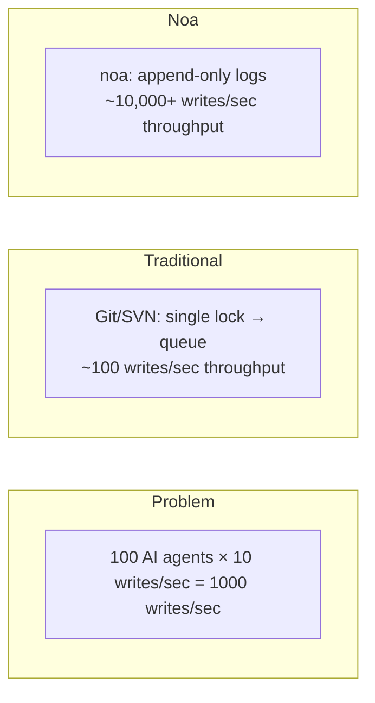
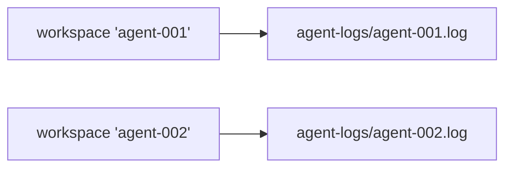
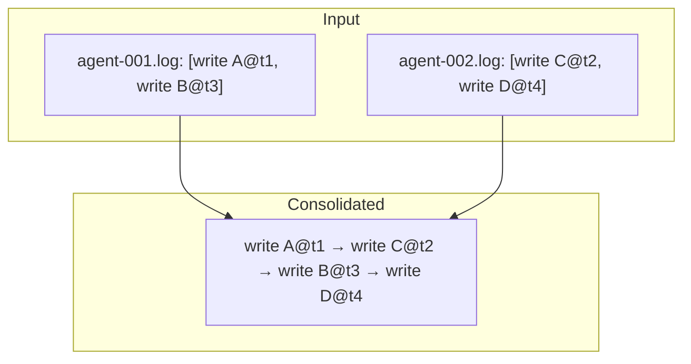
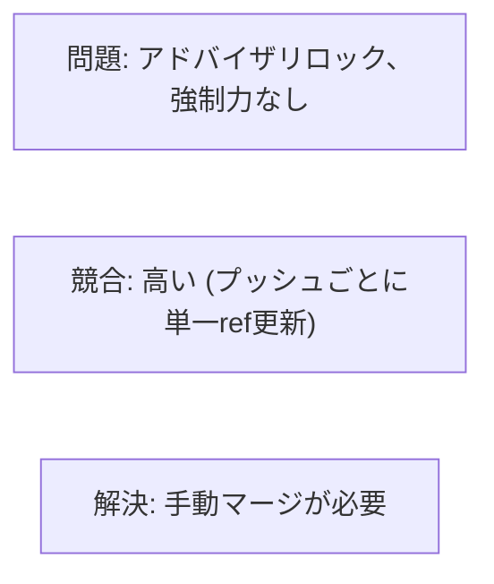
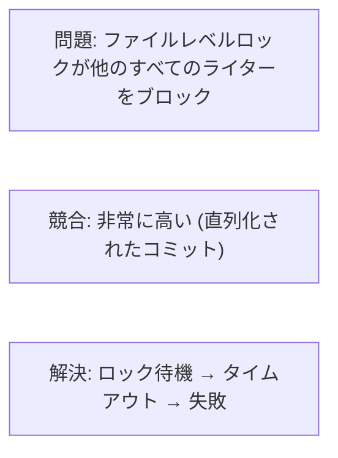
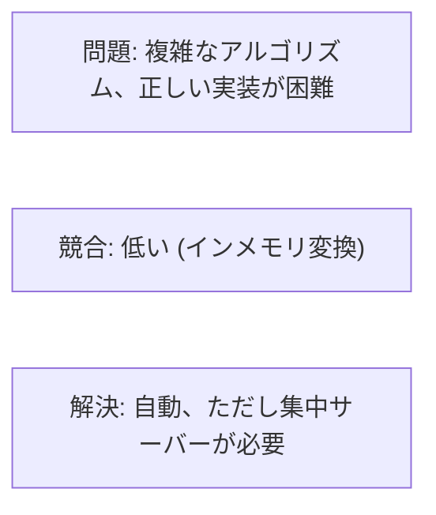
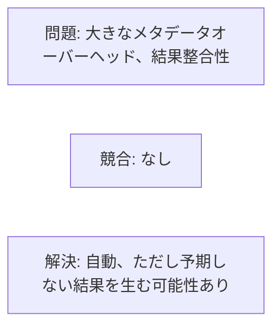
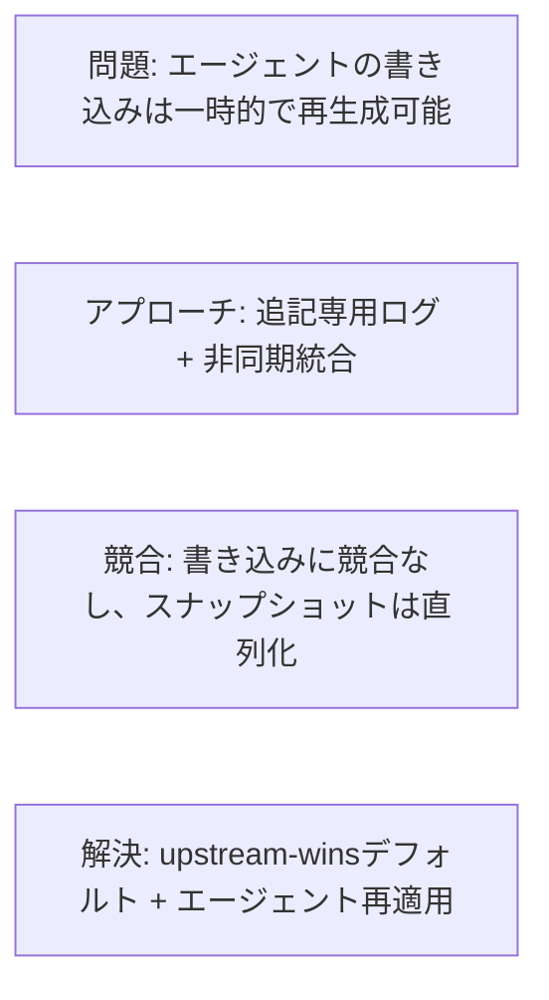

# 同時実行性の設計

## 問題提起

従来のVCSシステムは、単一のロックまたはマージキューを通じて書き込みを直列化します。これは人間規模のワークフロー（10-100コミット/日）では機能しますが、AIエージェントが毎分数千のファイル変更を生み出す場合には破綻します。



## アーキテクチャ

### レイヤー1: AgentLog (書き込みパス)

各ワークスペースは`.noa/agent-logs/`の下に専用のJSONLファイルを持ちます。



書き込みには`O_APPEND`フラグを使用し、以下を提供します:
- **アトミック性**: カーネルが追記の全体書き込みアトミック性を保証
- **順序付け**: 書き込みはファイルごと（ワークスペースごと）に直列化
- **ロック不要**: 異なるファイル間でfcntl/flock不要

```rust
pub trait AgentLog: Send + Sync {
    async fn append(&self, workspace: &str, entry: &LogEntry) -> Result<()>;
    async fn read_all(&self, workspace: &str) -> Result<Vec<LogEntry>>;
}
```

### レイヤー2: スナップショットストア (読み取りパス)

スナップショットはMVCC（マルチバージョン同時実行制御）付きのredbに保存されます:
- 書き込みはredbのシングルライタートランザクションを通じて直列化
- 読み取りは書き込みをブロックしない (スナップショット分離)
- 複数のリーダーが同時にアクセス可能

### レイヤー3: 統合 (マージパス)

`Consolidator`はすべてのワークスペースにわたるエージェントログを読み取り、タイムスタンプでソートし、統一されたスナップショットチェーンを生成します:



これは非同期に実行され、エージェントの書き込みをブロックしません。

## 同時実行性の保証

| 保証 | メカニズム |
|-----------|-----------|
| データ損失なし | O_APPEND + 書き込みごとのfsync |
| ワークスペースごとの順序付け | ワークスペースごとに単一ファイル |
| ワークスペース間の順序付け | マイクロ秒タイムスタンプ |
| 読み取り一貫性 | redb MVCCスナップショット分離 |
| ワークスペースヘッドの安全性 | CAS (compare-and-swap) 更新 |

## スケーラビリティ分析

### 単一プロセス (組み込み)

| エージェント数 | 1-100 (同一プロセス) |
| スループット | ~10,000 書き込み/秒 |
| ボトルネック | ディスクI/O (書き込みごとのfsync) |

### マルチプロセス (noa-server)

| エージェント数 | 100-1000 (別プロセス) |
| スループット | ~5,000 書き込み/秒 |
| ボトルネック | サーバーサイドの書き込み直列化 |

サーバーは単一のデータベース接続を保持し、書き込みを直列化します。エージェントログは並列取り込みのためにファイルごとのままです。

### 分散 (MinIOバックエンド)

| エージェント数 | 1000+ |
| スループット | S3 PUTレート制限 (~3,500/秒/プレフィックス) |
| ボトルネック | ネットワーク + S3レート制限 |

## 代替案との比較

### Git + ファイルロック



### SVN + svn:needs-lock



### 操作変換 (OT)



### CRDT (競合フリー複製データ型)



### noaのアプローチ



## fsync戦略

すべてのエージェントログ書き込みは以下のパターンに従います:

```rust
file.write_all(data)?;   // ファイルに追記
file.flush()?;           // ユーザースペースバッファをフラッシュ
file.sync_data()?;       // fsync — ディスク上での永続性を保証
```

Linuxでは、`sync_data()`はメタデータ同期をスキップし（fdatasync）、完全なfsyncと比較してレイテンシを約30%削減します。

## 将来: 先行書き込みログのバッチ処理

現在: 書き込みごとに1 fsync。
計画: 複数の書き込みを単一のfsyncにバッチ処理:

```rust
// エージェントがメモリ内で書き込みをバッファリング
agent.buffer(write_a);
agent.buffer(write_b);
agent.buffer(write_c);
agent.flush(); // 3つすべてに対して単一のfsync
```

期待されるスループット改善: バースト的な書き込みで3-5倍。
