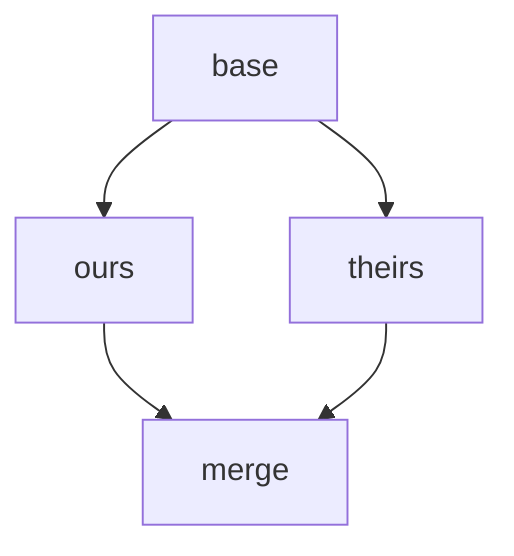
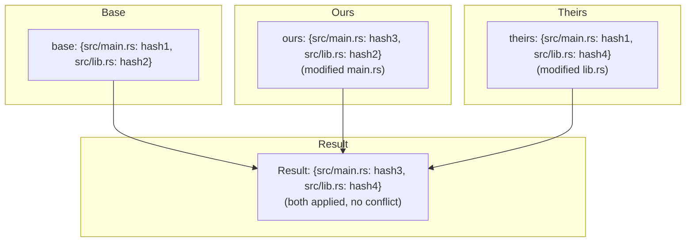
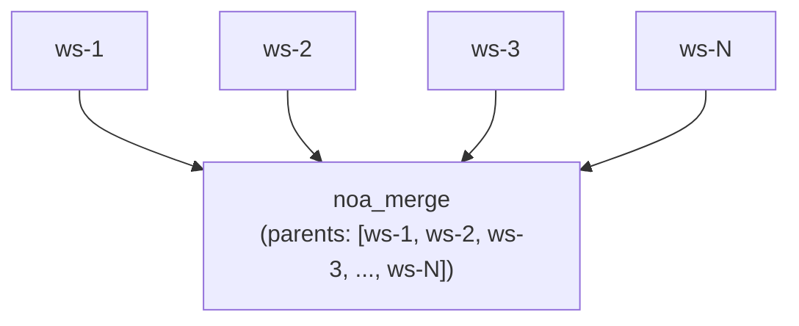
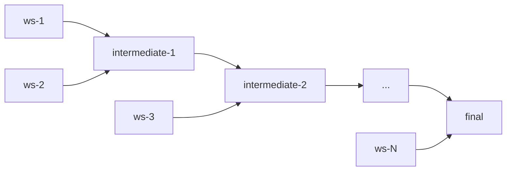

# マージ戦略の設計

## 概要

noaは、設定可能な競合解決を備えた3方向マージアルゴリズムを使用します。この設計は、人的介入よりも**前進の進行**を優先し、変更を再生成できるAIエージェントのユースケースを反映しています。

## 3方向マージ

### アルゴリズム

共通の祖先（base）を持つ2つのスナップショット（ours, theirs）が与えられた場合:



1. `base` vs `ours`の差分 → changes_A
2. `base` vs `theirs`の差分 → changes_B
3. いずれかが触れた各パスについて:
   - 両側で同じ変更 → 適用 (競合なし)
   - Aのみで変更 → Aを適用
   - Bのみで変更 → Bを適用
   - 同じパスへの異なる変更 → **競合**

### 実装

```rust
pub fn three_way_merge(
    base_tree: &Vec<TreeEntry>,
    ours_tree: &Vec<TreeEntry>,
    theirs_tree: &Vec<TreeEntry>,
) -> (Vec<TreeEntry>, Vec<Conflict>)
```

ツリーエントリは比較のためにフラットなパス→ハッシュマップに正規化されます:



## 競合検出

```rust
pub struct Conflict {
    pub path: String,
    pub base_hash: Option<String>,
    pub ours_hash: Option<String>,
    pub theirs_hash: Option<String>,
}
```

競合の種類:
- **Modify/Modify**: 両側が同じファイルを異なる方法で変更
- **Add/Add**: 両側が同じパスに異なるコンテンツでファイルを追加
- **Delete/Modify**: 一方が削除、他方が変更

## 解決戦略

### upstream-wins (デフォルト)

競合が検出された場合、theirsのバージョンを採用:

```rust
ConflictResolution::UpstreamWins => theirs_hash,
```

根拠: AIエージェントのワークフローでは、「上流」（main/defaultワークスペース）が標準的な状態を表します。エージェントは更新されたベースに対して変更を再適用できます。

### ours-wins

自側のバージョンを採用:

```rust
ConflictResolution::OursWins => ours_hash,
```

### fail (計画中)

マージを中断し、手動解決のために競合を返す:

```rust
ConflictResolution::Fail => return Err(MergeError::Conflict(conflicts)),
```

## ワークスペースマージフロー

```bash
noa workspace switch default          # ours = defaultを設定
noa workspace merge feature-1         # theirs = feature-1
```

内部手順:
1. oursスナップショットを読み込み (defaultのヘッド)
2. theirsスナップショットを読み込み (feature-1のヘッド)
3. マージベースを検索 (DAG内の最新の共通祖先)
4. 共通祖先がない場合、`noa_empty`をベースとして使用
5. 3方向マージを実行
6. 競合解決戦略を適用
7. parents = [ours, theirs]のマージスナップショットを作成
8. defaultのヘッドをマージスナップショットに更新

## 複数親マージ

noaスナップショットは無制限の親をサポートし、オクトパス形式のマージを可能にします:



N方向マージの場合、アルゴリズムはペアワイズマージを実行します:



## Gitマージとの比較

| 観点 | noa | Git |
|--------|-----|-----|
| アルゴリズム | 3方向 | 3方向 (同じコアアルゴリズム) |
| 競合マーカー | なし (自動解決) | `<<<<<<<` / `=======` / `>>>>>>>` |
| デフォルト解決 | upstream-wins | なし (人間が必要) |
| 複数親 | 無制限 | 通常 ≤2 |
| リベース | 未サポート | サポート |
| チェリーピック | 未サポート | サポート |
| Fast-forward | 自動 | オプション (–no-ff) |

## SVNマージとの比較

| 観点 | noa | SVN |
|--------|-----|-----|
| マージ追跡 | 組み込み (親DAG) | 手動 (mergeinfoプロパティ) |
| 競合解決 | 自動 | 手動 (競合ファイル) |
| ブランチモデル | ワークスペース (軽量) | ディレクトリベース (重い) |
| マージ方向 | 任意 → 任意 (DAG) | 通常 branch → trunk |

## 設計の根拠: なぜ自動解決か

従来のVCSが人間による競合解決を必要とする理由:
1. 人間が書いたコードには人間だけが理解できる意味的意味がある
2. 競合は根本的な設計の不一致を表す可能性がある
3. 手動解決が正確性を保証する

AIエージェントの変更には異なる特徴があります:
1. **再生成可能**: エージェントは最新の状態に対して変更を再適用できる
2. **高頻度**: 人間の解決のために一時停止すると下流の作業がすべてブロックされる
3. **非意味的**: ファイルレベルの変更は人間の解釈を必要としない

したがって、明確なポリシー（upstream-wins）による自動解決は、noaのユースケースにとって正しいトレードオフです。
