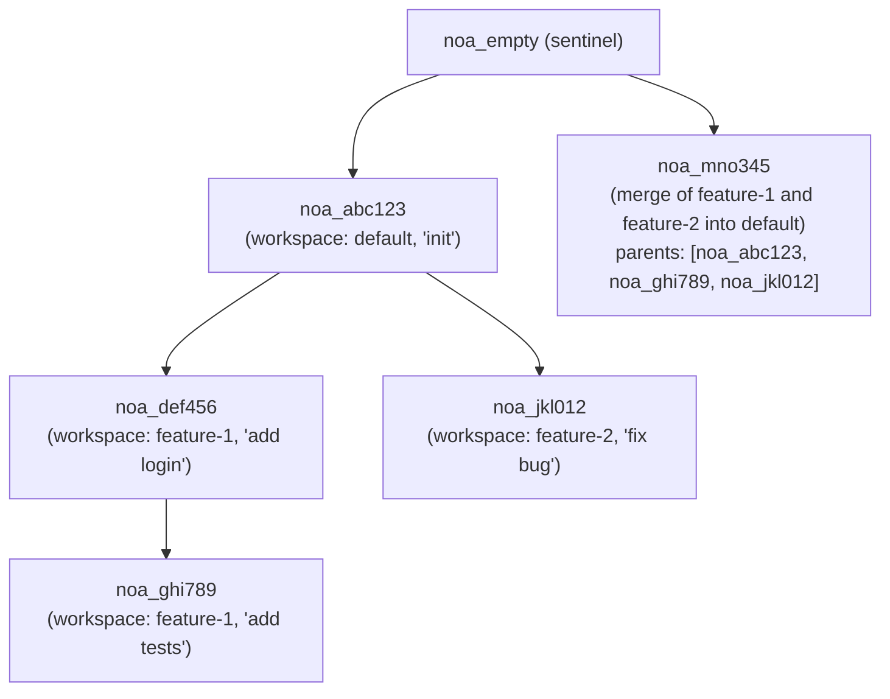
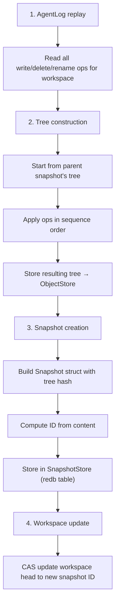

# スナップショットモデルの設計

## 概要

スナップショットは、ある時点でのワークスペースの完全なファイルツリー状態を記録した、不変でコンテンツアドレス型のレコードです。スナップショットは親参照を通じて有向非巡回グラフ（DAG）を形成します。

## スナップショット構造

```rust
pub struct SnapshotId(pub String);  // "noa_<12-char-base62>"

pub struct Snapshot {
    pub id: SnapshotId,
    pub tree_hash: String,           // ルートツリーのSHA-256
    pub parents: Vec<SnapshotId>,    // 0-N個の親スナップショット
    pub workspace: String,           // 生成元ワークスペース
    pub author: String,              // エージェントまたは人間の識別子
    pub timestamp: u64,              // エポックからのマイクロ秒
    pub message: String,             // 人間可読な説明
}
```

## ID生成

スナップショットIDは`noa_`で始まる12文字のbase62文字列を使用します:

```
noa_3kF8x2mP9aB1
```

生成: `SHA256(tree_hash || parents || workspace || timestamp)[0..9]`をbase62エンコード。これにより:
- 62^12 ≈ 3.2 × 10^21 の可能なID
- 衝突確率は実質的にゼロ
- 決定論的: 同じ入力 → 同じID (重複排除が可能)

## スナップショットDAG



## スナップショット作成フロー



## スナップショットストア

スナップショットはIDをキーとするredbテーブルに保存されます:

```
テーブル: snapshots
  キー:   "noa_abc123" (SnapshotIdを&strとして)
  値:     msgpack(Snapshot) を &[u8]として
```

## 差分アルゴリズム

`diff_snapshots(base, other)`はファイルレベルの変更リストを生成します:

```rust
pub struct FileDiff {
    pub path: String,
    pub kind: DiffKind, // Added, Removed, Modified
    pub old_blob: Option<String>,
    pub new_blob: Option<String>,
}
```

アルゴリズム:
1. 両方のスナップショットのルートツリーを読み込み
2. 両方のツリーを同時に再帰的に走査
3. 各パスでblobハッシュを比較
4. 異なるハッシュ → Modified; 片方にのみ存在 → Added/Removed

時間計算量: O(n)、n = 両方のツリーの総ファイル数。

## センチネルスナップショット

`noa_empty`は空のツリーを表す予約されたスナップショットIDです。すべての新しいリポジトリはこれをベースとして開始します。これは明示的に保存されることはなく、ワークスペースマネージャーはこれを「まだスナップショットがない」と認識します。

## Gitコミットとの比較

| 観点 | noaスナップショット | Gitコミット |
|--------|-------------|------------|
| ID形式 | `noa_<base62>` | SHA-1 16進数 |
| 親の制限 | 無制限 (マージDAG) | 通常1-2 |
| ツリー形式 | MessagePack | カスタムバイナリ |
| タイムスタンプ | マイクロ秒精度 | 秒精度 + タイムゾーン |
| 作成者フィールド | エージェントID または人間 | 名前 + メール |
| 不変性 | ストアにより強制 | ハッシュにより強制 |
| GPG署名 | 未サポート | サポート |
