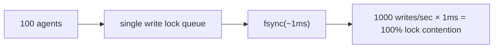
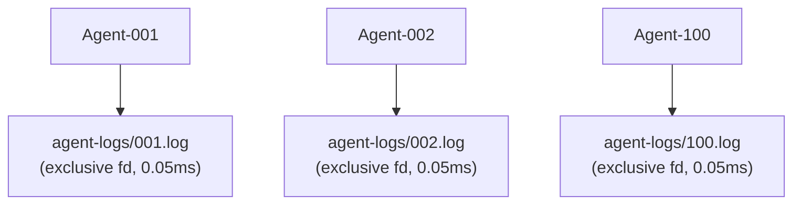

# エージェント同時実行モデル

## 設計目標

noaは**ロック競合ゼロ**で数十から数百のAIエージェントが同時に書き込むことをサポートします。

## 問題: シングルライターボトルネック

従来の組み込みデータベース（redbを含む）は単一の書き込みロックを使用します:



## 解決策: ワークスペースごとのエージェントログ

各ワークスペースは独自のJSONLファイルを持ちます。書き込みにはPOSIXシステム上でアトミックな`O_APPEND`を使用します:



合計: 書き込みあたり0.05ms、ロック競合ゼロ。

## AgentLog形式

```jsonl
{"seq":1,"op":"write","path":"src/main.rs","blob":"abc123...","ts":1717592400000000}
{"seq":2,"op":"delete","path":"src/old.rs","ts":1717592401000000}
{"seq":3,"op":"rename","from":"src/foo.rs","to":"src/bar.rs","ts":1717592402000000}
{"seq":4,"op":"snapshot","snapshot_id":"noa_z7x9","parent":"noa_y6w8","message":"feat","ts":1717592405000000}
```

- `seq`: ワークスペースごとの単調カウンタ
- `ts`: マイクロ秒精度のタイムスタンプ
- 統合はグローバルに`ts`でソート

## redbとAgentLogの使い分け

| コンポーネント | ストレージ | 理由 |
|-----------|---------|--------|
| blobs, trees | redb | コンテンツアドレス型、不変、読み取り中心 |
| snapshots, refs, workspaces | redb | メタデータ、低書き込み頻度 |
| エージェント増分ログ | ファイルJSONL | 高頻度同時書き込み |

## 統合

`Consolidator`はすべてのエージェントログを読み取り、タイムスタンプでソートし、統一されたスナップショットチェーンを作成します:

```rust
Consolidator::new(&engine)
    .consolidate("default", parent_ids, "agent", "batch update")
    .await?;
```

## マルチプロセス同時実行のためのnoa-server

真のマルチプロセスシナリオ（複数のCLIプロセスまたは分散エージェント）には、noa-server HTTP APIを使用します:

```bash
noa-server  # ポート3000で起動

# エージェントはREST経由で対話:
POST /api/v1/repo/my-project/blobs
POST /api/v1/repo/my-project/snapshots
POST /api/v1/repo/my-project/agent-log
```

サーバーは単一のデータベース接続を保持し、内部的に書き込みを直列化しながら、MVCC経由で同時読み取りを処理します。
