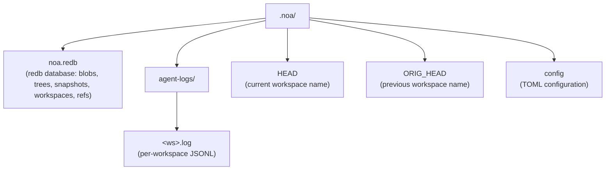
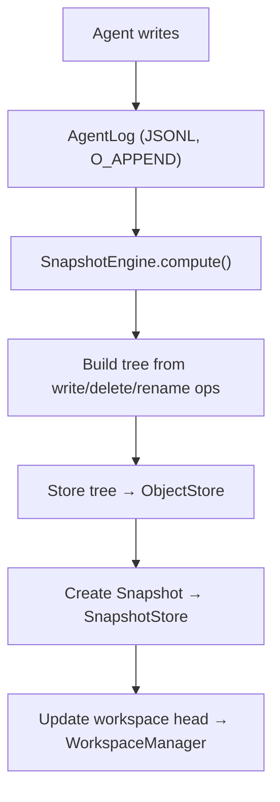

# アーキテクチャ

## コアコンポーネント

### ObjectStore

blobとツリーのためのコンテンツアドレス型ストレージ。コンテンツはSHA-256ハッシュでアドレス指定されます。

```
BlobId = SHA256(content)
TreeId = SHA256(msgpack(TreeEntries))
```

実装:
- **RedbObjectStore**: redb組み込みKVストアを使用したローカルストレージ
- **MinioObjectStore**: S3互換MinIOを使用したリモートストレージ

### AgentLog

ゼロロック同時書き込みのためのワークスペースごとの追記専用ログ。各ワークスペースは`.noa/agent-logs/<ws>.log`の下に独自のJSONLファイルを持ちます。

操作:
- **write**: blob参照付きのファイル書き込みを記録
- **delete**: ファイル削除を記録
- **rename**: ファイル名変更を記録
- **snapshot**: スナップショット作成を記録
- **merge**: 別のワークスペースからのマージを記録

### スナップショット

ワークスペースのある時点での不変な状態。ツリーハッシュ、親スナップショット、作成者、メッセージを含みます。

```
Snapshot = {
    id: "noa_<12-char-base62>"
    tree_hash: ツリーコンテンツのSHA-256
    parents: [SnapshotId, ...]
    workspace: ワークスペース名
    author: エージェント識別子
    timestamp: マイクロ秒精度
    message: 人間可読な説明
}
```

### ワークスペース

エージェントのための分離された作業コンテキスト。ヘッドスナップショットとベーススナップショットを追跡します。

### RefStore

安全な同時更新のためのcompare-and-swap (CAS)セマンティクスを持つ、スナップショットへの名前付きポインタ。

### マージエンジン

base、ours、theirsのツリーを比較する3方向マージ:
- 両側で同じ変更 → 競合なし
- 片側のみの変更 → 適用
- 同じファイルへの異なる変更 → 競合 (デフォルト: upstream-wins)

## ストレージレイアウト



## データフロー


