# noaのビルド

## 前提条件

- Rust 1.75+ (安定版)
- Python 3.8+ (ビルドスクリプト用)
- `just`コマンドランナー

## セットアップ

```bash
git clone https://github.com/celestia-island/noa.git
cd noa
just init          # Rust依存関係を取得
just build-dev     # 開発ビルド
```

## 開発

```bash
just fmt            # コードのフォーマット
just clippy         # lint
just test           # テストの実行
just check          # 型チェック
```

## プロジェクト構造

```mermaid
graph TD
    SRC["src/"] --> LIB["lib.rs<br/>(Library root)"]
    SRC --> ERR["error.rs<br/>(Error types)"]
    SRC --> CFG["config.rs<br/>(Configuration)"]
    SRC --> REPO["repo.rs<br/>(Repository lifecycle)"]
    SRC --> OBJ["object/<br/>(ObjectStore trait + impls)"]
    SRC --> LOG["log/<br/>(AgentLog trait + impls)"]
    SRC --> SNAP["snapshot/<br/>(Snapshot engine)"]
    SRC --> WS["workspace/<br/>(Workspace manager)"]
    SRC --> REFS["refs.rs<br/>(RefStore trait + impl)"]
    SRC --> MERGE["merge/<br/>(Merge engine)"]
    SRC --> GIT["git/<br/>(Git compatibility)"]
    SRC --> REMOTE["remote.rs<br/>(RemoteBackend trait)"]
    SRC --> CLI["cli/<br/>(CLI commands)"]
```


