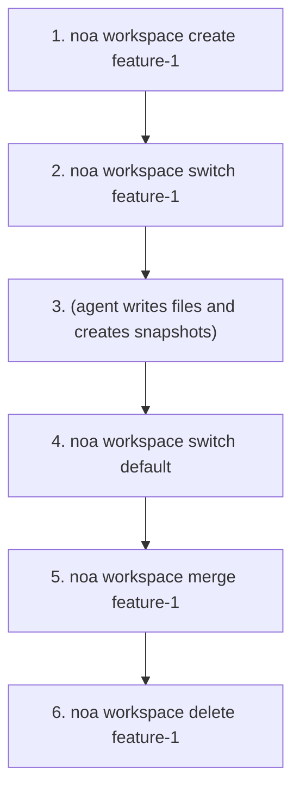
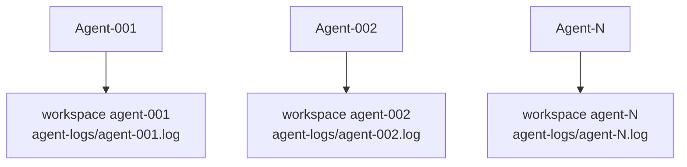

# ワークスペースガイド

ワークスペースは分離された作業コンテキストで、Gitのブランチに似ています。各ワークスペースは独自のヘッドスナップショットとエージェントログを持ちます。

## ワークスペースの作成

```bash
noa workspace create feature-1
noa workspace create agent-debug --agent bot-42
```

`--agent`フラグはワークスペースを特定のエージェントIDに関連付けます。

## ワークスペースの切り替え

```bash
noa workspace switch feature-1
noa status
# On workspace: feature-1 (head: noa_abc123)
```

## ワークスペースの一覧表示

```bash
noa workspace list
#   default             head: noa_abc123 base: noa_empty
# * feature-1           head: noa_def456 base: noa_abc123
```

`*`マーカーはアクティブなワークスペースを示します。

## ワークスペースのマージ

```bash
noa workspace switch default
noa workspace merge feature-1
# Merged feature-1 into default -> noa_ghi789
```

競合が検出された場合:

```
Conflicts detected:
  CONFLICT: src/main.rs
Merged feature-1 into default -> noa_ghi789
```

デフォルトの解決戦略はupstream-wins（theirs）です。将来のバージョンでは手動の競合解決をサポートする予定です。

## ワークスペースの削除

```bash
noa workspace delete feature-1
# Deleted workspace 'feature-1'
```

アクティブなワークスペースは削除できません。

## ワークフローパターン



## マルチエージェントパターン

各エージェントは独自のワークスペースを持ちます:



各ワークスペースは独立したエージェントログ（`.noa/agent-logs/agent-001.log`）を持ち、ゼロロック同時書き込みが可能です。統合ステップですべてのログをタイムスタンプ順にマージし、統一された履歴を作成します。

> **注意**: redbは排他的ファイルロックを使用するため、複数のCLIプロセスが同じデータベースを同時に開くことはできません。真のマルチプロセス同時実行には、noa-server HTTP APIを使用してください。
