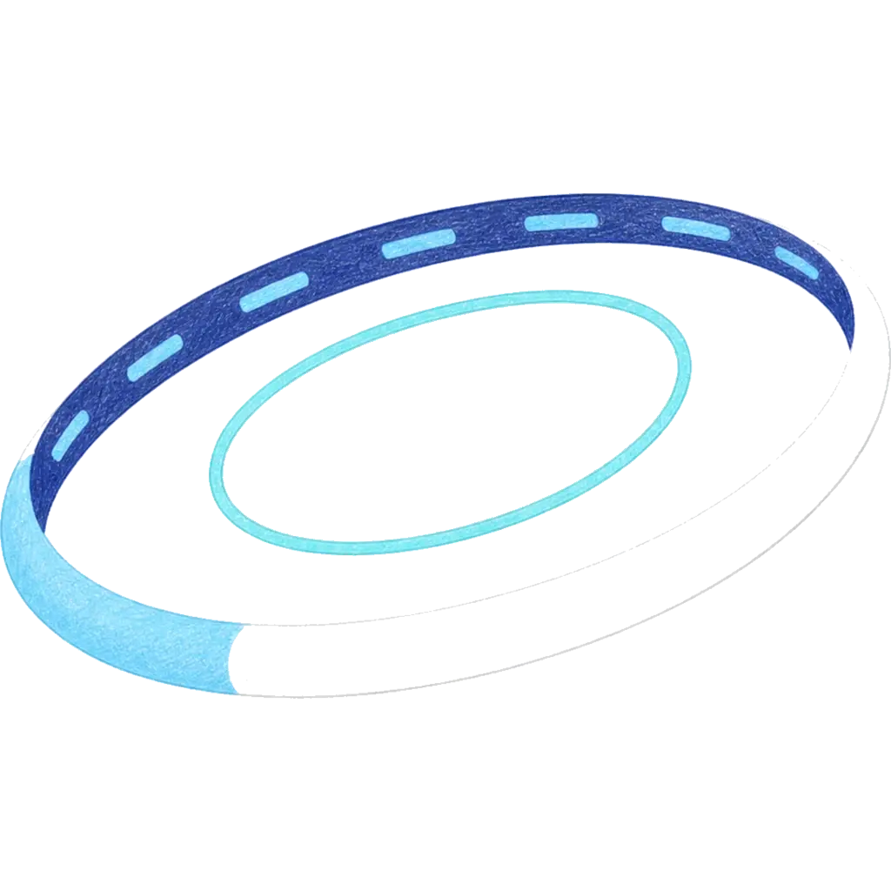

# Noa
<!-- markdownlint-disable MD033 MD041 MD036 -->

**AIネイティブの分散バージョン管理システム**

<!-- markdownlint-enable MD033 MD041 MD036 -->

> [celestia-island](https://github.com/celestia-island) エコシステムの一部。

エージェントごとのワークスペース隔離、JSONL追記専用ログ、スナップショットベースの履歴、および完全な git プロトコル互換性を備えます。

## ドキュメント

アーキテクチャ、設計、ガイドは [docs.celestia.world/en/noa](https://github.com/celestia-island/docs.celestia.world/tree/master/docs/en) にあります。

ソース: [noa](https://github.com/celestia-island/noa)。
