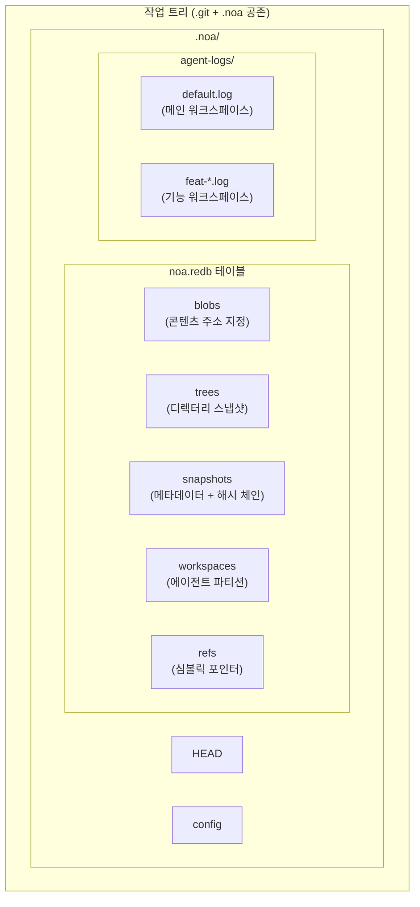
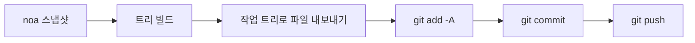
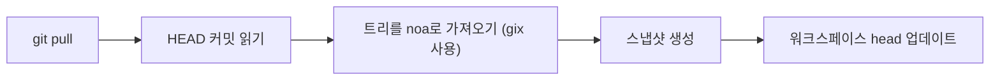
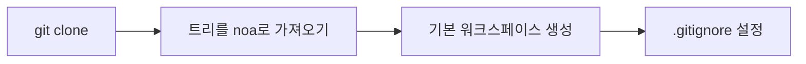

<div align="center"></div>
<h1 align="center">Noa</h1>
<div align="center">
 <strong>AI 네이티브 분산 버전 관리 시스템</strong>
</div>

<br />

<div align="center">
  <a href="https://github.com/celestia-island/noa/actions">
    
  </a>
  <a href="https://github.com/celestia-island/noa/actions">
    
  </a>
  <a href="https://crates.io/crates/libnoa">
    
  </a>
  <a href="https://docs.rs/libnoa">
    
  </a>
  <a href="../../LICENSE">
    
  </a>
  <a href="https://github.com/celestia-island/noa/releases">
    
  </a>
</div>

noa는 AI 네이티브 분산 버전 관리 시스템입니다. `.git`과 공존하며 — git은 소스 코드를 관리하고, noa는 AI 에이전트 반복 데이터를 관리합니다 — 에이전트별 무잠금 JSONL 로그, 스냅샷 기반 히스토리, 그리고 완전한 git 프로토콜 호환성을 제공합니다.

## 목차

- [noa를 사용하는 이유](#noa를-사용하는-이유)
- [아키텍처](#아키텍처)
- [설치](#설치)
- [빠른 시작](#빠른-시작)
- [명령어](#명령어)
- [Git 통합](#git-통합)
- [호환성](#호환성)
- [API (libnoa)](#api-libnoa)
- [소스에서 빌드하기](#소스에서-빌드하기)
- [관련 프로젝트](#관련-프로젝트)
- [라이선스](#라이선스)

## noa를 사용하는 이유

전통적인 git은 모든 기여자를 동일하게 취급합니다 — 인간이든 AI든 관계없이요. 하지만 AI 에이전트는 근본적으로 다른 요구사항을 가지고 있습니다:

| 과제 | Git의 해답 | noa의 해답 |
|-----------|-------------|--------------|
| **동시 쓰기** | 잠금 파일, 병합 충돌 | 에이전트별 JSONL 추가 전용 로그 |
| **에이전트 신원** | 저장소별 user.name/email 설정 | 워크스페이스 범위의 agent_id와 에이전트별 파티션 |
| **부분 기여** | 하나의 커밋 = 작업 트리의 모든 변경사항 | 에이전트 로그는 실제로 수정한 파일만 기록 |
| **반복 추적** | 리베이스/스쿼시로 히스토리 파괴 | 워크스페이스별 불변 스냅샷 체인 |
| **다중 에이전트 병합** | 텍스트에 대한 삼방향 병합 | 스냅샷 병합, 파일 수준 충돌 감지 |
| **Git 프로토콜 호환성** | 해당 없음 | clone/push/pull/fetch를 위한 시스템 git CLI 브리지 |

## 아키텍처



**핵심 개념:**

- **워크스페이스**: 하나의 에이전트를 위한 격리된 선형 네임스페이스. 각각 고유한 JSONL 로그를 가집니다.
- **스냅샷**: 워크스페이스 트리의 특정 시점 기록 (SHA-256 콘텐츠 주소 지정된 blob + tree).
- **에이전트 로그**: blob ID와 타임스탬프를 포함한 원자적 파일 연산(`write`, `delete`, `rename`)을 기록하는 추가 전용 JSONL 파일.
- **병합**: 두 워크스페이스 스냅샷을 공통 베이스 기준으로 삼방향 병합.

## 설치

### GitHub 릴리스에서 설치

```bash
# 플랫폼에 맞는 최신 릴리스 바이너리를 다운로드하세요:
#   https://github.com/celestia-island/noa/releases

chmod +x noa
mv noa /usr/local/bin/
```

### 소스에서 설치 (Rust 1.85+ 필요)

```bash
git clone https://github.com/celestia-island/noa.git
cd noa
cargo build --release
# 바이너리: target/release/noa, target/release/noa-server
```

### 라이브러리로 사용 (Cargo)

```toml
[dependencies]
libnoa = { git = "https://github.com/celestia-island/noa" }
```

참고: crates.io의 패키지 이름은 `libnoa`입니다 (`noa`라는 이름은 이미 사용 중). 바이너리는 여전히 `noa`입니다.

## 빠른 시작

### 기존 git 저장소에서 초기화

```bash
cd my-git-project
noa init                              # .git/ 옆에 .noa/ 생성
noa remote add origin "git@github.com:user/repo.git"
noa pull                              # 현재 git HEAD를 noa로 가져오기
```

### 에이전트 워크스페이스 생성 및 반복

```bash
# 에이전트 A가 인증 기능 작업
noa workspace create feat-auth -a agent-auth
noa workspace switch feat-auth

# 에이전트가 자신의 에이전트 로그에 기록
# (AI 에이전트는 JSONL을 직접 작성합니다. 아래는 수동 예시입니다)
cat >> .noa/agent-logs/feat-auth.log << EOF
{"seq":1,"op":"write","path":"src/auth.rs","blob_id":"<sha256>","ts":1717000000000000}
EOF

# 워크스페이스 상태 저장
noa snapshot create -m "인증 모듈 추가" -a agent-auth
```

### 기능 병합 및 git과 동기화

```bash
noa workspace switch default
noa workspace merge feat-auth          # default로 병합
noa push                               # git 커밋으로 내보내기 + git push
```

## 명령어

### 워크스페이스 관리

```bash
noa workspace create <name> [-a <agent-id>]   # 새 워크스페이스 생성
noa workspace switch <name>                    # 활성 워크스페이스 전환
noa workspace list                              # 모든 워크스페이스 나열
noa workspace delete <name>                     # 워크스페이스 삭제
noa workspace merge <from>                      # 다른 워크스페이스를 현재로 병합
```

### 스냅샷 관리

```bash
noa snapshot create -m <msg> [-a <author>]     # 에이전트 로그에서 스냅샷 생성
noa snapshot list                               # 스냅샷 나열
noa snapshot diff <id-a> <id-b>                # 두 스냅샷 비교 (파일 수준)
```

### 원격 작업

```bash
noa remote add <name> <url>                     # 원격 저장소 추가
noa remote remove <name>                        # 원격 저장소 제거
noa remote list                                 # 원격 저장소 나열
noa fetch [-r <remote>]                         # 원격 참조 나열
noa pull [-r <remote>]                          # Git pull + noa로 다시 가져오기
noa push [-r <remote>]                          # 스냅샷 내보내기 → git 커밋 → git push
```

### 저장소 작업

```bash
noa init [-p <path>] [--noa-remote <url>]      # .noa/ 저장소 초기화
noa clone <url> [-p <path>]                     # Git clone + noa로 가져오기
noa clone --svn <url> [-p <path>]              # SVN 내보내기 → git init → noa로 가져오기
noa status                                       # 현재 워크스페이스 상태 표시
noa log [-w <workspace>] [-n <limit>]          # 스냅샷 히스토리 표시
```

## Git 통합

noa는 모든 네트워크 작업에 시스템 `git` CLI를 사용합니다. 이를 통해 모든 git 원격 저장소와 100% 호환성을 보장합니다.

### Push 워크플로우



### Pull 워크플로우



### Clone 워크플로우



### 주요 설계 결정

- **내보내기는 추가적입니다**: noa 스냅샷에 있는 파일만 작업 트리에 기록됩니다. 스냅샷에 없는 기존 git 추적 파일은 변경되지 않습니다.
- **가져오기는 gix 사용**: 로컬 트리 탐색용 (네트워크 불필요). 네트워크 작업은 시스템 `git` CLI를 사용합니다.
- **`.noa/` 자동 gitignore**: `noa init`은 `.noa/`를 `.gitignore`에 추가하여 에이전트 데이터가 git 히스토리에 유출되지 않도록 합니다.

## 호환성

### 테스트된 플랫폼

| 제공자 | 프로토콜 | Push | Pull | Clone | LFS |
|----------|----------|------|------|-------|-----|
| **GitHub** | HTTPS, SSH | ✓ | ✓ | ✓ | ✓ |
| **Bitbucket** | HTTPS, SSH | ✓ | ✓ | ✓ | ✓ |
| **GitLab** | HTTPS, SSH | ✓ | ✓ | ✓ | ✓ |
| **로컬 bare 저장소** | file:// | ✓ | ✓ | ✓ | ✓ |
| **SVN** | svn:// | 가져오기만 | — | `--svn` | — |

### Git LFS

noa는 Git LFS 저장소를 자동으로 감지합니다:

- `noa clone`: LFS 추적 저장소에 대해 `git lfs install` + `git lfs pull` 실행
- `noa push`: git push 후 `git lfs push --all` 실행
- `noa pull`: git pull 후 `git lfs pull` 실행
- LFS 포인터 파일은 noa에 일반 blob으로 가져옵니다

### SVN

```bash
noa clone --svn file:///path/to/svn/repo -p ./my-project
```

이 명령은 `svn export trunk → git init → noa import`를 수행합니다. 이는 **일회성 가져오기**입니다 — 증분 동기화를 위해서는 일정에 따라 `svn export` + `noa snapshot create`를 사용하세요.

### Bitbucket

SSH (`git@bitbucket.org:ws/repo.git`) 및 HTTPS (`https://user@bitbucket.org/ws/repo.git`) URL 모두 git 브리지를 통해 기본적으로 지원됩니다.

## API (libnoa)

libnoa는 noa 기능을 다른 도구에 내장하기 위한 Rust API를 제공합니다:

```rust
use libnoa::repo::Repository;
use libnoa::snapshot::SnapshotEngine;
use libnoa::log::FileAgentLog;

// 저장소 열기
let repo = Repository::open(&path)?;

// 워크스페이스 생성
let ws_mgr = repo.workspace_manager()?;
ws_mgr.create(&Workspace {
    name: "feat-x".into(),
    head: base_snap_id.clone(),
    base: base_snap_id.clone(),
    agent_id: Some("my-agent".into()),
    created_at: now,
    updated_at: now,
}).await?;

// 에이전트 로그에서 스냅샷 빌드
let engine = SnapshotEngine::new(
    FileAgentLog::new(&path, "my-agent")?,
    repo.snapshot_store()?,
    repo.object_store()?,
)
.with_repo_root(repo.root.clone());
let snapshot = engine.compute("feat-x", vec![], "author", "message").await?;

// 스냅샷을 git으로 내보내기
libnoa::git::export_noa_to_git(&repo.root, repo.db.clone()).await?;
```

더 많은 사용 예제는 `tests/smoke.rs`와 `tests/compat.rs`를 참조하세요.

## 소스에서 빌드하기

```bash
# 필수 조건: Rust 1.85+, git, pkg-config (LFS/SVN용 선택 사항)
git clone https://github.com/celestia-island/noa.git
cd noa

# 빌드
cargo build --release
# 출력: target/release/noa (CLI), target/release/noa-server (API 서버)

# 테스트 실행
cargo test -- --test-threads=1

# noa 서버 시작
NOA_PORT=3000 NOA_DB_PATH=/data/noa/server.redb target/release/noa-server
```

## 관련 프로젝트

| 프로젝트 | 관계 |
|---------|-------------|
| [entelecheia](https://github.com/celestia-island/entelecheia) | 다중 에이전트 오케스트레이션 플랫폼. 에이전트 워크스페이스 버전 관리를 위해 noa를 사용합니다. |
| [tairitsu](https://github.com/celestia-island/tairitsu) | WASM 컴포넌트 모델 프레임워크. 향후: WASM 컴포넌트로서의 noa 클라이언트. |
| [kirino](https://github.com/celestia-island/kirino) | 제로 트러스트 인증/RBAC. noa-server의 인증에 사용됩니다. |

## 라이선스

Apache-2.0. [LICENSE](../../LICENSE) 참조.
