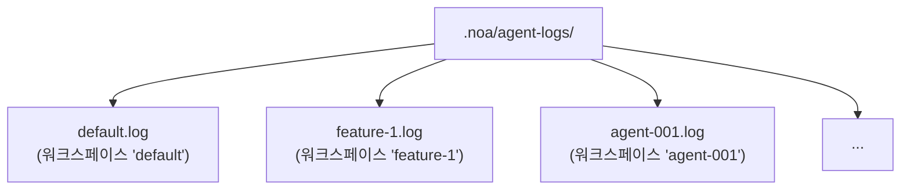
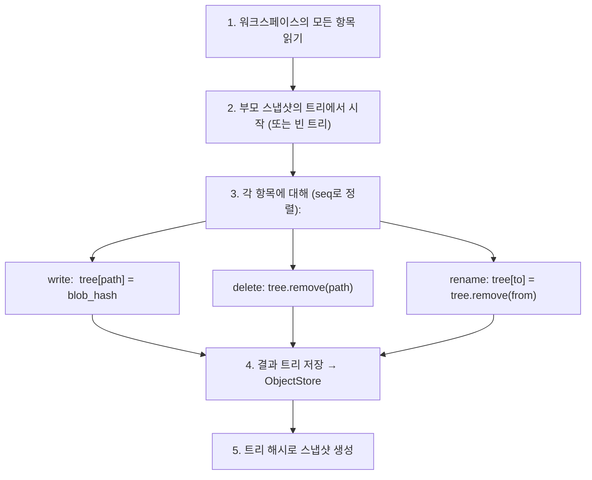
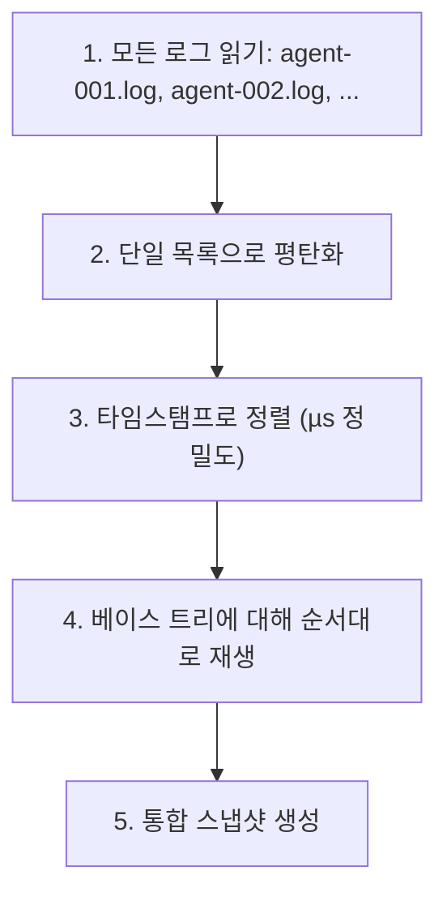

# 에이전트 로그 설계

## 개요

AgentLog는 noa의 고처리량 쓰기 계층입니다. 각 워크스페이스에 대해 추가 전용 JSONL 파일을 제공하여 여러 AI 에이전트의 무잠금 동시 쓰기를 가능하게 합니다.

## 로그 항목 형식

각 줄은 JSON 객체입니다:

```jsonl
{"seq":1,"op":"write","path":"src/main.rs","blob":"a1b2c3...","ts":1717592400000000}
{"seq":2,"op":"delete","path":"src/old.rs","ts":1717592401000000}
{"seq":3,"op":"rename","from":"src/foo.rs","to":"src/bar.rs","ts":1717592402000000}
{"seq":4,"op":"snapshot","snapshot_id":"noa_z7x9","parent":"noa_y6w8","message":"feat","ts":1717592405000000}
{"seq":5,"op":"merge","from_workspace":"feature-1","from_snapshot":"noa_abc","base":"noa_def","ts":1717592408000000}
```

### 필드

| 필드 | 타입 | 설명 |
|-------|------|-------------|
| `seq` | u64 | 워크스페이스별 단조 증가 시퀀스 번호 |
| `op` | string | 작업 유형: write, delete, rename, snapshot, merge |
| `path` | string | 대상 파일 경로 (write, delete) |
| `blob` | string | Blob 해시 (write) |
| `from` | string | 원본 경로 (rename) |
| `to` | string | 대상 경로 (rename) |
| `ts` | u64 | 마이크로초 정밀도 Unix 타임스탬프 |

## 파일 구조



각 워크스페이스는 정확히 하나의 로그 파일을 가집니다. 파일 이름은 워크스페이스 이름과 일치합니다.

## 쓰기 경로

```rust
async fn append(&self, workspace: &str, entry: &LogEntry) -> Result<()> {
    let file = self.get_or_create_file(workspace)?;
    let line = serde_json::to_string(entry)? + "\n";
    file.write_all(line.as_bytes())?;
    file.sync_data()?;  // 내구성을 위한 fdatasync
    Ok(())
}
```

주요 속성:
- **O_APPEND**: 커널이 원자적 추가를 보장
- **쓰기당 fsync**: 충돌 후 내구성 보장
- **워크스페이스당 하나의 fd**: 성능을 위해 메모리에 캐시됨

## 읽기 경로

```rust
async fn read_all(&self, workspace: &str) -> Result<Vec<LogEntry>> {
    let path = self.log_dir.join(format!("{}.log", workspace));
    let content = tokio::fs::read_to_string(&path).await?;
    content.lines()
        .filter(|l| !l.is_empty())
        .map(|l| serde_json::from_str(l))
        .collect::<Result<Vec<_>, _>>()
        .map_err(|e| NoaError::Serialization(e.to_string()))
}
```

## 스냅샷 계산

`SnapshotEngine`은 로그 항목을 재생하여 트리를 빌드합니다:



## 통합

여러 에이전트 로그를 병합해야 할 때:



## 비교: 왜 이걸 사용하지 않는가?

### 에이전트 로그에 SQLite를?

- **쓰기 증폭**: 순차 추가에 대한 SQLite B-트리 업데이트
- **잠금**: SQLite는 WAL 잠금을 사용 (단일 쓰기)
- **fsync 오버헤드**: SQLite는 트랜잭션당 여러 fsync를 발생시킴
- **과잉**: 에이전트 로그는 추가 전용 — 임의 읽기나 업데이트가 없음

### 에이전트 로그에 redb를?

- **단일 쓰기**: redb의 MVCC는 쓰기 트랜잭션이 필요
- **경합**: 여러 에이전트가 동일한 DB에 쓰기 → 직렬화됨
- **추가 최적화 안 됨**: redb는 범용 KV 저장소

### 인메모리 버퍼를?

- **내구성**: 프로세스 충돌 시 모든 버퍼링된 쓰기 손실
- **메모리 압박**: 100개 에이전트 × 1000 쓰기 = 메모리에 10만 개 항목
- **복잡성**: 충돌 복구가 포함된 백그라운드 플러시 스레드 필요

### O_APPEND가 있는 일반 JSONL을?

✅ 이것이 noa가 사용하는 것입니다:
- **최소 오버헤드**: 항목당 하나의 쓰기 + 하나의 fsync
- **커널 보장 원자성**: POSIX의 O_APPEND
- **충돌 복구**: 마지막 항목만 부분적일 수 있음 (후행 개행으로 감지)
- **사람이 읽을 수 있음**: JSONL은 표준 도구로 검사 가능
- **잠금 경합 제로**: 워크스페이스당 하나의 파일

## 성능

벤치마크 (ext4, SSD, Linux):

| 측정 항목 | 값 |
|--------|-------|
| 단일 쓰기 지연 시간 | ~0.05ms (추가 + fdatasync) |
| 처리량 (워크스페이스 1개) | ~20,000 쓰기/초 |
| 처리량 (워크스페이스 100개) | ~10,000+ 쓰기/초 |
| 100만 항목당 파일 크기 | ~200MB (항목당 평균 200바이트) |

## 충돌 복구

시작 시 각 로그 파일을 스캔:
1. 모든 완전한 줄 읽기 (`\n`으로 끝남)
2. 마지막 줄이 잘렸으면 폐기 (불완전한 쓰기)
3. `seq`가 단조 증가하는지 확인
4. 유효한 항목에서 인메모리 상태 재구축

이렇게 하면 부분적이거나 손상된 항목이 스냅샷 계산에 사용되지 않도록 보장합니다.
