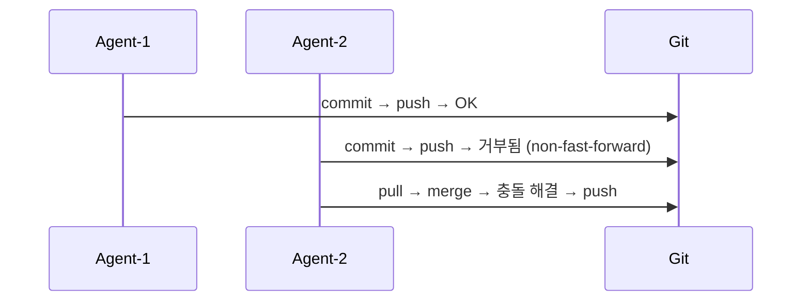
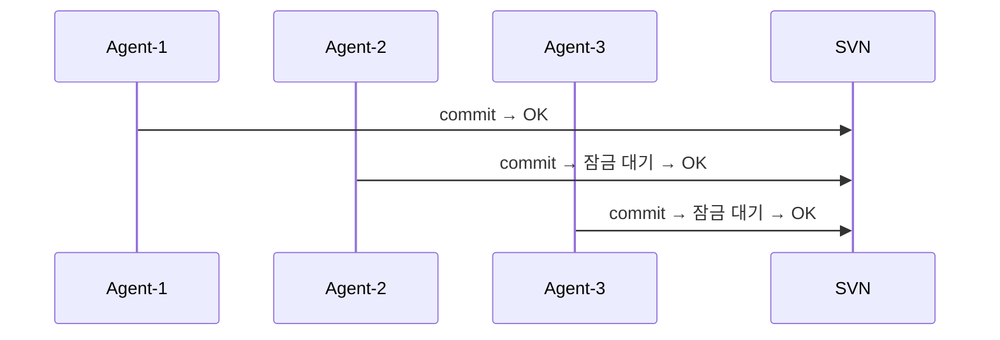
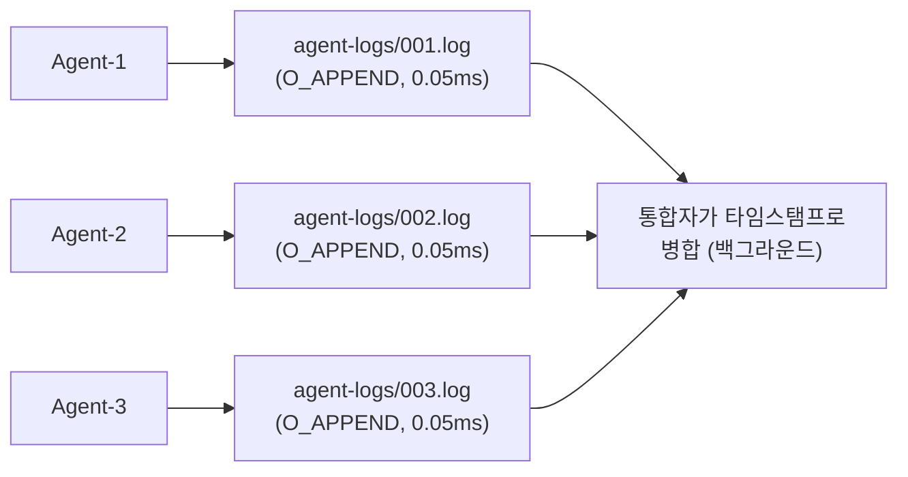
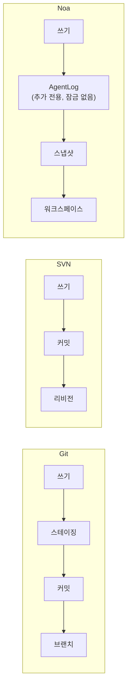
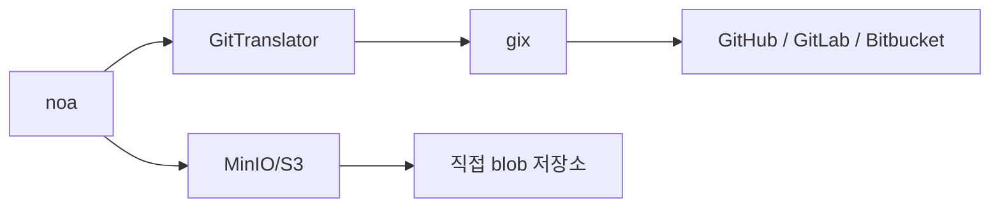

# noa vs Git vs SVN vs Bitbucket: 비교 분석

## 개요

noa는 AI 에이전트 워크플로우를 위해 특별히 설계된 버전 관리 시스템입니다.
Git, SVN, Bitbucket(Git/SVN을 래핑)과 달리, noa는 잠금 경합 없이 동시에 파일을 수정하는 수십에서 수백 개의 AI 에이전트인 **비인간 행위자의 고빈도 동시 쓰기**에 최적화되어 있습니다.

---

## 기능 비교 매트릭스

| 기능 | noa | Git | SVN | Bitbucket |
|---------|-----|-----|-----|-----------|
| **아키텍처** | 내장 KV + 추가 전용 로그 | 콘텐츠 주소 지정 DAG | 중앙 집중 델타 저장소 | Git/SVN 호스팅 |
| **동시성 모델** | 워크스페이스별 추가 전용 로그 (무잠금) | 브랜치 수준 잠금 (병합 충돌) | 중앙 서버 직렬화 | Git/SVN과 동일 |
| **병합 전략** | 삼방향, upstream-wins 기본값 | 삼방향, 수동 해결 | 수동 병합 | Git/SVN과 동일 |
| **스냅샷 세분성** | 마이크로초 타임스탬프, 에이전트별 | 커밋별 (인간 주기) | 리비전별 | Git/SVN과 동일 |
| **에이전트 네이티브** | 예 — 에이전트별 워크스페이스, 에이전트 로그 | 아니요 — 인간 워크플로우용 설계 | 아니요 | 아니요 |
| **저장소 백엔드** | 교체 가능 (redb 로컬, MinIO/S3 원격) | 팩 파일 + 느슨한 객체 | Berkeley DB / FSFS | 서버 측 저장소 |
| **분산형** | 예 (Git 브리지를 통한 원격 push/pull) | 예 (네이티브) | 아니요 (중앙 집중) | 예 (호스팅됨) |
| **바이너리 diff** | 콘텐츠 주소 지정 blob (델타 없음) | 팩 수준 델타 압축 | 서버 측 델타 | Git/SVN과 동일 |
| **잠금** | 쓰기에 없음 (추가 전용 로그) | 권고 잠금만 | `svn:needs-lock` | Git/SVN과 동일 |
| **HTTP API** | 내장 (noa-server) | git-http-backend | WebDAV | REST API |
| **학습 곡선** | 최소 (6개 명령어) | 가파름 (~40개 명령어) | 보통 | 보통 |

---

## 상세 비교

### 1. 동시성

**Git**: 한 브랜치 = 한 번에 한 명의 작성자. 동시 작성자는 병합을 통해 조정해야 하는 분기된 히스토리를 생성합니다. 병합 충돌은 인간의 개입이 필요합니다.



**SVN**: 중앙 서버가 모든 커밋을 직렬화합니다. 파일 수준 잠금이 가능하지만 병목 현상을 만듭니다.



**noa**: 각 에이전트가 자신의 추가 전용 로그 파일에 기록합니다. 설계상 잠금 경합이 제로입니다. 통합은 비동기적으로 발생합니다.



### 2. 데이터 모델

**Git**: Blob → Tree → Commit → Branch → Ref. SHA-1로 콘텐츠 주소 지정.
불변 객체. 브랜치는 가변 포인터.

**SVN**: 파일/디렉터리 → 리비전. 선형 리비전 번호. 경로가 일급 엔티티.

**noa**: Blob → Tree → Snapshot → Workspace. SHA-256으로 콘텐츠 주소 지정.
스냅샷은 불변. 워크스페이스는 CAS 업데이트가 있는 가변 포인터.

주요 차이점: noa의 **AgentLog** 계층은 에이전트의 쓰기와 불변 스냅샷 계층 사이에 위치하여, 고빈도 작업을 위한 버퍼를 제공합니다.



### 3. 병합 철학

**Git**: 인간 충돌 해결을 통한 삼방향 병합. 충돌은 해결될 때까지 진행을 차단합니다.

**SVN**: 수동 병합 추적. 충돌 해결은 파일 수준.

**noa**: 구성 가능한 자동 해결을 통한 삼방향 병합 (기본값: upstream-wins). 충돌을 수동으로 해결하는 대신 변경 사항을 다시 적용할 수 있는 AI 에이전트를 위해 설계되었습니다.

근거: AI 에이전트는 충돌 마커를 볼 필요가 없습니다 — 최신 상태에 대해 변경 사항을 다시 생성할 수 있습니다. "upstream-wins" 전략은 전진 진행을 보장합니다.

### 4. 저장소 효율성

**Git**: 델타 압축이 포함된 팩 파일. 인간 규모의 커밋 빈도(~10-100 커밋/일)에 최적화.

**SVN**: 서버 측 델타 저장소. 대용량 바이너리 파일에 효율적.

**noa**: 델타 압축 없는 콘텐츠 주소 지정 blob. 스냅샷은 msgpack으로 인코딩됨. 트레이드오프: 더 단순한 구현, 더 빠른 쓰기, 더 큰 저장소. 다음과 같은 이유로 수용 가능:
- AI 에이전트 아티팩트는 종종 재생성됨 (이전 버전은 일시적)
- 저장소는 저렴하고 에이전트 처리량은 비쌈
- MinIO/S3 백엔드가 중복 제거를 처리

### 5. 원격 상호 운용성

**Git**: 네이티브 프로토콜 (git://, https://, ssh://). 보편적.

**SVN**: svn://, http://. Apache/Subversion에 종속됨.

**noa**: `gix`(gitoxide)를 통한 Git 브리지. 모든 Git 원격에서 push/pull 가능.
직접 객체 저장을 위한 네이티브 MinIO/S3 백엔드도 지원.



### 6. 접근 제어

**Git**: 파일 시스템 권한 또는 서버 측 훅 (pre-receive 등).

**SVN**: 프로토콜에 내장된 경로 기반 ACL.

**Bitbucket**: 브랜치 권한, 병합 검사, 코드 리뷰 요구사항.

**noa**: 워크스페이스 수준 격리. 각 에이전트는 할당된 워크스페이스에만 쓸 수 있습니다. 공유 브랜치로의 병합은 명시적 작업이 필요합니다. noa-server를 통한 서버 측 인증.

---

## 사용 시기

| 시나리오 | 최선의 선택 | 이유 |
|----------|-------------|--------|
| 인간 소프트웨어 개발 | Git | 성숙한 생태계, 보편적 도구 |
| AI 에이전트 코드 생성 (10+ 에이전트) | noa | 무잠금 동시 쓰기 |
| 엔터프라이즈 규정 준수 + 감사 | SVN | 중앙 집중식, 경로 기반 ACL |
| 팀 협업 + CI/CD | Bitbucket | 내장 파이프라인, PR, 리뷰 |
| AI 에이전트 오케스트레이션 + 인간 리뷰 | noa → Git 브리지 | 에이전트는 noa에서 작업, 인간은 Git으로 리뷰 |
| 대용량 바이너리 자산 | SVN 또는 Git LFS | 바이너리용 델타 압축 |
| 임베디드 / 엣지 장치 | noa | 단일 바이너리, redb 내장, 데몬 없음 |

---

## 마이그레이션 경로

### noa ↔ Git

```bash
# noa 스냅샷을 Git으로 내보내기
noa remote add origin https://github.com/example/repo.git
noa push --remote origin

# Git 히스토리를 noa로 가져오기
noa clone https://github.com/example/repo.git
```

`GitTranslator`는 noa의 blob/tree 형식과 Git의 객체 형식 간에 변환합니다. 스냅샷은 Git 커밋에 매핑되고, 워크스페이스는 브랜치에 매핑됩니다.

### Git → noa

대체가 아닙니다 — noa는 AI 에이전트 워크플로우를 위한 Git의 **보완**입니다.
둘 다 사용하세요:
1. AI 에이전트는 noa 워크스페이스에서 작업
2. 승인된 변경 사항은 push를 통해 Git으로 병합
3. 인간 개발자는 이전과 동일하게 Git을 계속 사용
