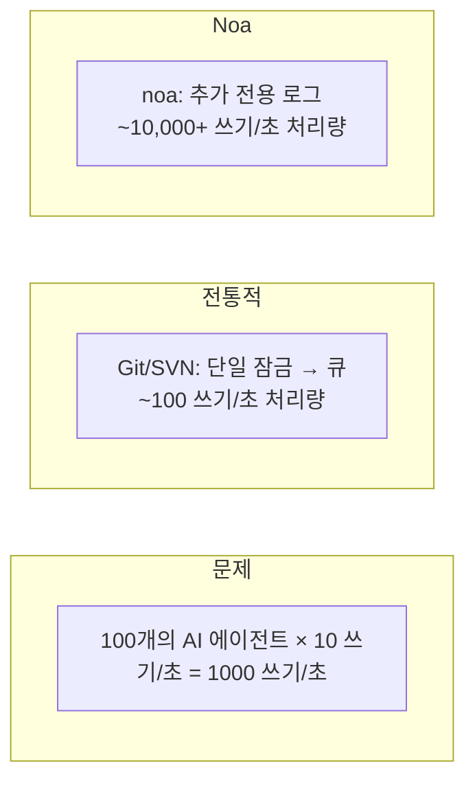
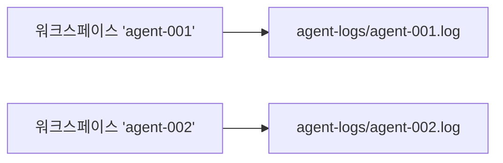
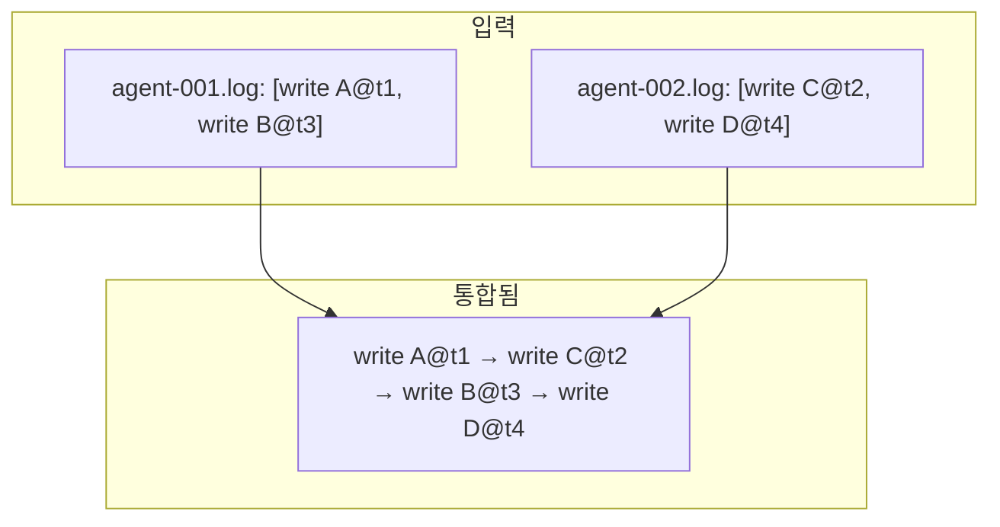
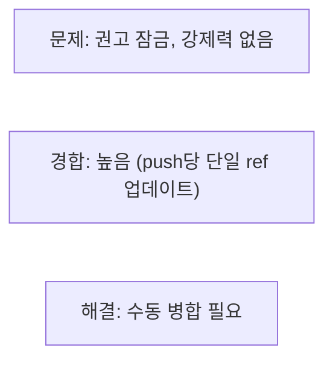
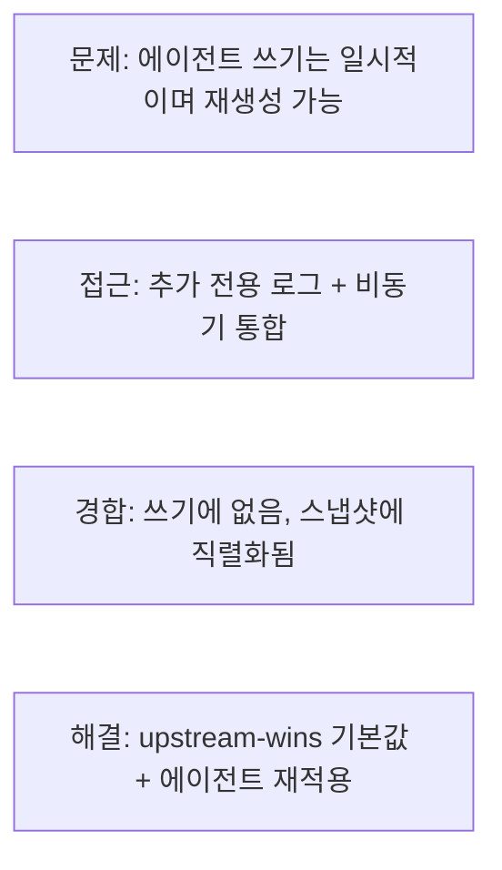

# 동시성 설계

## 문제 정의

전통적인 VCS 시스템은 단일 잠금 또는 병합 큐를 통해 쓰기를 직렬화합니다.
이는 인간 규모의 워크플로우(10-100 커밋/일)에서는 작동하지만,
분당 수천 개의 파일 수정을 생성하는 AI 에이전트에서는 무너집니다.



## 아키텍처

### 계층 1: AgentLog (쓰기 경로)

각 워크스페이스는 `.noa/agent-logs/` 아래에 전용 JSONL 파일을 가집니다.



쓰기는 `O_APPEND` 플래그를 사용하여 다음을 제공합니다:
- **원자성**: 커널이 추가에 대한 전체 쓰기 원자성을 보장
- **순서**: 쓰기는 파일별(워크스페이스별)로 직렬화됨
- **잠금 없음**: 다른 파일 간에는 fcntl/flock이 필요하지 않음

```rust
pub trait AgentLog: Send + Sync {
    async fn append(&self, workspace: &str, entry: &LogEntry) -> Result<()>;
    async fn read_all(&self, workspace: &str) -> Result<Vec<LogEntry>>;
}
```

### 계층 2: Snapshot Store (읽기 경로)

스냅샷은 MVCC(다중 버전 동시성 제어)와 함께 redb에 저장됩니다:
- 쓰기는 redb의 단일 쓰기 트랜잭션을 통해 직렬화됨
- 읽기는 쓰기를 차단하지 않음 (스냅샷 격리)
- 여러 리더가 동시에 접근 가능

### 계층 3: 통합 (병합 경로)

`Consolidator`는 모든 워크스페이스의 모든 에이전트 로그를 읽고, 타임스탬프로 정렬하여 통합된 스냅샷 체인을 생성합니다:



이는 비동기적으로 실행되며 에이전트 쓰기를 차단하지 않습니다.

## 동시성 보장

| 보장 | 메커니즘 |
|-----------|-----------|
| 데이터 손실 없음 | O_APPEND + 쓰기당 fsync |
| 워크스페이스별 순서 | 워크스페이스당 단일 파일 |
| 워크스페이스 간 순서 | 마이크로초 타임스탬프 |
| 읽기 일관성 | redb MVCC 스냅샷 격리 |
| 워크스페이스 헤드 안전성 | CAS (compare-and-swap) 업데이트 |

## 확장성 분석

### 단일 프로세스 (내장)

| 에이전트 | 1-100 (동일 프로세스) |
| 처리량 | ~10,000 쓰기/초 |
| 병목 | 디스크 I/O (쓰기당 fsync) |

### 다중 프로세스 (noa-server)

| 에이전트 | 100-1000 (별도 프로세스) |
| 처리량 | ~5,000 쓰기/초 |
| 병목 | 서버 측 쓰기 직렬화 |

서버는 단일 데이터베이스 연결을 보유하고 쓰기를 직렬화합니다.
에이전트 로그는 병렬 수집을 위해 파일별로 유지됩니다.

### 분산형 (MinIO 백엔드)

| 에이전트 | 1000+ |
| 처리량 | S3 PUT 속도 제한 (~3,500/초/프리픽스) |
| 병목 | 네트워크 + S3 속도 제한 |

## 대안과의 비교

### Git + 파일 잠금



### SVN + svn:needs-lock


### 운영 변환 (OT)


### CRDT (충돌 없는 복제 데이터 타입)


### noa의 접근 방식



## fsync 전략

모든 에이전트 로그 쓰기는 다음 패턴을 따릅니다:

```rust
file.write_all(data)?;   // 파일에 추가
file.flush()?;           // 사용자 공간 버퍼 플러시
file.sync_data()?;       // fsync — 디스크 내구성 보장
```

Linux에서 `sync_data()`는 메타데이터 동기화를 건너뛰어(fdatasync) 전체 fsync에 비해 지연 시간을 약 30% 줄입니다.

## 미래: 쓰기 선행 로그 배치 처리

현재: 쓰기당 한 번의 fsync.
계획: 여러 쓰기를 단일 fsync로 배치 처리:

```rust
// 에이전트가 메모리에 쓰기를 버퍼링
agent.buffer(write_a);
agent.buffer(write_b);
agent.buffer(write_c);
agent.flush(); // 세 개 모두에 대해 단일 fsync
```

예상 처리량 개선: 버스트 쓰기에 대해 3-5배.
