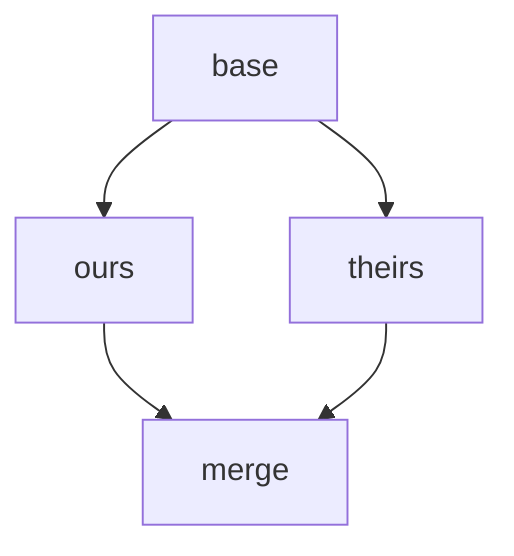
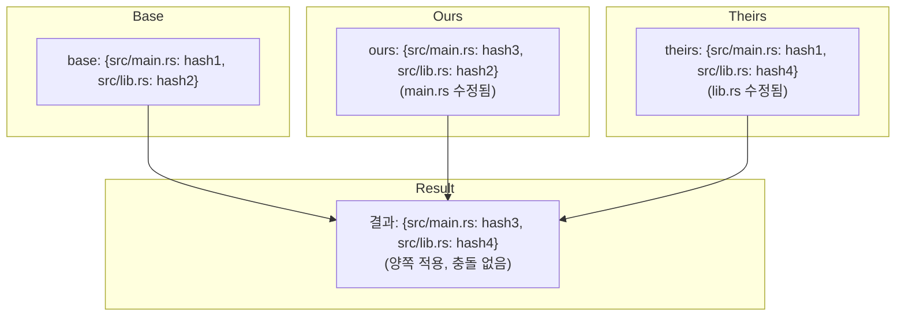
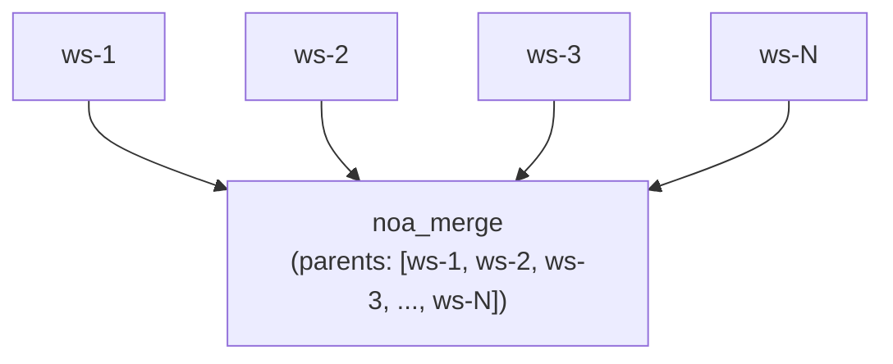
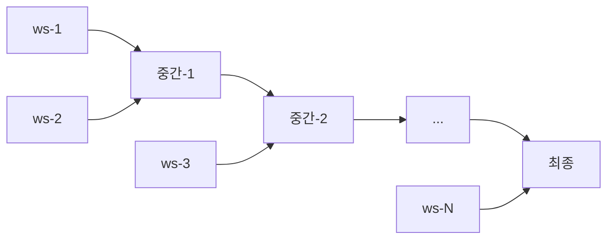

# 병합 전략 설계

## 개요

noa는 구성 가능한 충돌 해결을 통해 삼방향 병합 알고리즘을 사용합니다.
설계는 인간의 개입보다 **전진 진행**을 우선시하며,
변경 사항을 재생성할 수 있는 AI 에이전트 사용 사례를 반영합니다.

## 삼방향 병합

### 알고리즘

공통 조상(base)을 가진 두 스냅샷(ours, theirs)이 주어졌을 때:



1. `base` vs `ours` 비교 → changes_A
2. `base` vs `theirs` 비교 → changes_B
3. 어느 한쪽에 의해 수정된 각 경로에 대해:
   - 양쪽에서 동일한 변경 → 적용 (충돌 없음)
   - A에서만 변경 → A 적용
   - B에서만 변경 → B 적용
   - 동일한 경로에 대한 서로 다른 변경 → **충돌**

### 구현

```rust
pub fn three_way_merge(
    base_tree: &Vec<TreeEntry>,
    ours_tree: &Vec<TreeEntry>,
    theirs_tree: &Vec<TreeEntry>,
) -> (Vec<TreeEntry>, Vec<Conflict>)
```

트리 항목은 비교를 위해 평면 경로→해시 맵으로 정규화됩니다:



## 충돌 감지

```rust
pub struct Conflict {
    pub path: String,
    pub base_hash: Option<String>,
    pub ours_hash: Option<String>,
    pub theirs_hash: Option<String>,
}
```

충돌 유형:
- **수정/수정**: 양쪽이 동일한 파일을 다르게 변경
- **추가/추가**: 양쪽이 동일한 경로에 다른 내용의 파일을 추가
- **삭제/수정**: 한쪽은 삭제, 다른 쪽은 수정

## 해결 전략

### upstream-wins (기본값)

충돌이 감지되면 theirs 버전을 채택:

```rust
ConflictResolution::UpstreamWins => theirs_hash,
```

근거: AI 에이전트 워크플로우에서 "업스트림"(메인/기본 워크스페이스)은
표준 상태를 나타냅니다. 에이전트는 업데이트된 베이스에 대해 변경 사항을 다시 적용할 수 있습니다.

### ours-wins

우리 버전을 채택:

```rust
ConflictResolution::OursWins => ours_hash,
```

### fail (계획됨)

병합을 중단하고 수동 해결을 위해 충돌 반환:

```rust
ConflictResolution::Fail => return Err(MergeError::Conflict(conflicts)),
```

## 워크스페이스 병합 흐름

```bash
noa workspace switch default          # ours = default 설정
noa workspace merge feature-1         # theirs = feature-1
```

내부 단계:
1. ours 스냅샷 로드 (default의 head)
2. theirs 스냅샷 로드 (feature-1의 head)
3. 병합 베이스 찾기 (DAG의 최신 공통 조상)
4. 공통 조상이 없으면 `noa_empty`를 베이스로 사용
5. 삼방향 병합 수행
6. 충돌 해결 전략 적용
7. parents = [ours, theirs]인 병합 스냅샷 생성
8. default의 head를 병합 스냅샷으로 업데이트

## 다중 부모 병합

noa 스냅샷은 무제한 부모를 지원하여 문어 스타일 병합을 가능하게 합니다:



N-way 병합의 경우, 알고리즘은 쌍별 병합을 수행합니다:



## Git 병합과의 비교

| 측면 | noa | Git |
|--------|-----|-----|
| 알고리즘 | 삼방향 | 삼방향 (동일한 핵심 알고리즘) |
| 충돌 마커 | 없음 (자동 해결) | `<<<<<<<` / `=======` / `>>>>>>>` |
| 기본 해결 | upstream-wins | 없음 (인간 필요) |
| 다중 부모 | 무제한 | 일반적으로 ≤2 |
| Rebase | 지원 안 함 | 지원함 |
| Cherry-pick | 지원 안 함 | 지원함 |
| Fast-forward | 자동 | 선택적 (–no-ff) |

## SVN 병합과의 비교

| 측면 | noa | SVN |
|--------|-----|-----|
| 병합 추적 | 내장 (부모 DAG) | 수동 (mergeinfo 속성) |
| 충돌 해결 | 자동 | 수동 (충돌 파일) |
| 브랜치 모델 | 워크스페이스 (경량) | 디렉터리 기반 (무거움) |
| 병합 방향 | 모든 방향 → 모든 방향 (DAG) | 일반적으로 브랜치 → 트렁크 |

## 설계 근거: 자동 해결을 사용하는 이유?

전통적인 VCS는 다음과 같은 이유로 인간의 충돌 해결이 필요합니다:
1. 인간이 작성한 코드는 인간만 이해할 수 있는 의미적 의미를 가집니다
2. 충돌은 근본적인 설계 의견 차이를 나타낼 수 있습니다
3. 수동 해결은 정확성을 보장합니다

AI 에이전트 변경 사항은 다른 특성을 가집니다:
1. **재생성 가능**: 에이전트는 최신 상태에 대해 변경 사항을 다시 적용할 수 있습니다
2. **고빈도**: 인간 해결을 위해 일시 중지하면 모든 하위 작업이 차단됩니다
3. **비의미적**: 파일 수준 변경은 인간의 해석이 필요하지 않습니다

따라서 명확한 정책(upstream-wins)을 통한 자동 해결이 noa의 사용 사례에 올바른 트레이드오프입니다.
