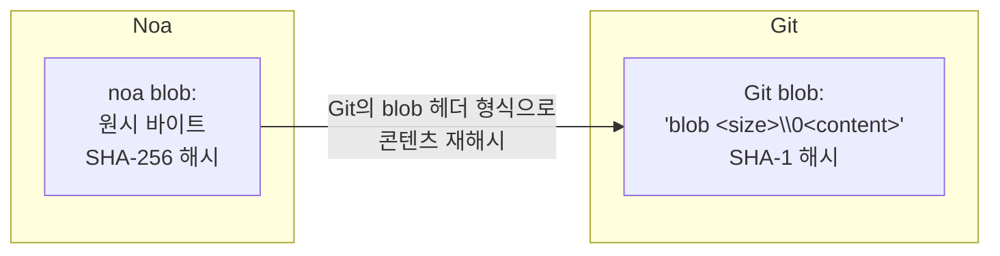
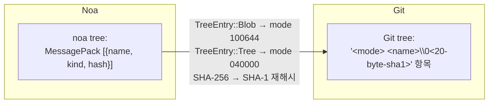
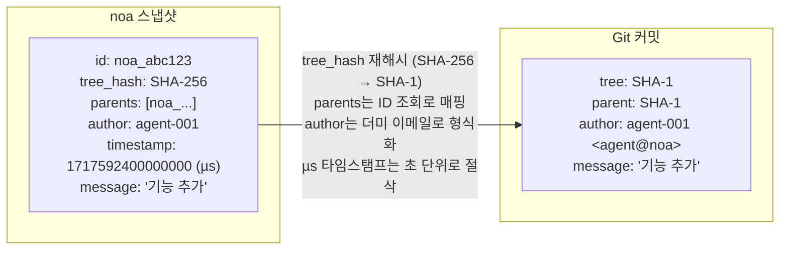
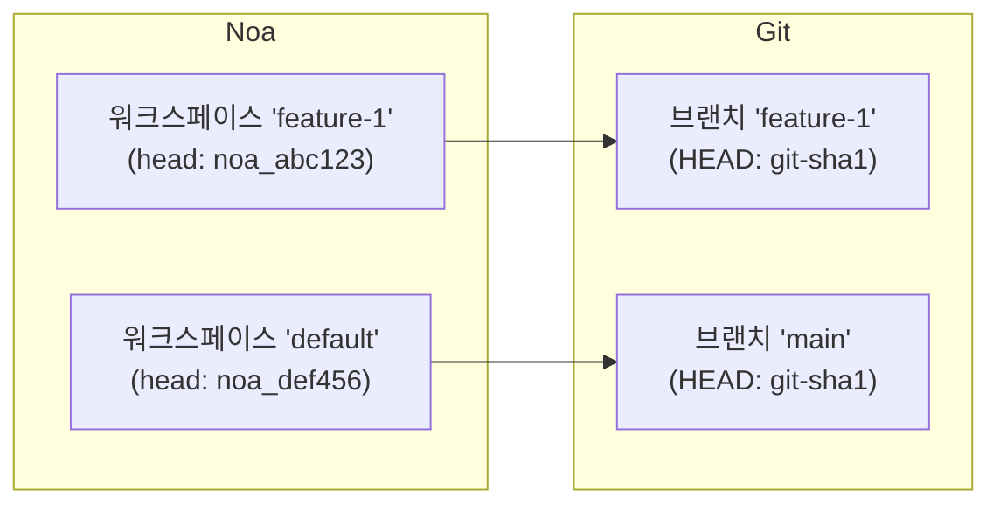
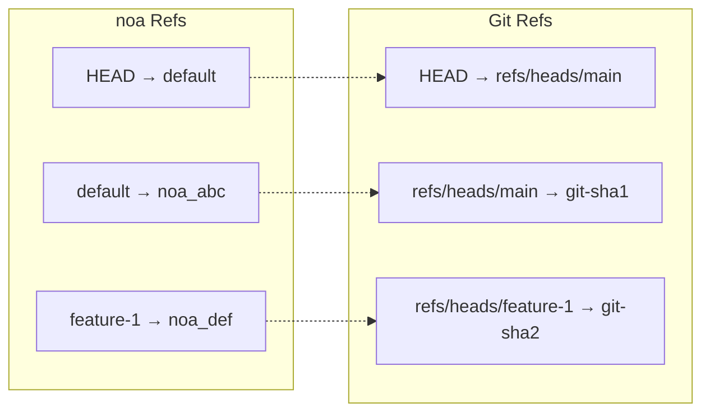
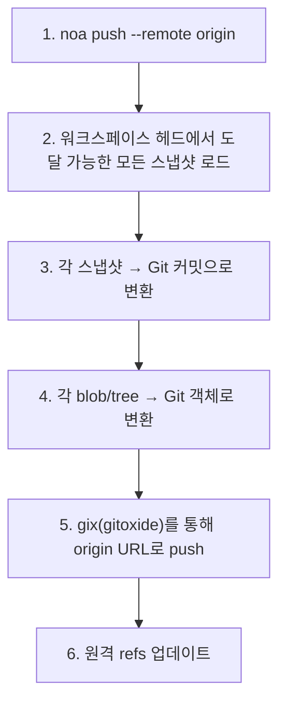
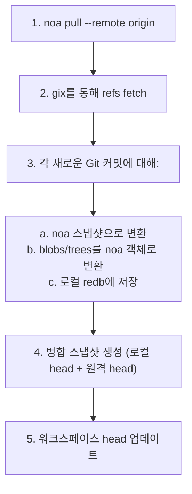
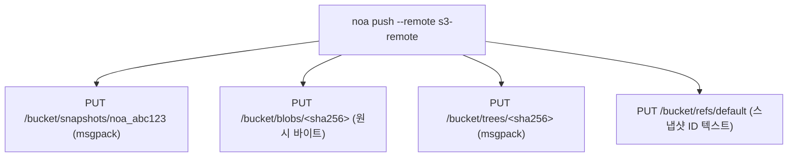

# 원격 상호 운용성 설계

## 개요

noa는 여러 머신과 팀 간에 스냅샷과 객체를 동기화하기 위한 다양한 원격 백엔드를 지원합니다. 주요 상호 운용성 대상은 Git으로, GitHub, GitLab, Bitbucket의 기존 워크플로우와의 원활한 통합을 가능하게 합니다.

## 원격 백엔드 트레이트

```rust
#[async_trait]
pub trait RemoteBackend: Send + Sync {
    async fn push_snapshots(&self, ids: &[SnapshotId]) -> Result<()>;
    async fn fetch_snapshots(&self, ids: &[SnapshotId]) -> Result<Vec<Snapshot>>;
    async fn push_objects(&self, ids: &[String]) -> Result<()>;
    async fn fetch_objects(&self, ids: &[String]) -> Result<()>;
    async fn list_refs(&self) -> Result<HashMap<String, SnapshotId>>;
    async fn update_ref(&self, name: &str, old: Option<&SnapshotId>, new: &SnapshotId) -> Result<()>;
}
```

## Git 변환 계층

`GitTranslator`는 noa의 객체 모델과 Git의 객체 모델 간에 변환합니다:

### Blob ↔ Git Blob



### Tree ↔ Git Tree



### Snapshot ↔ Git Commit



### Workspace ↔ Git Branch



### Ref 매핑



## Push 흐름



## Pull 흐름



## MinIO/S3 백엔드

Git 인프라가 없는 배포의 경우:



Git 원격 대비 장점:
- 트리/스냅샷 변환 불필요 (네이티브 noa 형식)
- 직접 blob 저장 (팩 파일 오버헤드 없음)
- S3 호환 (AWS, GCS, MinIO, Cloudflare R2와 작동)

## 원격 설정

`.noa/config`에 저장됨 (TOML):

```toml
[[remotes]]
name = "origin"
url = "https://github.com/example/repo.git"
backend = "git"

[[remotes]]
name = "s3"
url = "s3://my-bucket/noa-repo"
backend = "minio"
endpoint = "https://s3.amazonaws.com"
region = "us-east-1"
```

## 인증

| 백엔드 | 방법 |
|---------|--------|
| Git HTTPS | `~/.git-credentials`의 자격 증명 또는 프롬프트 |
| Git SSH | SSH 에이전트 또는 키 파일 |
| MinIO/S3 | 액세스 키 + 비밀 키 (환경 변수 또는 설정) |

## 비교: 원격 상호 운용 접근 방식

| 접근 방식 | 사용처 | 장점 | 단점 |
|----------|---------|------|------|
| Git 브리지 (gix) | noa | 보편적 호환성 | 변환 오버헤드, SHA-1/SHA-256 불일치 |
| 네이티브 프로토콜 | Git | 빠름, 변환 없음 | Git에서만 작동 |
| WebDAV | SVN | HTTP 표준 | 제한적, SVN 전용 |
| REST API | Bitbucket | 현대적, 유연함 | 호스팅 서비스 필요 |
| S3 호환 저장소 | noa | 확장 가능, 클라우드 네이티브 | 브리지 없이는 Git 상호 운용 불가 |

noa는 Git 브리지(호환성용)와 네이티브 S3(확장성용)를 모두 지원합니다.
