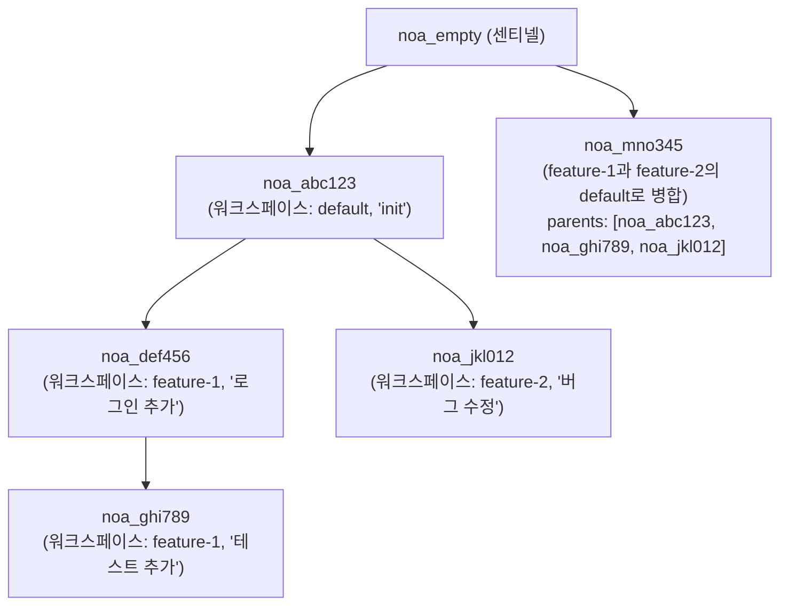
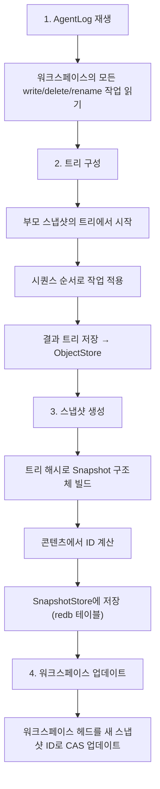

# 스냅샷 모델 설계

## 개요

스냅샷은 특정 시점의 워크스페이스의 완전한 파일 트리 상태에 대한 불변의 콘텐츠 주소 지정 레코드입니다. 스냅샷은 부모 참조를 통해 방향성 비순환 그래프(DAG)를 형성합니다.

## 스냅샷 구조

```rust
pub struct SnapshotId(pub String);  // "noa_<12-char-base62>"

pub struct Snapshot {
    pub id: SnapshotId,
    pub tree_hash: String,           // 루트 트리의 SHA-256
    pub parents: Vec<SnapshotId>,    // 0-N개의 부모 스냅샷
    pub workspace: String,           // 원본 워크스페이스
    pub author: String,              // 에이전트 또는 인간 식별자
    pub timestamp: u64,              // 에포크 이후 마이크로초
    pub message: String,             // 사람이 읽을 수 있는 설명
}
```

## ID 생성

스냅샷 ID는 `noa_` 접두사가 붙은 12자 base62 문자열을 사용합니다:

```
noa_3kF8x2mP9aB1
```

생성: `SHA256(tree_hash || parents || workspace || timestamp)[0..9]`를 base62로 인코딩. 이는 다음을 제공합니다:
- 62^12 ≈ 3.2 × 10^21개의 가능한 ID
- 충돌 확률은 실질적으로 0
- 결정론적: 동일한 입력 → 동일한 ID (중복 제거 가능)

## 스냅샷 DAG



## 스냅샷 생성 흐름



## 스냅샷 저장소

스냅샷은 ID로 키 지정된 redb 테이블에 저장됩니다:

```
테이블: snapshots
  키:   "noa_abc123" (&str로서의 SnapshotId)
  값:   msgpack(Snapshot) (&[u8]로서)
```

## Diff 알고리즘

`diff_snapshots(base, other)`는 파일 수준 변경 목록을 생성합니다:

```rust
pub struct FileDiff {
    pub path: String,
    pub kind: DiffKind, // 추가됨, 제거됨, 수정됨
    pub old_blob: Option<String>,
    pub new_blob: Option<String>,
}
```

알고리즘:
1. 두 스냅샷의 루트 트리 로드
2. 두 트리를 동시에 재귀적으로 순회
3. 각 경로에서 blob 해시 비교
4. 다른 해시 → 수정됨; 한쪽에만 있음 → 추가됨/제거됨

시간 복잡도: O(n), 여기서 n = 두 트리의 총 파일 수.

## 센티넬 스냅샷

`noa_empty`는 빈 트리를 나타내는 예약된 스냅샷 ID입니다. 모든 새 저장소는 이를 베이스로 시작합니다. 명시적으로 저장되지는 않습니다 — 워크스페이스 관리자는 이를 "아직 스냅샷 없음"으로 인식합니다.

## Git 커밋과의 비교

| 측면 | noa 스냅샷 | Git 커밋 |
|--------|-------------|------------|
| ID 형식 | `noa_<base62>` | SHA-1 16진수 |
| 부모 제한 | 무제한 (병합 DAG) | 일반적으로 1-2 |
| 트리 형식 | MessagePack | 사용자 정의 바이너리 |
| 타임스탬프 | 마이크로초 정밀도 | 초 정밀도 + 시간대 |
| 작성자 필드 | 에이전트 ID 또는 인간 | 이름 + 이메일 |
| 불변성 | 저장소에 의해 강제됨 | 해시에 의해 강제됨 |
| GPG 서명 | 지원 안 함 | 지원함 |
