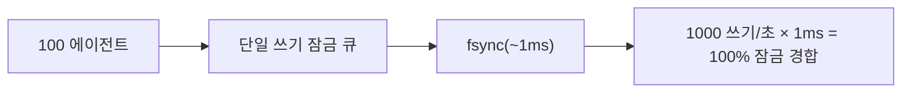
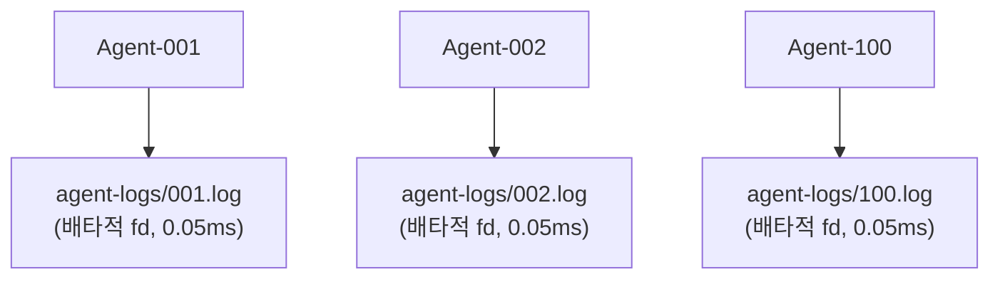

# 에이전트 동시성 모델

## 설계 목표

noa는 **잠금 경합 제로**로 수십에서 수백 개의 AI 에이전트가 동시에 쓰는 것을 지원합니다.

## 문제: 단일 쓰기 병목

전통적인 내장 데이터베이스(redb 포함)는 단일 쓰기 잠금을 사용합니다:



## 해결책: 워크스페이스별 에이전트 로그

각 워크스페이스는 자신의 JSONL 파일을 가집니다. 쓰기는 POSIX 시스템에서 원자적인 `O_APPEND`를 사용합니다:



총계: 쓰기당 0.05ms, 잠금 경합 제로.

## AgentLog 형식

```jsonl
{"seq":1,"op":"write","path":"src/main.rs","blob":"abc123...","ts":1717592400000000}
{"seq":2,"op":"delete","path":"src/old.rs","ts":1717592401000000}
{"seq":3,"op":"rename","from":"src/foo.rs","to":"src/bar.rs","ts":1717592402000000}
{"seq":4,"op":"snapshot","snapshot_id":"noa_z7x9","parent":"noa_y6w8","message":"feat","ts":1717592405000000}
```

- `seq`: 워크스페이스별 단조 증가 카운터
- `ts`: 마이크로초 정밀도 타임스탬프
- 통합은 `ts`로 전역 정렬

## redb vs AgentLog 사용 시기

| 구성 요소 | 저장소 | 이유 |
|-----------|---------|--------|
| blobs, trees | redb | 콘텐츠 주소 지정, 불변, 읽기 중심 |
| snapshots, refs, workspaces | redb | 메타데이터, 낮은 쓰기 빈도 |
| 에이전트 증분 로그 | 파일 JSONL | 고빈도 동시 쓰기 |

## 통합

`Consolidator`는 모든 에이전트 로그를 읽고, 타임스탬프로 정렬하여 통합된 스냅샷 체인을 생성합니다:

```rust
Consolidator::new(&engine)
    .consolidate("default", parent_ids, "agent", "일괄 업데이트")
    .await?;
```

## 다중 프로세스 동시성을 위한 noa-server

진정한 다중 프로세스 시나리오(여러 CLI 프로세스 또는 분산 에이전트)의 경우, noa-server HTTP API를 사용하세요:

```bash
noa-server  # 3000번 포트에서 시작

# 에이전트는 REST를 통해 상호 작용:
POST /api/v1/repo/my-project/blobs
POST /api/v1/repo/my-project/snapshots
POST /api/v1/repo/my-project/agent-log
```

서버는 단일 데이터베이스 연결을 보유하고 내부적으로 쓰기를 직렬화하면서, MVCC를 통해 동시 읽기를 처리합니다.
