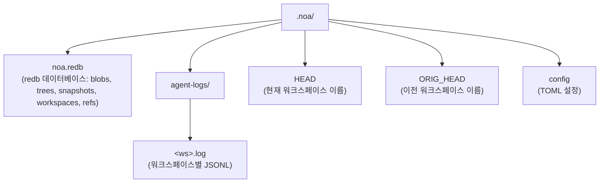
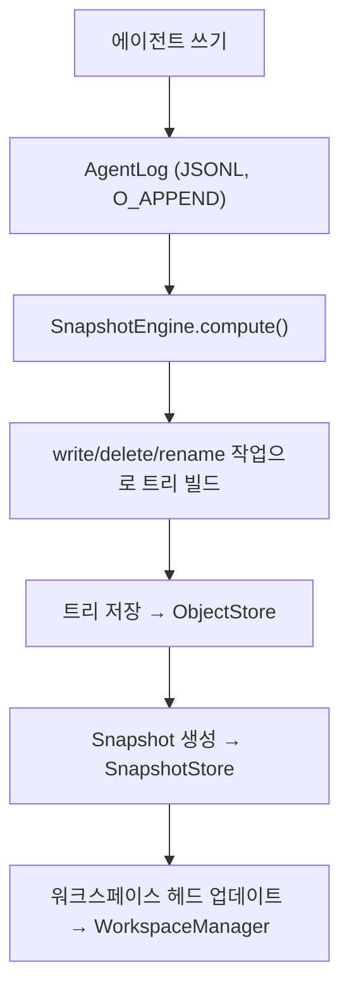

# 아키텍처

## 핵심 구성 요소

### ObjectStore

blob과 tree를 위한 콘텐츠 주소 지정 저장소. 콘텐츠는 SHA-256 해시로 주소 지정됩니다.

```
BlobId = SHA256(content)
TreeId = SHA256(msgpack(TreeEntries))
```

구현체:
- **RedbObjectStore**: redb 내장 KV 저장소를 사용한 로컬 저장소
- **MinioObjectStore**: S3 호환 MinIO를 사용한 원격 저장소

### AgentLog

무잠금 동시 쓰기를 위한 워크스페이스별 추가 전용 로그. 각 워크스페이스는 `.noa/agent-logs/<ws>.log` 아래에 자신의 JSONL 파일을 가집니다.

작업:
- **write**: blob 참조와 함께 파일 쓰기 기록
- **delete**: 파일 삭제 기록
- **rename**: 파일 이름 변경 기록
- **snapshot**: 스냅샷 생성 기록
- **merge**: 다른 워크스페이스에서의 병합 기록

### Snapshot

워크스페이스의 불변 특정 시점 상태. 트리 해시, 부모 스냅샷, 작성자, 메시지를 포함합니다.

```
Snapshot = {
    id: "noa_<12-char-base62>"
    tree_hash: 트리 콘텐츠의 SHA-256
    parents: [SnapshotId, ...]
    workspace: 워크스페이스 이름
    author: 에이전트 식별자
    timestamp: 마이크로초 정밀도
    message: 사람이 읽을 수 있는 설명
}
```

### Workspace

에이전트를 위한 격리된 작업 컨텍스트. 헤드 스냅샷과 베이스 스냅샷을 추적합니다.

### RefStore

안전한 동시 업데이트를 위한 CAS(compare-and-swap) 시맨틱을 가진 스냅샷에 대한 이름付き 포인터.

### Merge Engine

base, ours, theirs 트리를 비교하는 삼방향 병합:
- 양쪽에서 동일한 변경 → 충돌 없음
- 한쪽에서만 변경 → 적용
- 동일한 파일에 대한 다른 변경 → 충돌 (기본값: upstream-wins)

## 저장소 레이아웃



## 데이터 흐름


