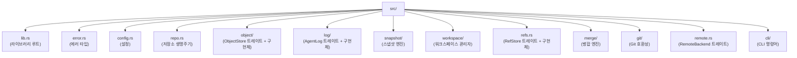

# noa 빌드하기

## 필수 조건

- Rust 1.75+ (stable)
- Python 3.8+ (빌드 스크립트용)
- `just` 명령어 러너

## 설정

```bash
git clone https://github.com/celestia-island/noa.git
cd noa
just init          # Rust 의존성 가져오기
just build-dev     # 개발 빌드
```

## 개발

```bash
just fmt            # 코드 포맷
just clippy         # 린트
just test           # 테스트 실행
just check          # 타입 검사
```

## 프로젝트 구조


