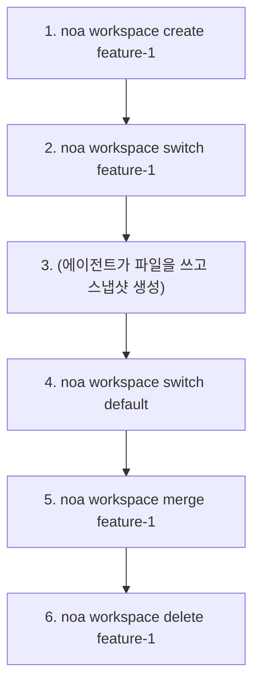
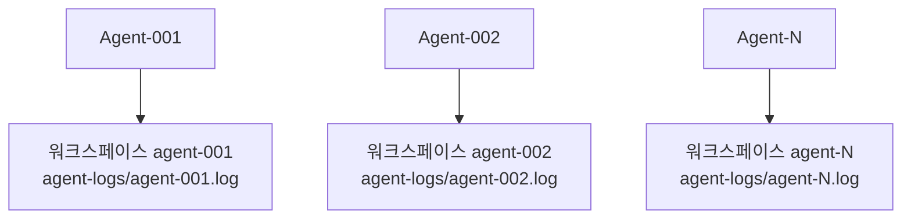

# 워크스페이스 가이드

워크스페이스는 Git 브랜치와 유사한 격리된 작업 컨텍스트입니다. 각 워크스페이스는 고유한 헤드 스냅샷과 에이전트 로그를 가집니다.

## 워크스페이스 생성

```bash
noa workspace create feature-1
noa workspace create agent-debug --agent bot-42
```

`--agent` 플래그는 워크스페이스를 특정 에이전트 ID와 연결합니다.

## 워크스페이스 전환

```bash
noa workspace switch feature-1
noa status
# 워크스페이스: feature-1 (head: noa_abc123)
```

## 워크스페이스 나열

```bash
noa workspace list
#   default             head: noa_abc123 base: noa_empty
# * feature-1           head: noa_def456 base: noa_abc123
```

`*` 마커는 활성 워크스페이스를 나타냅니다.

## 워크스페이스 병합

```bash
noa workspace switch default
noa workspace merge feature-1
# feature-1을 default로 병합 -> noa_ghi789
```

충돌이 감지된 경우:

```
충돌 감지됨:
  충돌: src/main.rs
feature-1을 default로 병합 -> noa_ghi789
```

기본 해결 전략은 upstream-wins(theirs)입니다. 향후 버전에서 수동 충돌 해결을 지원할 예정입니다.

## 워크스페이스 삭제

```bash
noa workspace delete feature-1
# 워크스페이스 'feature-1' 삭제됨
```

활성 워크스페이스는 삭제할 수 없습니다.

## 워크플로우 패턴



## 다중 에이전트 패턴

각 에이전트는 자신의 워크스페이스를 가집니다:



각 워크스페이스는 독립적인 에이전트 로그(`.noa/agent-logs/agent-001.log`)를 가지므로, 무잠금 동시 쓰기가 가능합니다. 통합 단계에서 모든 로그를 타임스탬프로 병합하여 통합된 히스토리를 생성합니다.

> **참고**: redb는 배타적 파일 잠금을 사용하므로 여러 CLI 프로세스가 동일한 데이터베이스를 동시에 열 수 없습니다. 진정한 다중 프로세스 동시성을 위해서는 noa-server HTTP API를 사용하세요.
