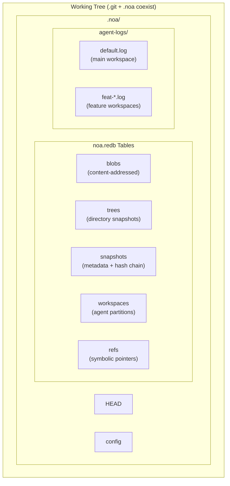
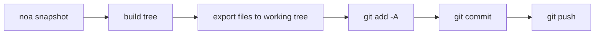
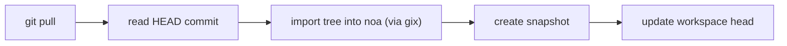
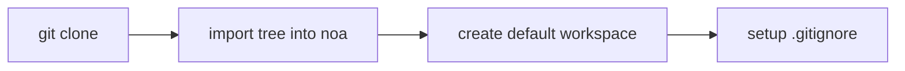

<div align="center"></div>
<h1 align="center">Noa</h1>
<div align="center">
 <strong>ИИ-ориентированная распределённая система контроля версий</strong>
</div>

<br />

<div align="center">
  <a href="https://github.com/celestia-island/noa/actions">
    
  </a>
  <a href="https://github.com/celestia-island/noa/actions">
    
  </a>
  <a href="https://crates.io/crates/libnoa">
    
  </a>
  <a href="https://docs.rs/libnoa">
    
  </a>
  <a href="../../LICENSE">
    
  </a>
  <a href="https://github.com/celestia-island/noa/releases">
    
  </a>
</div>

<div align="center">

**[English](../../README.md)** &bull; **[简体中文](../zh-hans/README.md)** &bull;
**[繁體中文](../zh-hant/README.md)** &bull; **[日本語](../ja/README.md)** &bull;
**[한국어](../ko/README.md)** &bull; **[Français](../fr/README.md)** &bull;
**[Español](../es/README.md)** &bull; **[Русский](../ru/README.md)** &bull;
**[العربية](../ar/README.md)**

</div>

noa — это ИИ-ориентированная распределённая система контроля версий. Она сосуществует с `.git` — git управляет исходным кодом, noa управляет данными итераций ИИ-агентов — с блокировкой-ноль JSONL-логами на каждого агента, историей на основе снимков и полной совместимостью с протоколом git.

## Содержание

- [Зачем нужна noa](#зачем-нужна-noa)
- [Архитектура](#архитектура)
- [Установка](#установка)
- [Быстрый старт](#быстрый-старт)
- [Команды](#команды)
- [Интеграция с Git](#интеграция-с-git)
- [Совместимость](#совместимость)
- [API (libnoa)](#api-libnoa)
- [Сборка из исходников](#сборка-из-исходников)
- [Связанные проекты](#связанные-проекты)
- [Лицензия](#лицензия)

## Зачем нужна noa

Традиционный git относится ко всем участникам одинаково — человек или ИИ. Но у ИИ-агентов принципиально иные потребности:

| Проблема | Ответ git | Ответ noa |
|-----------|-------------|--------------|
| **Параллельные записи** | Блокировки файлов, конфликты слияния | JSONL-логи с добавлением в конец для каждого агента |
| **Идентификация агента** | Настройка user.name/email для каждого репозитория | agent_id в рамках рабочей области с разделами на агента |
| **Частичный вклад** | Один коммит = все изменения в рабочем дереве | Агент логирует только те файлы, которые он реально изменял |
| **Отслеживание итераций** | Rebase/squash уничтожает историю | Неизменяемая цепочка снимков на каждую рабочую область |
| **Мульти-агентное слияние** | Трёхстороннее слияние текста | Слияние снимков, обнаружение конфликтов на уровне файлов |
| **Совместимость с протоколом Git** | Н/Д | Системный мост git CLI для clone/push/pull/fetch |

## Архитектура



**Основные концепции:**

- **Рабочая область (Workspace)**: Изолированное линейное пространство имён для одного агента. Каждая имеет собственный JSONL-лог.
- **Снимок (Snapshot)**: Запись состояния дерева рабочей области на определённый момент времени (SHA-256 контентно-адресуемые блобы и деревья).
- **Журнал агента (Agent Log)**: JSONL-файл только для добавления, записывающий атомарные файловые операции (`write`, `delete`, `rename`) с идентификаторами блобов и временными метками.
- **Слияние (Merge)**: Трёхстороннее слияние двух снимков рабочих областей относительно их общей базы.

## Установка

### Из релизов GitHub

```bash
# Скачайте последний релизный бинарный файл для вашей платформы:
#   https://github.com/celestia-island/noa/releases

chmod +x noa
mv noa /usr/local/bin/
```

### Из исходников (требуется Rust 1.85+)

```bash
git clone https://github.com/celestia-island/noa.git
cd noa
cargo build --release
# Бинарные файлы: target/release/noa, target/release/noa-server
```

### Как библиотека (Cargo)

```toml
[dependencies]
libnoa = { git = "https://github.com/celestia-island/noa" }
```

Примечание: Имя пакета на crates.io — `libnoa` (имя `noa` было уже занято). Бинарный файл по-прежнему называется `noa`.

## Быстрый старт

### Инициализация в существующем git-репозитории

```bash
cd my-git-project
noa init                              # создаёт .noa/ рядом с .git/
noa remote add origin "git@github.com:user/repo.git"
noa pull                              # импортирует текущий git HEAD в noa
```

### Создание рабочих областей агентов и итерация

```bash
# Агент A работает над функцией аутентификации
noa workspace create feat-auth -a agent-auth
noa workspace switch feat-auth

# Агент пишет в свой журнал агента
# (ИИ-агенты пишут JSONL напрямую; здесь пример вручную)
cat >> .noa/agent-logs/feat-auth.log << EOF
{"seq":1,"op":"write","path":"src/auth.rs","blob_id":"<sha256>","ts":1717000000000000}
EOF

# Сохраняем состояние рабочей области
noa snapshot create -m "добавить модуль auth" -a agent-auth
```

### Слияние функций и синхронизация с git

```bash
noa workspace switch default
noa workspace merge feat-auth          # слияние в default
noa push                               # экспорт в git-коммит + git push
```

## Команды

### Управление рабочими областями

```bash
noa workspace create <name> [-a <agent-id>]   # Создать новую рабочую область
noa workspace switch <name>                    # Переключить активную рабочую область
noa workspace list                              # Список всех рабочих областей
noa workspace delete <name>                     # Удалить рабочую область
noa workspace merge <from>                      # Слить другую рабочую область в текущую
```

### Управление снимками

```bash
noa snapshot create -m <msg> [-a <author>]     # Создать снимок из журнала агента
noa snapshot list                               # Список снимков
noa snapshot diff <id-a> <id-b>                # Сравнить два снимка (на уровне файлов)
```

### Операции с удалёнными репозиториями

```bash
noa remote add <name> <url>                     # Добавить удалённый репозиторий
noa remote remove <name>                        # Удалить удалённый репозиторий
noa remote list                                 # Список удалённых репозиториев
noa fetch [-r <remote>]                         # Список удалённых ссылок
noa pull [-r <remote>]                          # Git pull + повторный импорт в noa
noa push [-r <remote>]                          # Экспорт снимка → git-коммит → git push
```

### Операции с репозиторием

```bash
noa init [-p <path>] [--noa-remote <url>]      # Инициализировать репозиторий .noa/
noa clone <url> [-p <path>]                     # Git clone + импорт в noa
noa clone --svn <url> [-p <path>]              # Экспорт SVN → git init → импорт в noa
noa status                                       # Показать статус текущей рабочей области
noa log [-w <workspace>] [-n <limit>]          # Показать историю снимков
```

## Интеграция с Git

noa использует системную утилиту `git` CLI для всех сетевых операций. Это обеспечивает 100% совместимость с любым git-удалённым репозиторием.

### Процесс Push



### Процесс Pull



### Процесс Clone



### Ключевые проектные решения

- **Экспорт аддитивен**: Только файлы из снимка noa записываются в рабочее дерево. Существующие git-отслеживаемые файлы, не входящие в снимок, остаются без изменений.
- **Импорт использует gix**: Для локального обхода дерева (сеть не требуется). Сетевые операции используют системную утилиту `git` CLI.
- **`.noa/` автоматически добавляется в .gitignore**: `noa init` добавляет `.noa/` в `.gitignore`, чтобы данные агентов никогда не попали в историю git.

## Совместимость

### Протестированные платформы

| Провайдер | Протокол | Push | Pull | Clone | LFS |
|----------|----------|------|------|-------|-----|
| **GitHub** | HTTPS, SSH | ✓ | ✓ | ✓ | ✓ |
| **Bitbucket** | HTTPS, SSH | ✓ | ✓ | ✓ | ✓ |
| **GitLab** | HTTPS, SSH | ✓ | ✓ | ✓ | ✓ |
| **Локальный bare-репозиторий** | file:// | ✓ | ✓ | ✓ | ✓ |
| **SVN** | svn:// | Только импорт | — | `--svn` | — |

### Git LFS

noa автоматически определяет репозитории Git LFS:

- `noa clone`: выполняет `git lfs install` + `git lfs pull` для LFS-отслеживаемых репозиториев
- `noa push`: выполняет `git lfs push --all` после git push
- `noa pull`: выполняет `git lfs pull` после git pull
- LFS-файлы-указатели импортируются в noa как обычные блобы

### SVN

```bash
noa clone --svn file:///path/to/svn/repo -p ./my-project
```

Выполняет `svn export trunk → git init → noa import`. Это **одноразовый импорт** — для инкрементальной синхронизации используйте `svn export` + `noa snapshot create` по расписанию.

### Bitbucket

Как SSH- (`git@bitbucket.org:ws/repo.git`), так и HTTPS- (`https://user@bitbucket.org/ws/repo.git`) URL-адреса поддерживаются нативно через git-мост.

## API (libnoa)

libnoa предоставляет Rust API для встраивания функциональности noa в другие инструменты:

```rust
use libnoa::repo::Repository;
use libnoa::snapshot::SnapshotEngine;
use libnoa::log::FileAgentLog;

// Открыть репозиторий
let repo = Repository::open(&path)?;

// Создать рабочую область
let ws_mgr = repo.workspace_manager()?;
ws_mgr.create(&Workspace {
    name: "feat-x".into(),
    head: base_snap_id.clone(),
    base: base_snap_id.clone(),
    agent_id: Some("my-agent".into()),
    created_at: now,
    updated_at: now,
}).await?;

// Построить снимок из журналов агента
let engine = SnapshotEngine::new(
    FileAgentLog::new(&path, "my-agent")?,
    repo.snapshot_store()?,
    repo.object_store()?,
)
.with_repo_root(repo.root.clone());
let snapshot = engine.compute("feat-x", vec![], "author", "message").await?;

// Экспортировать снимок в git
libnoa::git::export_noa_to_git(&repo.root, repo.db.clone()).await?;
```

Смотрите `tests/smoke.rs` и `tests/compat.rs` для дополнительных примеров использования.

## Сборка из исходников

```bash
# Необходимые компоненты: Rust 1.85+, git, pkg-config (опционально для LFS/SVN)
git clone https://github.com/celestia-island/noa.git
cd noa

# Сборка
cargo build --release
# Результат: target/release/noa (CLI), target/release/noa-server (API-сервер)

# Запуск тестов
cargo test -- --test-threads=1

# Запуск noa-сервера
NOA_PORT=3000 NOA_DB_PATH=/data/noa/server.redb target/release/noa-server
```

## Связанные проекты

| Проект | Связь |
|---------|-------------|
| [entelecheia](https://github.com/celestia-island/entelecheia) | Платформа оркестрации мульти-агентов. Использует noa для версионирования рабочих областей агентов. |
| [tairitsu](https://github.com/celestia-island/tairitsu) | Фреймворк компонентной модели WASM. В будущем: клиент noa как WASM-компонент. |
| [kirino](https://github.com/celestia-island/kirino) | Аутентификация/ролевой доступ с нулевым доверием. Используется noa-server для аутентификации. |

## Лицензия

Apache-2.0. См. [LICENSE](../../LICENSE).
