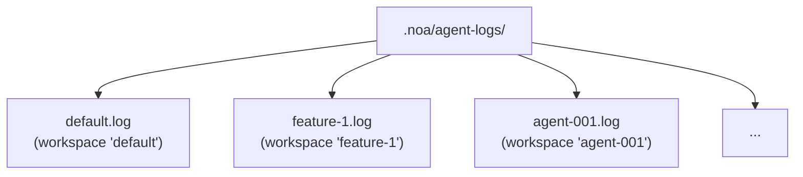
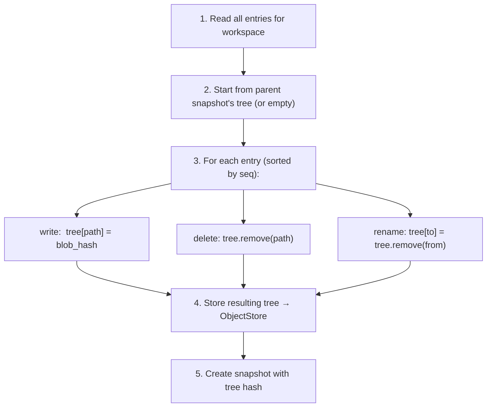
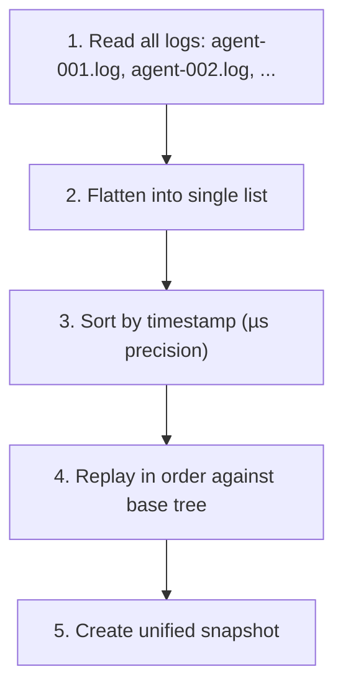

# Дизайн журнала агента

## Обзор

AgentLog — это слой высокопроизводительной записи noa. Он предоставляет JSONL-файлы
только для добавления для каждой рабочей области, обеспечивая параллельные записи без блокировок
от нескольких ИИ-агентов.

## Формат записи журнала

Каждая строка — JSON-объект:

```jsonl
{"seq":1,"op":"write","path":"src/main.rs","blob":"a1b2c3...","ts":1717592400000000}
{"seq":2,"op":"delete","path":"src/old.rs","ts":1717592401000000}
{"seq":3,"op":"rename","from":"src/foo.rs","to":"src/bar.rs","ts":1717592402000000}
{"seq":4,"op":"snapshot","snapshot_id":"noa_z7x9","parent":"noa_y6w8","message":"feat","ts":1717592405000000}
{"seq":5,"op":"merge","from_workspace":"feature-1","from_snapshot":"noa_abc","base":"noa_def","ts":1717592408000000}
```

### Поля

| Поле | Тип | Описание |
|-------|------|-------------|
| `seq` | u64 | Монотонный порядковый номер в пределах рабочей области |
| `op` | string | Тип операции: write, delete, rename, snapshot, merge |
| `path` | string | Целевой путь файла (write, delete) |
| `blob` | string | Хеш блоба (write) |
| `from` | string | Исходный путь (rename) |
| `to` | string | Целевой путь (rename) |
| `ts` | u64 | Unix-временная метка с микросекундной точностью |

## Структура файлов



Каждая рабочая область получает ровно один файл журнала. Имя файла соответствует имени рабочей области.

## Путь записи

```rust
async fn append(&self, workspace: &str, entry: &LogEntry) -> Result<()> {
    let file = self.get_or_create_file(workspace)?;
    let line = serde_json::to_string(entry)? + "\n";
    file.write_all(line.as_bytes())?;
    file.sync_data()?;  // fdatasync для долговечности
    Ok(())
}
```

Ключевые свойства:
- **O_APPEND**: Ядро гарантирует атомарные добавления
- **fsync на запись**: Обеспечивает долговечность после сбоя
- **Один fd на рабочую область**: Кешируется в памяти для производительности

## Путь чтения

```rust
async fn read_all(&self, workspace: &str) -> Result<Vec<LogEntry>> {
    let path = self.log_dir.join(format!("{}.log", workspace));
    let content = tokio::fs::read_to_string(&path).await?;
    content.lines()
        .filter(|l| !l.is_empty())
        .map(|l| serde_json::from_str(l))
        .collect::<Result<Vec<_>, _>>()
        .map_err(|e| NoaError::Serialization(e.to_string()))
}
```

## Вычисление снимка

`SnapshotEngine` воспроизводит записи журнала для построения дерева:



## Консолидация

Когда необходимо объединить несколько журналов агентов:



## Сравнение: Почему не...

### SQLite для журналов агентов?

- **Усиление записи**: B-tree обновления SQLite для последовательных добавлений
- **Блокировки**: SQLite использует WAL-блокировки (один писатель)
- **Накладные расходы fsync**: SQLite выполняет несколько fsync на транзакцию
- **Избыточность**: Журналы агентов только для добавления — без произвольного чтения или обновлений

### redb для журналов агентов?

- **Один писатель**: MVCC redb требует транзакции записи
- **Конкуренция**: Несколько агентов, пишущих в одну БД → сериализация
- **Не оптимизирован для добавления**: redb — это KV-хранилище общего назначения

### Буфер в памяти?

- **Долговечность**: Сбой процесса теряет все буферизованные записи
- **Давление на память**: 100 агентов × 1000 записей = 100K записей в памяти
- **Сложность**: Требуется фоновый поток сброса с восстановлением после сбоев

### Простой JSONL с O_APPEND?

✅ Именно это использует noa:
- **Минимальные накладные расходы**: Одна запись + один fsync на запись
- **Гарантированная ядром атомарность**: O_APPEND на POSIX
- **Восстановление после сбоя**: Только последняя запись может быть частичной (определяется по завершающему символу новой строки)
- **Человекочитаемость**: JSONL можно проверять стандартными инструментами
- **Ноль блокировок**: Один файл на рабочую область

## Производительность

Бенчмарк (ext4, SSD, Linux):

| Метрика | Значение |
|--------|-------|
| Задержка одной записи | ~0,05 мс (добавление + fdatasync) |
| Пропускная способность (1 рабочая область) | ~20 000 записей/сек |
| Пропускная способность (100 рабочих областей) | ~10 000+ записей/сек |
| Размер файла на 1M записей | ~200 МБ (в среднем 200 байт/запись) |

## Восстановление после сбоя

При запуске просканировать каждый файл журнала:
1. Прочитать все полные строки (заканчивающиеся на `\n`)
2. Отбросить последнюю строку, если она обрезана (неполная запись)
3. Проверить, что `seq` монотонно возрастает
4. Восстановить состояние в памяти из корректных записей

Это гарантирует, что никакие частичные или повреждённые записи не будут использованы для вычисления снимков.
