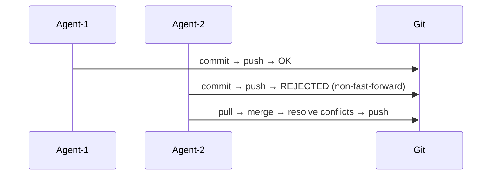
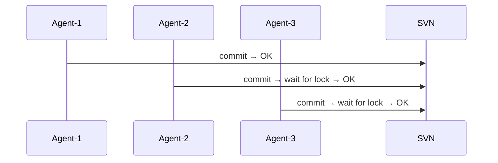
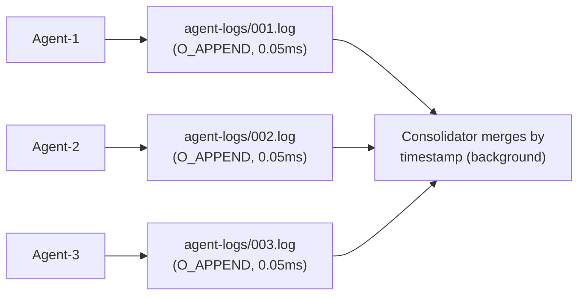
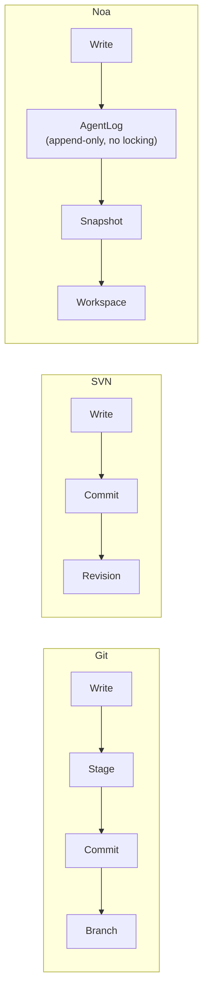
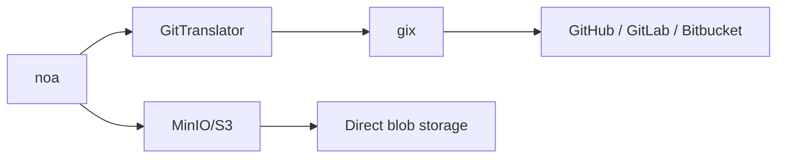

# noa против Git против SVN против Bitbucket: Сравнительный анализ

## Краткое резюме

noa — это система контроля версий, разработанная специально для рабочих процессов ИИ-агентов.
В отличие от Git, SVN и Bitbucket (которые являются обёртками над Git/SVN), noa оптимизирована для
**высокочастотных параллельных записей от нечеловеческих акторов** — от десятков до сотен
ИИ-агентов, одновременно изменяющих файлы без блокировок.

---

## Матрица сравнения функций

| Функция | noa | Git | SVN | Bitbucket |
|---------|-----|-----|-----|-----------|
| **Архитектура** | Встроенное KV + логи только для добавления | Контентно-адресуемый DAG | Централизованное дельта-хранилище | Хостинг Git/SVN |
| **Модель параллелизма** | Логи только для добавления на рабочую область (ноль блокировок) | Блокировка на уровне ветки (конфликты слияния) | Центральный сервер сериализует | Как в Git/SVN |
| **Стратегия слияния** | Трёхстороннее, upstream-wins по умолчанию | Трёхстороннее, ручное разрешение | Ручное слияние | Как в Git/SVN |
| **Детализация снимков** | Микросекундные метки времени, на каждого агента | На каждый коммит (человеческий темп) | На каждую ревизию | Как в Git/SVN |
| **ИИ-ориентированность** | Да — рабочая область на агента, журналы агентов | Нет — рассчитано на человеческие рабочие процессы | Нет | Нет |
| **Бэкенд хранения** | Подключаемый (redb локально, MinIO/S3 удалённо) | Pack-файлы + loose-объекты | Berkeley DB / FSFS | Серверное хранение |
| **Распределённость** | Да (удалённые push/pull через Git-мост) | Да (нативная) | Нет (централизованная) | Да (хостинг) |
| **Бинарный diff** | Контентно-адресуемые блобы (без дельты) | Дельта-сжатие на уровне pack | Серверная дельта | Как в Git/SVN |
| **Блокировки** | Нет для записей (логи только для добавления) | Только рекомендательные блокировки | `svn:needs-lock` | Как в Git/SVN |
| **HTTP API** | Встроенный (noa-server) | git-http-backend | WebDAV | REST API |
| **Кривая обучения** | Минимальная (6 команд) | Крутая (~40 команд) | Умеренная | Умеренная |

---

## Детальное сравнение

### 1. Параллелизм

**Git**: Одна ветка = один писатель за раз. Параллельные писатели создают
расходящиеся истории, которые должны быть согласованы через слияние. Конфликты слияния
требуют вмешательства человека.



**SVN**: Центральный сервер сериализует все коммиты. Доступна блокировка на уровне файлов,
но создаёт узкие места.



**noa**: Каждый агент пишет в собственный файл журнала только для добавления. Ноль
блокировок по дизайну. Консолидация происходит асинхронно.



### 2. Модель данных

**Git**: Blob → Tree → Commit → Branch → Ref. Контентно-адресуемый по SHA-1.
Неизменяемые объекты. Ветки — изменяемые указатели.

**SVN**: Файл/Директория → Ревизия. Линейные номера ревизий. Пути являются
сущностями первого класса.

**noa**: Blob → Tree → Snapshot → Workspace. Контентно-адресуемый по SHA-256.
Снимки неизменяемы. Рабочие области — изменяемые указатели с CAS-обновлениями.

Ключевое отличие: слой **AgentLog** noa находится между записью агента
и неизменяемым слоем снимков, обеспечивая буфер для высокочастотных
операций.



### 3. Философия слияния

**Git**: Трёхстороннее слияние с ручным разрешением конфликтов. Конфликты блокируют
прогресс до разрешения.

**SVN**: Ручное отслеживание слияний. Разрешение конфликтов на уровне файлов.

**noa**: Трёхстороннее слияние с настраиваемым авто-разрешением (по умолчанию:
upstream-wins). Разработано для ИИ-агентов, которые могут повторно применить изменения,
а не разрешать конфликты вручную.

Обоснование: ИИ-агентам не нужно видеть маркеры конфликтов — они могут
перегенерировать свои изменения относительно последнего состояния. Стратегия
«upstream-wins» обеспечивает прогресс вперёд.

### 4. Эффективность хранения

**Git**: Pack-файлы с дельта-сжатием. Оптимизированы для человеческого масштаба
частоты коммитов (~10-100 коммитов/день).

**SVN**: Серверное дельта-хранение. Эффективно для больших бинарных файлов.

**noa**: Контентно-адресуемые блобы без дельта-сжатия. Снимки
кодируются в msgpack. Компромисс: более простая реализация, более быстрые записи,
больший объём хранения. Приемлемо, потому что:
- Артефакты ИИ-агентов часто перегенерируются (старые версии эфемерны)
- Хранение дёшево; пропускная способность агентов дорога
- Бэкенд MinIO/S3 обрабатывает дедупликацию

### 5. Удалённая совместимость

**Git**: Нативный протокол (git://, https://, ssh://). Универсальный.

**SVN**: svn://, http://. Привязан к Apache/Subversion.

**noa**: Git-мост через `gix` (gitoxide). Может push/pull из любого Git-удалённого репозитория.
Также поддерживает нативный бэкенд MinIO/S3 для прямого хранения объектов.



### 6. Контроль доступа

**Git**: Права файловой системы или серверные хуки (pre-receive и т.д.).

**SVN**: ACL на основе путей, встроенные в протокол.

**Bitbucket**: Права на ветки, проверки слияния, требования код-ревью.

**noa**: Изоляция на уровне рабочей области. Каждый агент может писать только в свою
назначенную рабочую область. Слияние в общие ветки требует явного действия.
Серверная аутентификация через noa-server.

---

## Когда что использовать

| Сценарий | Лучший выбор | Причина |
|----------|-------------|--------|
| Разработка ПО человеком | Git | Зрелая экосистема, универсальный инструментарий |
| Генерация кода ИИ-агентами (10+ агентов) | noa | Параллельные записи без блокировок |
| Корпоративное соответствие + аудит | SVN | Централизованная, ACL на основе путей |
| Командная коллаборация + CI/CD | Bitbucket | Встроенные пайплайны, PR, ревью |
| Оркестрация ИИ-агентов + ревью человеком | noa → Git-мост | Агенты работают в noa, люди ревьюят через Git |
| Крупные бинарные активы | SVN или Git LFS | Дельта-сжатие для бинарных файлов |
| Встроенные / граничные устройства | noa | Один бинарный файл, встроенный redb, без демона |

---

## Пути миграции

### noa ↔ Git

```bash
# Экспорт снимков noa в Git
noa remote add origin https://github.com/example/repo.git
noa push --remote origin

# Импорт истории Git в noa
noa clone https://github.com/example/repo.git
```

`GitTranslator` преобразует между форматом блобов/деревьев noa и
объектным форматом Git. Снимки сопоставляются с Git-коммитами; рабочие области — с ветками.

### Git → noa

Не замена — noa является **дополнением** к Git для рабочих процессов ИИ-агентов.
Используйте оба:
1. ИИ-агенты работают в рабочих областях noa
2. Одобренные изменения сливаются в Git через push
3. Люди-разработчики продолжают использовать Git как прежде
