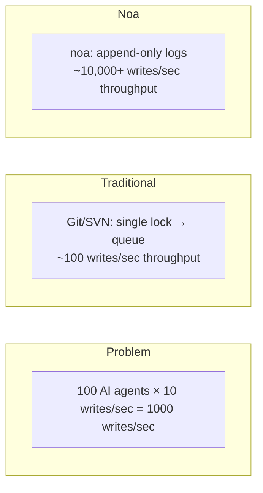
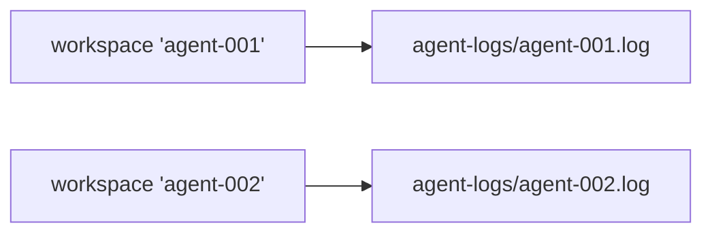
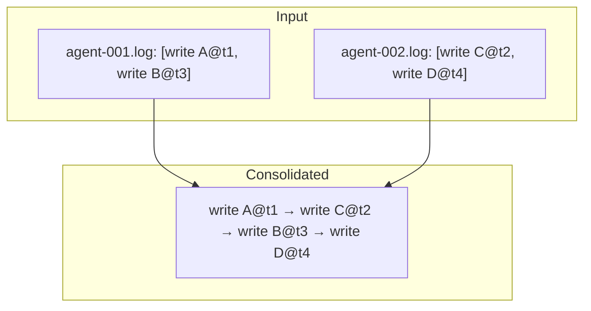
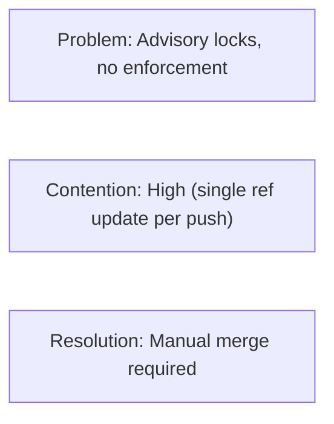
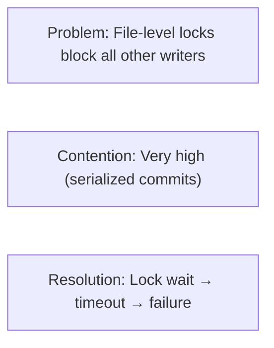
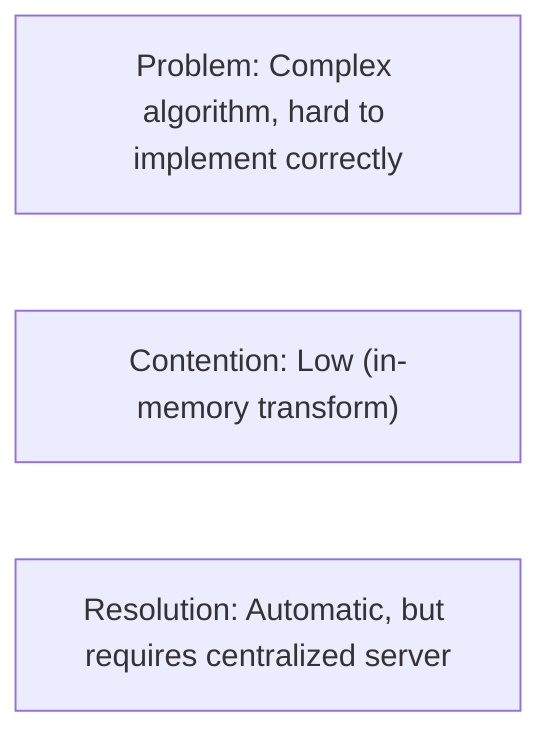
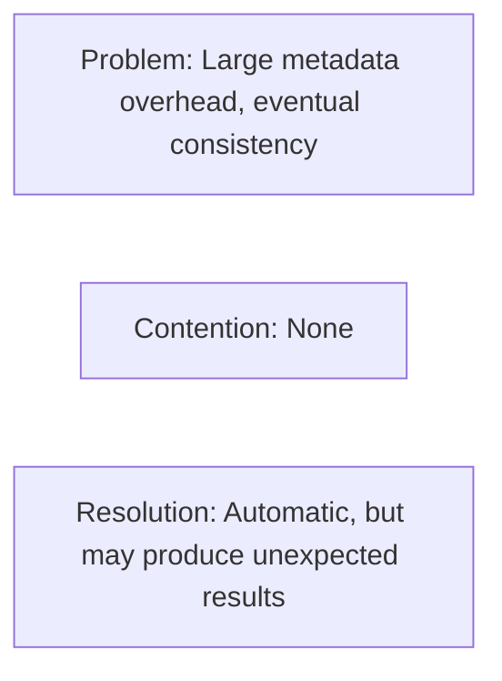
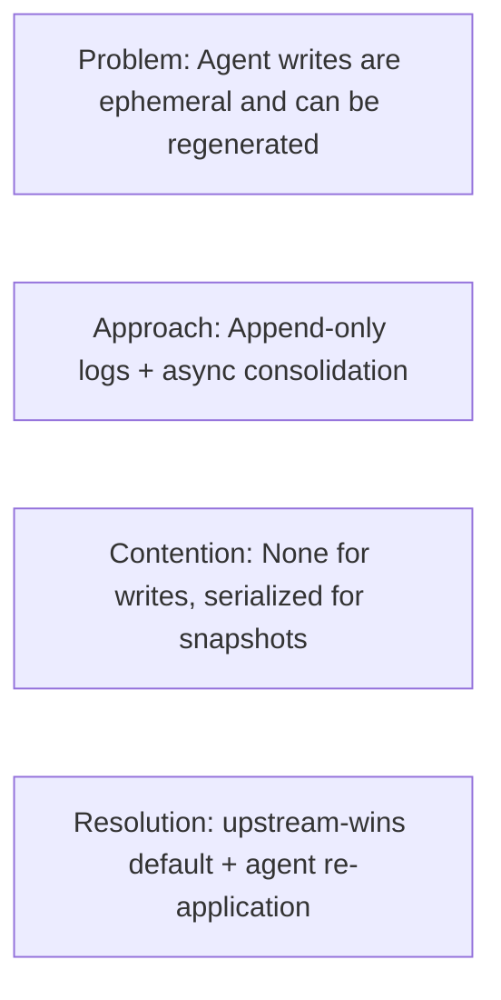

# Дизайн параллелизма

## Постановка проблемы

Традиционные VCS-системы сериализуют записи через одну блокировку или очередь слияния.
Это работает для рабочих процессов человеческого масштаба (10-100 коммитов/день), но ломается
при работе ИИ-агентов, производящих тысячи модификаций файлов в минуту.



## Архитектура

### Слой 1: AgentLog (Путь записи)

Каждая рабочая область имеет выделенный JSONL-файл в `.noa/agent-logs/`.



Записи используют флаг `O_APPEND`, который обеспечивает:
- **Атомарность**: Ядро гарантирует атомарность целой записи для добавлений
- **Упорядочение**: Записи сериализуются на уровне файла (на уровне рабочей области)
- **Без блокировок**: Не требуется fcntl/flock между разными файлами

```rust
pub trait AgentLog: Send + Sync {
    async fn append(&self, workspace: &str, entry: &LogEntry) -> Result<()>;
    async fn read_all(&self, workspace: &str) -> Result<Vec<LogEntry>>;
}
```

### Слой 2: Snapshot Store (Путь чтения)

Снимки хранятся в redb с MVCC (многоверсионным контролем параллелизма):
- Записи сериализуются через транзакцию одного писателя redb
- Чтения никогда не блокируют записи (изоляция снимков)
- Несколько читателей могут работать одновременно

### Слой 3: Консолидация (Путь слияния)

`Consolidator` читает все журналы агентов по всем рабочим областям, сортирует по
временной метке и создаёт единую цепочку снимков:



Это выполняется асинхронно и не блокирует записи агентов.

## Гарантии параллелизма

| Гарантия | Механизм |
|-----------|-----------|
| Без потери данных | O_APPEND + fsync на каждую запись |
| Упорядочение в пределах рабочей области | Один файл на рабочую область |
| Межобластное упорядочение | Микросекундные временные метки |
| Согласованность чтения | Изоляция снимков MVCC redb |
| Безопасность головы рабочей области | CAS-обновления (сравнение с обменом) |

## Анализ масштабируемости

### Один процесс (Встроенный)

| Агенты | 1-100 (тот же процесс) |
| Пропускная способность | ~10 000 записей/сек |
| Узкое место | дисковый I/O (fsync на запись) |

### Многопроцессный (noa-server)

| Агенты | 100-1000 (отдельные процессы) |
| Пропускная способность | ~5 000 записей/сек |
| Узкое место | серверная сериализация записей |

Сервер держит одно соединение с базой данных и сериализует записи.
Журналы агентов остаются пофайловыми для параллельного приёма.

### Распределённый (бэкенд MinIO)

| Агенты | 1000+ |
| Пропускная способность | Лимит скорости S3 PUT (~3 500/сек на префикс) |
| Узкое место | сеть + лимиты скорости S3 |

## Сравнение с альтернативами

### Git + файловые блокировки



### SVN + svn:needs-lock



### Operational Transformation (OT)



### CRDT (Conflict-free Replicated Data Types)



### Подход noa



## Стратегия fsync

Каждая запись в журнал агента следует этому шаблону:

```rust
file.write_all(data)?;   // добавить в файл
file.flush()?;           // сбросить буфер пользовательского пространства
file.sync_data()?;       // fsync — гарантировать долговечность на диске
```

На Linux `sync_data()` пропускает синхронизацию метаданных (fdatasync), снижая задержку
примерно на 30% по сравнению с полным fsync.

## Будущее: Пакетная обработка журнала упреждающей записи

Текущее: один fsync на запись.
Планируется: пакетная обработка нескольких записей в один fsync:

```rust
// Агент буферизует записи в памяти
agent.buffer(write_a);
agent.buffer(write_b);
agent.buffer(write_c);
agent.flush(); // один fsync для всех трёх
```

Ожидаемое улучшение пропускной способности: в 3-5 раз для пакетных записей.
