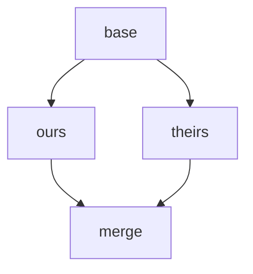
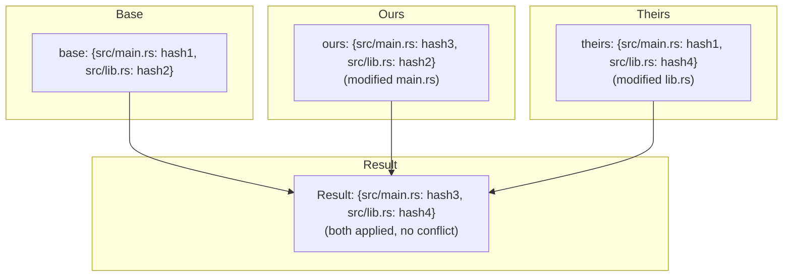
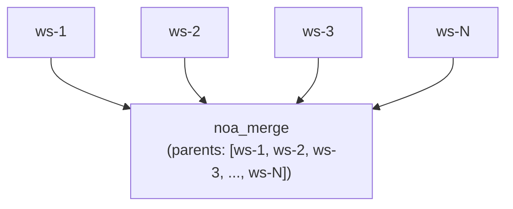
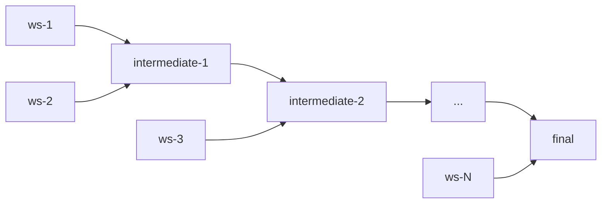

# Дизайн стратегии слияния

## Обзор

noa использует алгоритм трёхстороннего слияния с настраиваемым разрешением конфликтов.
Дизайн ставит **прогресс вперёд** выше человеческого вмешательства,
отражая случай использования ИИ-агентов, где изменения можно перегенерировать.

## Трёхстороннее слияние

### Алгоритм

Даны два снимка (ours, theirs) с общим предком (base):



1. Сравнить `base` с `ours` → changes_A
2. Сравнить `base` с `theirs` → changes_B
3. Для каждого пути, затронутого любой из сторон:
   - Одинаковое изменение с обеих сторон → применить (нет конфликта)
   - Изменено только в A → применить A
   - Изменено только в B → применить B
   - Разные изменения одного пути → **конфликт**

### Реализация

```rust
pub fn three_way_merge(
    base_tree: &Vec<TreeEntry>,
    ours_tree: &Vec<TreeEntry>,
    theirs_tree: &Vec<TreeEntry>,
) -> (Vec<TreeEntry>, Vec<Conflict>)
```

Записи дерева нормализуются в плоские карты путь→хеш для сравнения:



## Обнаружение конфликтов

```rust
pub struct Conflict {
    pub path: String,
    pub base_hash: Option<String>,
    pub ours_hash: Option<String>,
    pub theirs_hash: Option<String>,
}
```

Типы конфликтов:
- **Modify/Modify**: Обе стороны изменили один и тот же файл по-разному
- **Add/Add**: Обе стороны добавили файл по одному пути с разным содержимым
- **Delete/Modify**: Одна сторона удалила, другая изменила

## Стратегии разрешения

### upstream-wins (по умолчанию)

При обнаружении конфликта берётся версия theirs:

```rust
ConflictResolution::UpstreamWins => theirs_hash,
```

Обоснование: В рабочих процессах ИИ-агентов «вышестоящий» (основная/стандартная рабочая область)
представляет каноническое состояние. Агенты могут повторно применить свои изменения
к обновлённой базе.

### ours-wins

Берётся наша версия:

```rust
ConflictResolution::OursWins => ours_hash,
```

### fail (планируется)

Прервать слияние и вернуть конфликты для ручного разрешения:

```rust
ConflictResolution::Fail => return Err(MergeError::Conflict(conflicts)),
```

## Процесс слияния рабочих областей

```bash
noa workspace switch default          # установить ours = default
noa workspace merge feature-1         # theirs = feature-1
```

Внутренние шаги:
1. Загрузить снимок ours (голова default)
2. Загрузить снимок theirs (голова feature-1)
3. Найти базу слияния (последний общий предок в DAG)
4. Если нет общего предка, использовать `noa_empty` как базу
5. Выполнить трёхстороннее слияние
6. Применить стратегию разрешения конфликтов
7. Создать снимок слияния с parents = [ours, theirs]
8. Обновить голову default на снимок слияния

## Слияния с несколькими родителями

Снимки noa поддерживают неограниченное количество родителей, что позволяет слияния в стиле octopus:



Для N-сторонних слияний алгоритм выполняет попарные слияния:



## Сравнение со слиянием Git

| Аспект | noa | Git |
|--------|-----|-----|
| Алгоритм | Трёхсторонний | Трёхсторонний (тот же основной алгоритм) |
| Маркеры конфликтов | Нет (авто-разрешение) | `<<<<<<<` / `=======` / `>>>>>>>` |
| Разрешение по умолчанию | upstream-wins | Нет (требуется человек) |
| Множественные родители | Без ограничений | Обычно ≤2 |
| Rebase | Не поддерживается | Поддерживается |
| Cherry-pick | Не поддерживается | Поддерживается |
| Fast-forward | Автоматический | Опциональный (–no-ff) |

## Сравнение со слиянием SVN

| Аспект | noa | SVN |
|--------|-----|-----|
| Отслеживание слияний | Встроенное (родительский DAG) | Ручное (свойства mergeinfo) |
| Разрешение конфликтов | Автоматическое | Ручное (файлы конфликтов) |
| Модель ветвления | Рабочая область (легковесная) | На основе директорий (тяжёлая) |
| Направление слияния | Любой → любой (DAG) | Обычно ветка → trunk |

## Обоснование дизайна: Почему авто-разрешение?

Традиционные VCS требуют ручного разрешения конфликтов, потому что:
1. Написанный человеком код имеет семантический смысл, понятный только людям
2. Конфликты могут представлять фундаментальные разногласия в дизайне
3. Ручное разрешение обеспечивает корректность

Изменения ИИ-агентов имеют другие характеристики:
1. **Перегенерируемость**: Агенты могут повторно применить изменения к последнему состоянию
2. **Высокая частота**: Остановка для ручного разрешения блокирует всю последующую работу
3. **Несемантичность**: Изменения на уровне файлов не требуют человеческой интерпретации

Поэтому авто-разрешение с чёткой политикой (upstream-wins) является
правильным компромиссом для варианта использования noa.
