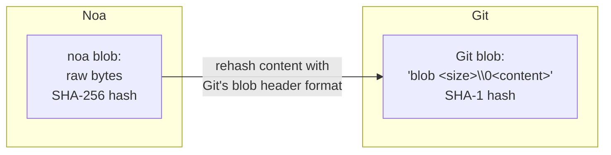
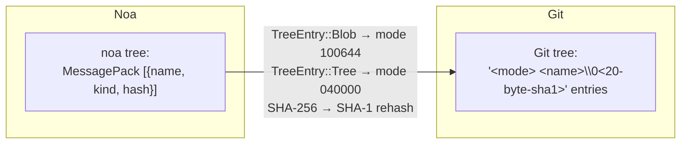
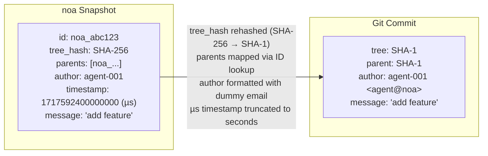
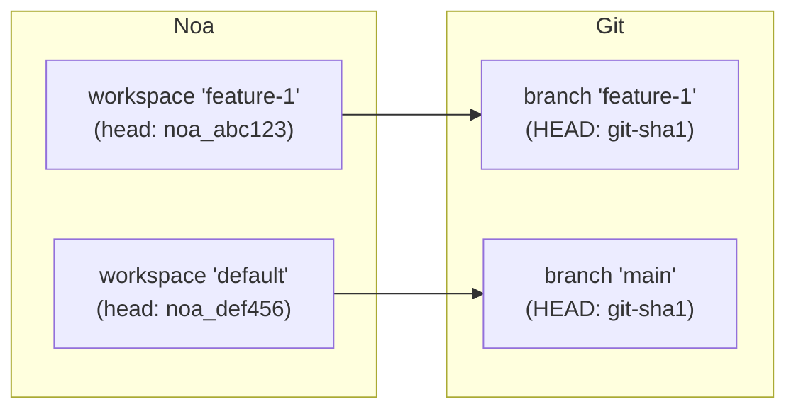
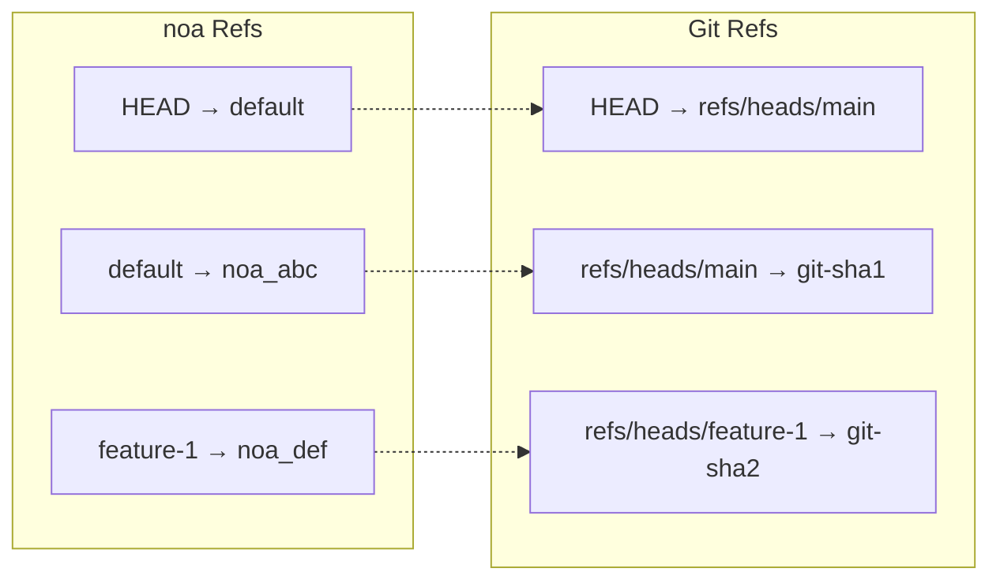
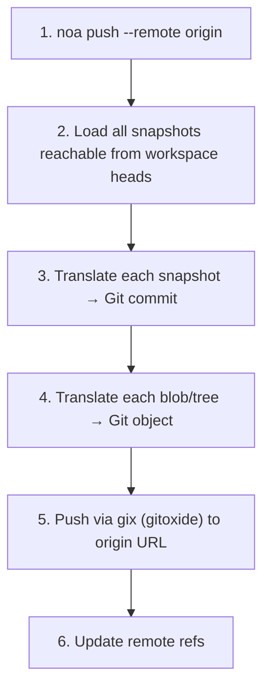
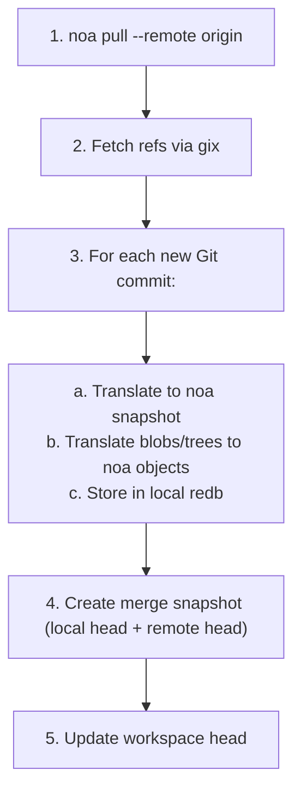
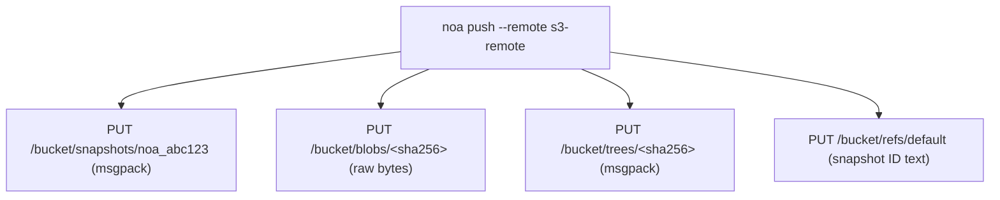

# Дизайн удалённой совместимости

## Обзор

noa поддерживает несколько удалённых бэкендов для синхронизации снимков и объектов
между машинами и командами. Основная цель совместимости — Git,
обеспечивающая бесшовную интеграцию с существующими рабочими процессами на GitHub, GitLab
и Bitbucket.

## Трейт удалённого бэкенда

```rust
#[async_trait]
pub trait RemoteBackend: Send + Sync {
    async fn push_snapshots(&self, ids: &[SnapshotId]) -> Result<()>;
    async fn fetch_snapshots(&self, ids: &[SnapshotId]) -> Result<Vec<Snapshot>>;
    async fn push_objects(&self, ids: &[String]) -> Result<()>;
    async fn fetch_objects(&self, ids: &[String]) -> Result<()>;
    async fn list_refs(&self) -> Result<HashMap<String, SnapshotId>>;
    async fn update_ref(&self, name: &str, old: Option<&SnapshotId>, new: &SnapshotId) -> Result<()>;
}
```

## Слой трансляции Git

`GitTranslator` преобразует между объектной моделью noa и Git:

### Блоб ↔ Git Blob



### Дерево ↔ Git Tree



### Снимок ↔ Git Commit



### Рабочая область ↔ Ветка Git



### Сопоставление ссылок (Ref)



## Процесс Push



## Процесс Pull



## Бэкенд MinIO/S3

Для развёртываний без инфраструктуры Git:



Преимущества перед Git-удалённым репозиторием:
- Не требуется трансляция дерева/снимка (нативный формат noa)
- Прямое хранение блобов (без накладных расходов pack-файлов)
- S3-совместимость (работает с AWS, GCS, MinIO, Cloudflare R2)

## Конфигурация удалённых репозиториев

Хранится в `.noa/config` (TOML):

```toml
[[remotes]]
name = "origin"
url = "https://github.com/example/repo.git"
backend = "git"

[[remotes]]
name = "s3"
url = "s3://my-bucket/noa-repo"
backend = "minio"
endpoint = "https://s3.amazonaws.com"
region = "us-east-1"
```

## Аутентификация

| Бэкенд | Метод |
|---------|--------|
| Git HTTPS | Учётные данные из `~/.git-credentials` или запрос |
| Git SSH | SSH-агент или файл ключа |
| MinIO/S3 | Ключ доступа + секретный ключ (переменные окружения или конфигурация) |

## Сравнение: Подходы к удалённой совместимости

| Подход | Используется | Плюсы | Минусы |
|----------|---------|------|------|
| Git-мост (gix) | noa | Универсальная совместимость | Накладные расходы трансляции, несоответствие SHA-1/SHA-256 |
| Нативный протокол | Git | Быстро, без трансляции | Работает только с Git |
| WebDAV | SVN | HTTP-стандарт | Ограниченный, специфичный для SVN |
| REST API | Bitbucket | Современный, гибкий | Требует хостингового сервиса |
| S3-совместимое хранилище | noa | Масштабируемое, облачное | Нет совместимости с Git без моста |

noa поддерживает и Git-мост (для совместимости), и нативный S3 (для масштаба).
