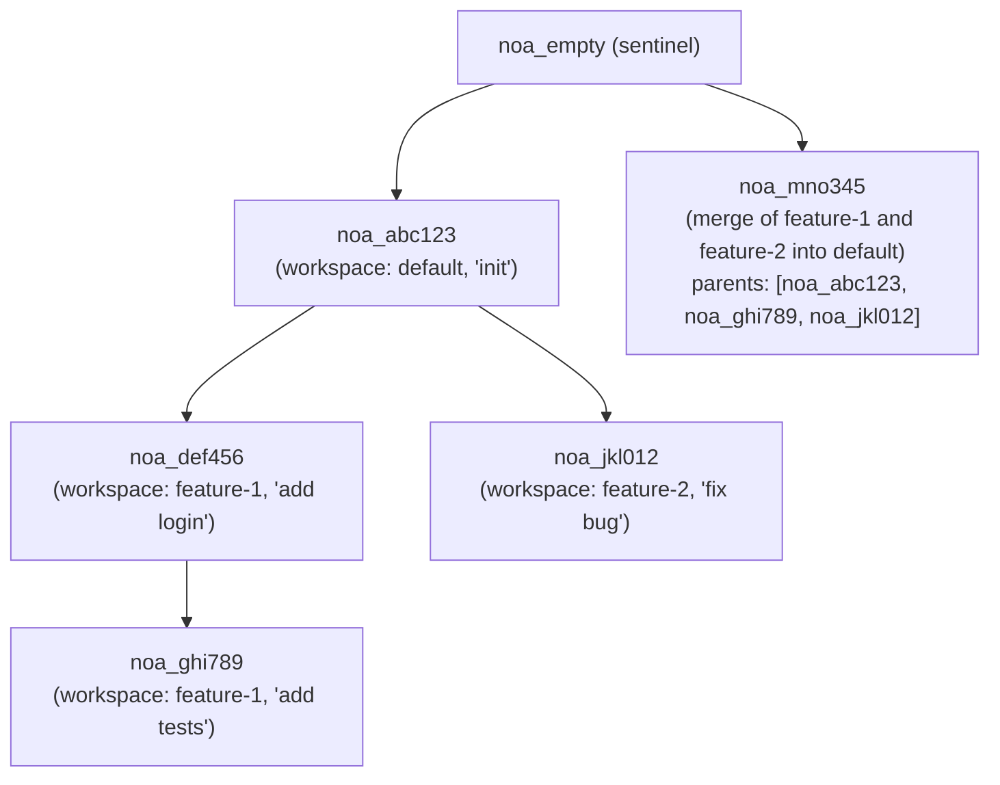
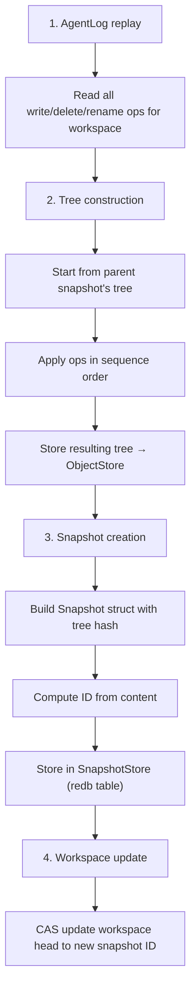

# Дизайн модели снимков

## Обзор

Снимок (Snapshot) — это неизменяемая, контентно-адресуемая запись полного
состояния файлового дерева рабочей области на определённый момент времени. Снимки образуют направленный
ациклический граф (DAG) через родительские ссылки.

## Структура снимка

```rust
pub struct SnapshotId(pub String);  // "noa_<12-char-base62>"

pub struct Snapshot {
    pub id: SnapshotId,
    pub tree_hash: String,           // SHA-256 корневого дерева
    pub parents: Vec<SnapshotId>,    // 0-N родительских снимков
    pub workspace: String,           // исходная рабочая область
    pub author: String,              // идентификатор агента или человека
    pub timestamp: u64,              // микросекунды с эпохи
    pub message: String,             // человекочитаемое описание
}
```

## Генерация ID

ID снимков используют 12-символьную строку base62 с префиксом `noa_`:

```
noa_3kF8x2mP9aB1
```

Генерация: `SHA256(tree_hash || parents || workspace || timestamp)[0..9]`
закодировано как base62. Это обеспечивает:
- 62^12 ≈ 3,2 × 10^21 возможных ID
- Вероятность коллизии практически нулевая
- Детерминированность: одинаковые входные данные → одинаковый ID (позволяет дедупликацию)

## DAG снимков



## Процесс создания снимка



## Хранилище снимков

Снимки хранятся в таблице redb с ключом по ID:

```
Таблица: snapshots
  Ключ:   "noa_abc123" (SnapshotId как &str)
  Значение: msgpack(Snapshot) как &[u8]
```

## Алгоритм сравнения (Diff)

`diff_snapshots(base, other)` создаёт список изменений на уровне файлов:

```rust
pub struct FileDiff {
    pub path: String,
    pub kind: DiffKind, // Added, Removed, Modified
    pub old_blob: Option<String>,
    pub new_blob: Option<String>,
}
```

Алгоритм:
1. Загрузить корневые деревья для обоих снимков
2. Рекурсивно обойти оба дерева одновременно
3. Сравнить хеши блобов по каждому пути
4. Разные хеши → Modified; только в одном → Added/Removed

Временная сложность: O(n), где n = общее количество файлов в обоих деревьях.

## Сторожевой снимок

`noa_empty` — это зарезервированный ID снимка, представляющий пустое дерево. Все
новые репозитории начинаются с него как с базы. Он никогда явно не
хранится — менеджер рабочих областей распознаёт его как «снимков пока нет».

## Сравнение с коммитами Git

| Аспект | Снимок noa | Коммит Git |
|--------|-------------|------------|
| Формат ID | `noa_<base62>` | SHA-1 hex |
| Лимит родителей | Без ограничений (DAG слияния) | Обычно 1-2 |
| Формат дерева | MessagePack | Собственный бинарный |
| Временная метка | Микросекундная точность | Секундная точность + часовой пояс |
| Поле автора | ID агента или человек | имя + email |
| Неизменяемость | Обеспечивается хранилищем | Обеспечивается хешем |
| Подпись GPG | Не поддерживается | Поддерживается |
