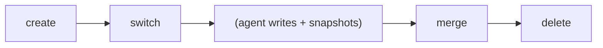

# Дизайн изоляции рабочих областей

## Обзор

Рабочие области (Workspaces) предоставляют изолированные рабочие контексты для агентов и людей.
Каждая рабочая область имеет независимое состояние (головной снимок, журнал агента), при этом
разделяя общее хранилище объектов.

## Структура рабочей области

```rust
pub struct Workspace {
    pub name: String,
    pub head: SnapshotId,     // текущий снимок
    pub base: SnapshotId,     // точка ответвления от родительской рабочей области
    pub agent_id: Option<String>,  // связанный агент
    pub created_at: u64,
    pub updated_at: u64,
}
```

## Жизненный цикл рабочей области



### Создание

```bash
noa workspace create feature-1
```

1. Прочитать головной снимок текущей рабочей области → становится `base`
2. Новая рабочая область: `head = base` (наследует текущее состояние)
3. Создать файл журнала агента: `agent-logs/feature-1.log`
4. Зарегистрировать в WorkspaceStore

### Переключение

```bash
noa workspace switch feature-1
```

1. Проверить, что рабочая область существует
2. Записать имя рабочей области в `.noa/HEAD`
3. Сохранить предыдущую рабочую область в `.noa/ORIG_HEAD`

### Слияние

```bash
noa workspace merge feature-1
```

1. Трёхстороннее слияние: base → ours (текущая) против theirs (feature-1)
2. Создать снимок слияния с обеими в качестве родителей
3. Обновить голову текущей рабочей области

### Удаление

```bash
noa workspace delete feature-1
```

1. Проверить, что это не активная рабочая область
2. Удалить запись рабочей области из хранилища
3. Удалить файл журнала агента
4. Объекты остаются (разделяемые, контентно-адресуемые)

## Файл HEAD

`.noa/HEAD` содержит имя активной рабочей области:

```
feature-1
```

`.noa/ORIG_HEAD` содержит предыдущую рабочую область (для отмены):

```
default
```

## Хранилище рабочих областей

Рабочие области хранятся в redb:

```
Таблица: workspaces
  Ключ:   "feature-1" (имя рабочей области как &str)
  Значение: msgpack(Workspace) как &[u8]
```

Обновления головы используют CAS (сравнение с обменом):

```rust
async fn update_head(&self, name: &str, expected: &SnapshotId, new: &SnapshotId) -> Result<()>
```

Это предотвращает потерянные обновления, когда несколько процессов пытаются обновить одну
и ту же рабочую область одновременно.

## Сравнение с ветками Git

| Аспект | Рабочая область noa | Ветка Git |
|--------|---------------|------------|
| Хранение | Запись в таблице redb | ref-файл (`.git/refs/heads/`) |
| Изоляция | Собственный файл журнала агента | Общий индекс + рабочее дерево |
| Переключение | Атомарная запись HEAD | Извлечение рабочего дерева (файловый I/O) |
| Создание | O(1) — только метаданные | O(1) — легковесная |
| Удаление | Удалить из хранилища | Удалить ref, опционально очистить |
| Привязка агента | Опциональное поле agent_id | Нет эквивалента |
| Отслеживание базы | Явное поле base | Неявное (merge base) |

## Сравнение с ветками SVN

| Аспект | Рабочая область noa | Ветка SVN |
|--------|---------------|------------|
| Хранение | Запись KV | Полная копия директории |
| Создание | O(1) метаданные | O(n) копирование файлов |
| Изоляция | Логическая (общие объекты) | Физическая (отдельные директории) |
| Отслеживание слияний | Родительский DAG | svn:mergeinfo свойства |

## Обоснование дизайна

### Почему рабочие области, а не ветки?

1. **Идентификация агента**: Рабочие области несут поле `agent_id` для атрибуции
2. **Изоляция журнала агента**: Каждая рабочая область имеет выделенный файл журнала
3. **Нет рабочего дерева**: noa не поддерживает извлечение — только снимки
4. **Явная база**: Поле `base` позволяет быстро вычислять базу слияния

### Почему нет извлечения рабочего дерева?

Ветки Git требуют извлечения рабочего дерева (файловый I/O для каждого переключённого файла).
Рабочие области noa переключают только указатель — ссылку на журнал агента и снимок.
Это O(1) независимо от размера репозитория.

Материализация файлов (извлечение) происходит отдельно, когда агенту необходимо
читать или записывать реальные файлы, используя дерево снимка как источник истины.
