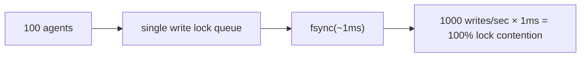
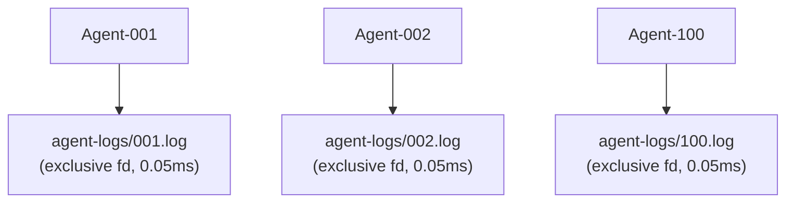

# Модель параллелизма агентов

## Цели дизайна

noa поддерживает от десятков до сотен ИИ-агентов, пишущих одновременно с
**нулевой конкуренцией за блокировки**.

## Проблема: Узкое место одного писателя

Традиционные встроенные базы данных (включая redb) используют одну блокировку записи:



## Решение: Журналы агентов на рабочую область

Каждая рабочая область получает собственный JSONL-файл. Записи используют `O_APPEND`, который
атомарен на POSIX-системах:



Итого: 0,05 мс на запись, ноль конкуренции за блокировки.

## Формат AgentLog

```jsonl
{"seq":1,"op":"write","path":"src/main.rs","blob":"abc123...","ts":1717592400000000}
{"seq":2,"op":"delete","path":"src/old.rs","ts":1717592401000000}
{"seq":3,"op":"rename","from":"src/foo.rs","to":"src/bar.rs","ts":1717592402000000}
{"seq":4,"op":"snapshot","snapshot_id":"noa_z7x9","parent":"noa_y6w8","message":"feat","ts":1717592405000000}
```

- `seq`: монотонный счётчик в пределах рабочей области
- `ts`: временная метка с микросекундной точностью
- Консолидация глобально сортирует по `ts`

## Когда использовать redb vs AgentLog

| Компонент | Хранилище | Причина |
|-----------|---------|--------|
| blobs, trees | redb | Контентно-адресуемые, неизменяемые, с интенсивным чтением |
| snapshots, refs, workspaces | redb | Метаданные, низкая частота записи |
| инкрементальные логи агентов | Файл JSONL | Высокочастотные параллельные записи |

## Консолидация

`Consolidator` читает все журналы агентов, сортирует по временной метке и создаёт
единую цепочку снимков:

```rust
Consolidator::new(&engine)
    .consolidate("default", parent_ids, "agent", "batch update")
    .await?;
```

## noa-server для многопроцессного параллелизма

Для настоящих многопроцессных сценариев (несколько CLI-процессов или распределённые
агенты) используйте HTTP API noa-server:

```bash
noa-server  # запускается на порту 3000

# Агенты взаимодействуют через REST:
POST /api/v1/repo/my-project/blobs
POST /api/v1/repo/my-project/snapshots
POST /api/v1/repo/my-project/agent-log
```

Сервер держит одно соединение с базой данных и сериализует записи
внутренне, при этом обрабатывая параллельные чтения через MVCC.
