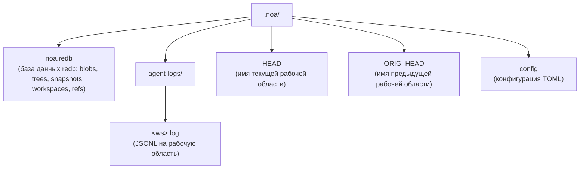
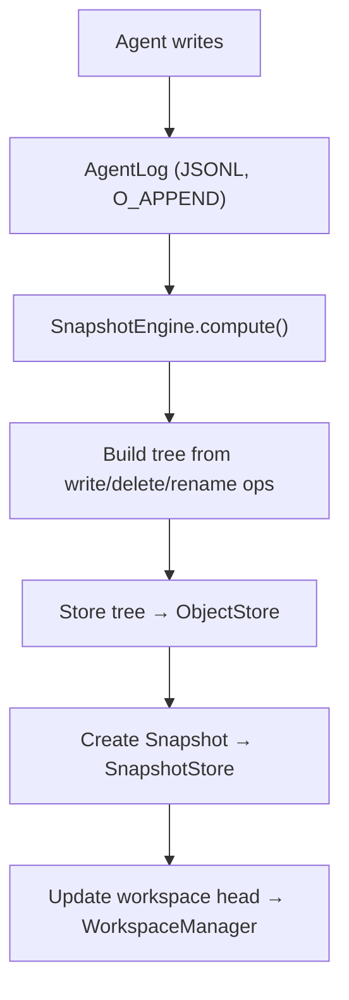

# Архитектура

## Основные компоненты

### ObjectStore

Контентно-адресуемое хранилище для блобов и деревьев. Содержимое адресуется по хешу SHA-256.

```
BlobId = SHA256(content)
TreeId = SHA256(msgpack(TreeEntries))
```

Реализации:
- **RedbObjectStore**: Локальное хранилище с использованием встроенного KV-хранилища redb
- **MinioObjectStore**: Удалённое хранилище с использованием S3-совместимого MinIO

### AgentLog

Журнал только для добавления на каждую рабочую область для параллельных записей без блокировок. Каждая рабочая область
получает собственный JSONL-файл в `.noa/agent-logs/<ws>.log`.

Операции:
- **write**: Записать файл с ссылкой на блоб
- **delete**: Записать удаление файла
- **rename**: Записать переименование файла
- **snapshot**: Записать создание снимка
- **merge**: Записать слияние из другой рабочей области

### Snapshot

Неизменяемое состояние рабочей области на момент времени. Содержит хеш дерева, родительские
снимки, автора и сообщение.

```
Snapshot = {
    id: "noa_<12-char-base62>"
    tree_hash: SHA256 содержимого дерева
    parents: [SnapshotId, ...]
    workspace: имя рабочей области
    author: идентификатор агента
    timestamp: микросекундная точность
    message: человекочитаемое описание
}
```

### Workspace

Изолированный рабочий контекст для агента. Отслеживает головной снимок и базовый снимок.

### RefStore

Именованные указатели на снимки с семантикой сравнения с обменом (CAS) для безопасных
параллельных обновлений.

### Merge Engine

Трёхстороннее слияние, сравнивающее деревья base, ours и theirs:
- Одинаковое изменение с обеих сторон → нет конфликта
- Изменение только с одной стороны → применить
- Разные изменения одного файла → конфликт (по умолчанию: upstream-wins)

## Схема хранения



## Поток данных


