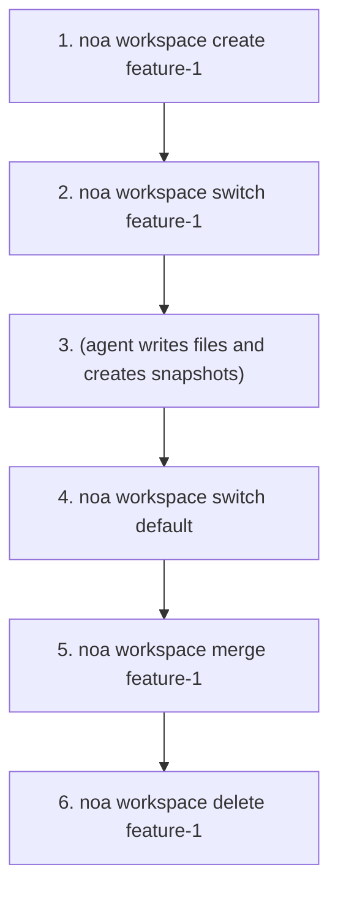
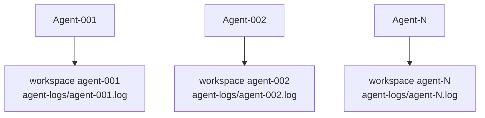

# Руководство по рабочим областям

Рабочие области (Workspaces) — это изолированные рабочие контексты, аналогичные веткам Git. Каждая
рабочая область имеет собственный головной снимок и журнал агента.

## Создание рабочих областей

```bash
noa workspace create feature-1
noa workspace create agent-debug --agent bot-42
```

Флаг `--agent` связывает рабочую область с конкретным идентификатором агента.

## Переключение рабочих областей

```bash
noa workspace switch feature-1
noa status
# В рабочей области: feature-1 (head: noa_abc123)
```

## Список рабочих областей

```bash
noa workspace list
#   default             head: noa_abc123 base: noa_empty
# * feature-1           head: noa_def456 base: noa_abc123
```

Маркер `*` показывает активную рабочую область.

## Слияние рабочих областей

```bash
noa workspace switch default
noa workspace merge feature-1
# Слито feature-1 в default -> noa_ghi789
```

При обнаружении конфликтов:

```
Обнаружены конфликты:
  CONFLICT: src/main.rs
Слито feature-1 в default -> noa_ghi789
```

Стратегия разрешения по умолчанию — upstream-wins (theirs). Будущие версии
будут поддерживать ручное разрешение конфликтов.

## Удаление рабочих областей

```bash
noa workspace delete feature-1
# Удалена рабочая область 'feature-1'
```

Нельзя удалить активную рабочую область.

## Шаблон рабочего процесса



## Шаблон мульти-агентной работы

Каждый агент получает собственную рабочую область:



Каждая рабочая область имеет независимый журнал агента (`.noa/agent-logs/agent-001.log`),
что позволяет параллельные записи без блокировок. Шаг консолидации объединяет все журналы
по временной метке для создания единой истории.

> **Примечание**: redb использует эксклюзивную файловую блокировку, поэтому несколько CLI-процессов
> не могут открыть одну базу данных одновременно. Для настоящей многопроцессной
> параллельной работы используйте HTTP API noa-server.
