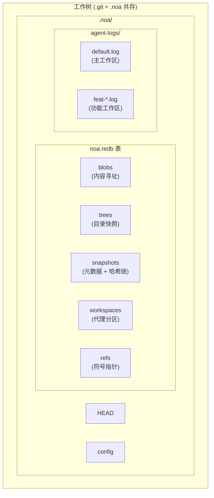
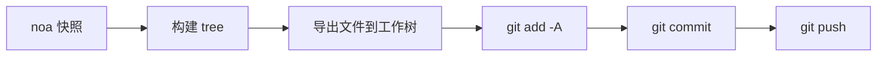
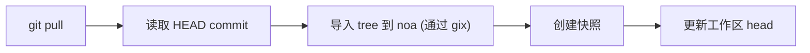
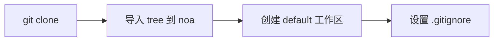

<div align="center"></div>
<h1 align="center">Noa</h1>
<div align="center">
 <strong>AI 原生分布式版本控制系统</strong>
</div>

<br />

<div align="center">
  <a href="https://github.com/celestia-island/noa/actions">
    
  </a>
  <a href="https://github.com/celestia-island/noa/actions">
    
  </a>
  <a href="https://crates.io/crates/libnoa">
    
  </a>
  <a href="https://docs.rs/libnoa">
    
  </a>
  <a href="../../LICENSE">
    
  </a>
  <a href="https://github.com/celestia-island/noa/releases">
    
  </a>
</div>

<div align="center">

**[English](../../README.md)** &bull; **[简体中文](../zh-hans/README.md)** &bull;
**[繁體中文](../zh-hant/README.md)** &bull; **[日本語](../ja/README.md)** &bull;
**[한국어](../ko/README.md)** &bull; **[Français](../fr/README.md)** &bull;
**[Español](../es/README.md)** &bull; **[Русский](../ru/README.md)** &bull;
**[العربية](../ar/README.md)**

</div>

noa 是一个 AI 原生分布式版本控制系统。它与 `.git` 共存 —— git 管理源代码，noa 管理 AI 代理迭代数据 —— 具有每代理零锁 JSONL 日志、基于快照的历史记录以及完整的 Git 协议兼容性。

## 目录

- [为什么选择 noa](#为什么选择-noa)
- [架构](#架构)
- [安装](#安装)
- [快速入门](#快速入门)
- [命令](#命令)
- [Git 集成](#git-集成)
- [兼容性](#兼容性)
- [API (libnoa)](#api-libnoa)
- [从源码构建](#从源码构建)
- [相关项目](#相关项目)
- [许可证](#许可证)

## 为什么选择 noa

传统的 Git 对所有贡献者一视同仁 —— 无论人类还是 AI。但 AI 代理有着根本不同的需求：

| 挑战 | Git 的答案 | noa 的答案 |
|-----------|-------------|--------------|
| **并发写入** | 锁文件、合并冲突 | 每代理 JSONL 追加式日志 |
| **代理身份** | 配置 user.name/email 每仓库 | 工作区作用域的 agent_id，每代理分区 |
| **部分贡献** | 一次提交 = 工作树中所有更改 | 代理日志仅记录它实际触碰的文件 |
| **迭代跟踪** | Rebase/squash 破坏历史 | 每工作区不可变快照链 |
| **多代理合并** | 文本三路合并 | 合并快照，检测文件级冲突 |
| **Git 协议兼容性** | N/A | 系统 Git CLI 桥接用于 clone/push/pull/fetch |

## 架构



**核心概念：**

- **工作区 (Workspace)**：一个代理的隔离线性命名空间。每个工作区有自己的 JSONL 日志。
- **快照 (Snapshot)**：工作区树在某个时间点的记录（SHA-256 内容寻址的 blob + tree）。
- **代理日志 (Agent Log)**：追加式 JSONL 文件，记录原子文件操作（`write`、`delete`、`rename`）及其 blob ID 和时间戳。
- **合并 (Merge)**：对两个工作区快照针对其共同基础进行三路合并。

## 安装

### 从 GitHub Releases 安装

```bash
# 下载适合你平台的最新版本二进制文件：
#   https://github.com/celestia-island/noa/releases

chmod +x noa
mv noa /usr/local/bin/
```

### 从源码构建（需要 Rust 1.85+）

```bash
git clone https://github.com/celestia-island/noa.git
cd noa
cargo build --release
# 二进制文件：target/release/noa, target/release/noa-server
```

### 作为库使用（Cargo）

```toml
[dependencies]
libnoa = { git = "https://github.com/celestia-island/noa" }
```

注意：crates.io 上的包名是 `libnoa`（`noa` 已被占用）。二进制文件仍命名为 `noa`。

## 快速入门

### 在现有 Git 仓库中初始化

```bash
cd my-git-project
noa init                              # 在 .git/ 旁创建 .noa/
noa remote add origin "git@github.com:user/repo.git"
noa pull                              # 将当前 git HEAD 导入 noa
```

### 创建代理工作区并迭代

```bash
# 代理 A 处理 auth 功能
noa workspace create feat-auth -a agent-auth
noa workspace switch feat-auth

# 代理写入其代理日志
# （AI 代理直接写入 JSONL；以下是手动示例）
cat >> .noa/agent-logs/feat-auth.log << EOF
{"seq":1,"op":"write","path":"src/auth.rs","blob_id":"<sha256>","ts":1717000000000000}
EOF

# 保存工作区状态
noa snapshot create -m "添加 auth 模块" -a agent-auth
```

### 合并功能并与 Git 同步

```bash
noa workspace switch default
noa workspace merge feat-auth          # 合并到 default
noa push                               # 导出到 git commit + git push
```

## 命令

### 工作区管理

```bash
noa workspace create <名称> [-a <代理id>]   # 创建新工作区
noa workspace switch <名称>                    # 切换活动工作区
noa workspace list                              # 列出所有工作区
noa workspace delete <名称>                     # 删除工作区
noa workspace merge <来源>                      # 将另一个工作区合并到当前
```

### 快照管理

```bash
noa snapshot create -m <消息> [-a <作者>]      # 从代理日志创建快照
noa snapshot list                                # 列出快照
noa snapshot diff <id-a> <id-b>                # 比较两个快照（文件级）
```

### 远程操作

```bash
noa remote add <名称> <url>                      # 添加远程
noa remote remove <名称>                         # 删除远程
noa remote list                                  # 列出远程
noa fetch [-r <远程>]                            # 列出远程引用
noa pull [-r <远程>]                             # Git pull + 重新导入 noa
noa push [-r <远程>]                             # 导出快照 → git commit → git push
```

### 仓库操作

```bash
noa init [-p <路径>] [--noa-remote <url>]       # 初始化 .noa/ 仓库
noa clone <url> [-p <路径>]                      # Git clone + 导入 noa
noa clone --svn <url> [-p <路径>]               # SVN export → git init → 导入 noa
noa status                                        # 显示当前工作区状态
noa log [-w <工作区>] [-n <限制>]               # 显示快照历史
```

## Git 集成

noa 使用系统 `git` CLI 进行所有网络操作。这确保与任何 Git 远程的 100% 兼容性。

### 推送工作流



### 拉取工作流



### 克隆工作流



### 关键设计决策

- **导出是增量的**：只有 noa 快照中的文件才写入工作树。不在快照中的现有 Git 跟踪文件保持不变。
- **导入使用 gix**：用于本地树遍历（无需网络）。网络操作使用系统 `git` CLI。
- **`.noa/` 自动加入 gitignore**：`noa init` 将 `.noa/` 追加到 `.gitignore`，使代理数据永远不会泄漏到 Git 历史中。

## 兼容性

### 已测试的平台

| 提供商 | 协议 | Push | Pull | Clone | LFS |
|----------|----------|------|------|-------|-----|
| **GitHub** | HTTPS, SSH | ✓ | ✓ | ✓ | ✓ |
| **Bitbucket** | HTTPS, SSH | ✓ | ✓ | ✓ | ✓ |
| **GitLab** | HTTPS, SSH | ✓ | ✓ | ✓ | ✓ |
| **本地裸仓库** | file:// | ✓ | ✓ | ✓ | ✓ |
| **SVN** | svn:// | 仅导入 | — | `--svn` | — |

### Git LFS

noa 自动检测 Git LFS 仓库：

- `noa clone`：运行 `git lfs install` + `git lfs pull` 处理 LFS 跟踪的仓库
- `noa push`：在 git push 后运行 `git lfs push --all`
- `noa pull`：在 git pull 后运行 `git lfs pull`
- LFS 指针文件作为常规 blob 导入 noa

### SVN

```bash
noa clone --svn file:///path/to/svn/repo -p ./my-project
```

这会执行 `svn export trunk → git init → noa import`。这是一次性导入 — 增量同步需按计划使用 `svn export` + `noa snapshot create`。

### Bitbucket

SSH (`git@bitbucket.org:ws/repo.git`) 和 HTTPS (`https://user@bitbucket.org/ws/repo.git`) URL 均通过 Git 桥接原生支持。

## API (libnoa)

libnoa 公开 Rust API 用于将 noa 功能嵌入到其他工具中：

```rust
use libnoa::repo::Repository;
use libnoa::snapshot::SnapshotEngine;
use libnoa::log::FileAgentLog;

// 打开仓库
let repo = Repository::open(&path)?;

// 创建工作区
let ws_mgr = repo.workspace_manager()?;
ws_mgr.create(&Workspace {
    name: "feat-x".into(),
    head: base_snap_id.clone(),
    base: base_snap_id.clone(),
    agent_id: Some("my-agent".into()),
    created_at: now,
    updated_at: now,
}).await?;

// 从代理日志构建快照
let engine = SnapshotEngine::new(
    FileAgentLog::new(&path, "my-agent")?,
    repo.snapshot_store()?,
    repo.object_store()?,
)
.with_repo_root(repo.root.clone());
let snapshot = engine.compute("feat-x", vec![], "author", "message").await?;

// 导出快照到 Git
libnoa::git::export_noa_to_git(&repo.root, repo.db.clone()).await?;
```

更多使用示例见 `tests/smoke.rs` 和 `tests/compat.rs`。

## 从源码构建

```bash
# 前置条件：Rust 1.85+，git，pkg-config（LFS/SVN 可选）
git clone https://github.com/celestia-island/noa.git
cd noa

# 构建
cargo build --release
# 输出：target/release/noa (CLI)，target/release/noa-server (API 服务器)

# 运行测试
cargo test -- --test-threads=1

# 启动 noa 服务器
NOA_PORT=3000 NOA_DB_PATH=/data/noa/server.redb target/release/noa-server
```

## 相关项目

| 项目 | 关系 |
|---------|-------------|
| [entelecheia](https://github.com/celestia-island/entelecheia) | 多代理编排平台。使用 noa 进行代理工作区版本控制。 |
| [tairitsu](https://github.com/celestia-island/tairitsu) | WASM 组件模型框架。未来：noa 客户端作为 WASM 组件。 |
| [kirino](https://github.com/celestia-island/kirino) | 零信任认证/RBAC。被 noa-server 用于认证。 |

## 许可证

Apache-2.0。见 [LICENSE](../../LICENSE)。
