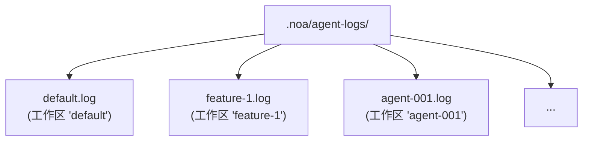
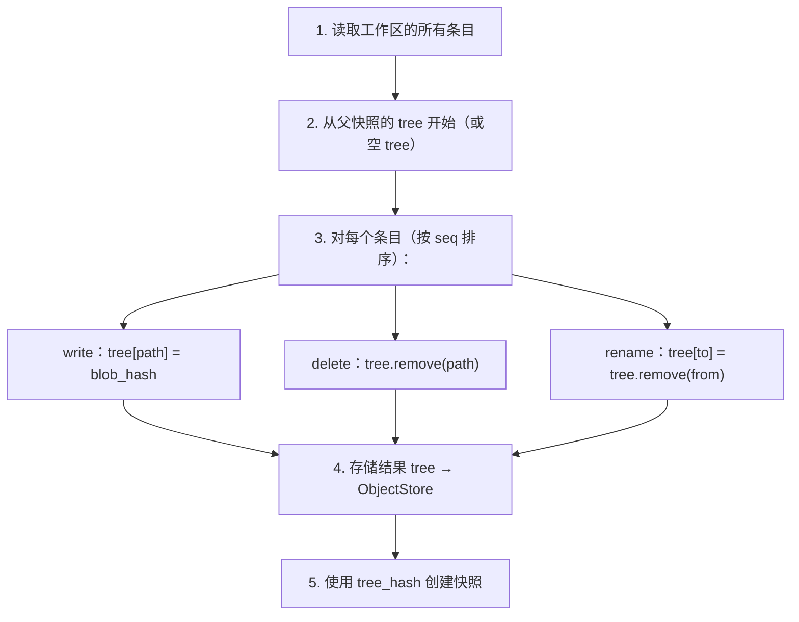
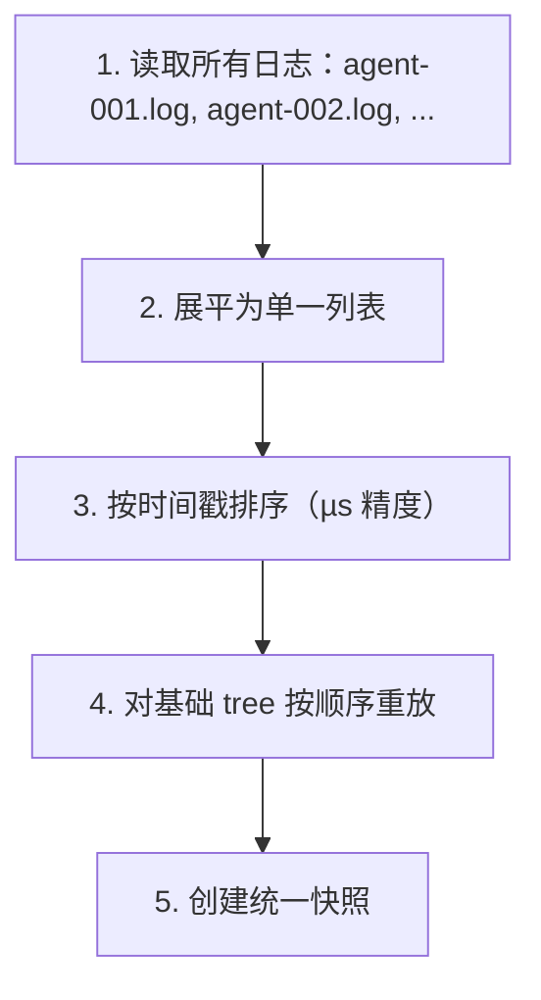

# 代理日志设计

## 概述

AgentLog 是 noa 的高吞吐量写入层。它为每个工作区提供追加式 JSONL 文件，支持多个 AI 代理的零锁并发写入。

## 日志条目格式

每行是一个 JSON 对象：

```jsonl
{"seq":1,"op":"write","path":"src/main.rs","blob":"a1b2c3...","ts":1717592400000000}
{"seq":2,"op":"delete","path":"src/old.rs","ts":1717592401000000}
{"seq":3,"op":"rename","from":"src/foo.rs","to":"src/bar.rs","ts":1717592402000000}
{"seq":4,"op":"snapshot","snapshot_id":"noa_z7x9","parent":"noa_y6w8","message":"feat","ts":1717592405000000}
{"seq":5,"op":"merge","from_workspace":"feature-1","from_snapshot":"noa_abc","base":"noa_def","ts":1717592408000000}
```

### 字段

| 字段 | 类型 | 描述 |
|------|------|------|
| `seq` | u64 | 每个工作区的单调序列号 |
| `op` | string | 操作类型：write, delete, rename, snapshot, merge |
| `path` | string | 目标文件路径（write, delete） |
| `blob` | string | Blob 哈希（write） |
| `from` | string | 源路径（rename） |
| `to` | string | 目标路径（rename） |
| `ts` | u64 | 微秒精度 Unix 时间戳 |

## 文件结构



每个工作区恰好一个日志文件。文件名匹配工作区名称。

## 写入路径

```rust
async fn append(&self, workspace: &str, entry: &LogEntry) -> Result<()> {
    let file = self.get_or_create_file(workspace)?;
    let line = serde_json::to_string(entry)? + "\n";
    file.write_all(line.as_bytes())?;
    file.sync_data()?;  // fdatasync 确保持久性
    Ok(())
}
```

关键属性：
- **O_APPEND**：内核保证原子追加
- **每次写入 fsync**：崩溃后确保持久性
- **每工作区一个 fd**：内存缓存以提高性能

## 读取路径

```rust
async fn read_all(&self, workspace: &str) -> Result<Vec<LogEntry>> {
    let path = self.log_dir.join(format!("{}.log", workspace));
    let content = tokio::fs::read_to_string(&path).await?;
    content.lines()
        .filter(|l| !l.is_empty())
        .map(|l| serde_json::from_str(l))
        .collect::<Result<Vec<_>, _>>()
        .map_err(|e| NoaError::Serialization(e.to_string()))
}
```

## 快照计算

`SnapshotEngine` 重放日志条目以构建 tree：



## 合并

多个代理日志需要合并时：



## 对比：为什么不……

### SQLite？

- **写放大**：顺序追加的 SQLite B-tree 更新
- **锁定**：SQLite 使用 WAL 锁（单写入者）
- **fsync 开销**：SQLite 每次事务多次 fsync
- **杀鸡用牛刀**：代理日志是仅追加的——不需要随机读取或更新

### redb？

- **单写入者**：redb 的 MVCC 需要写入事务
- **争用**：多个代理写入同一数据库 → 序列化
- **非追加优化**：redb 是通用 KV 存储

### 内存缓冲？

- **持久性**：进程崩溃丢失所有缓冲写入
- **内存压力**：100 代理 × 1000 写入 = 100K 条目在内存中
- **复杂性**：需要后台刷新线程和崩溃恢复

### 使用 O_APPEND 的纯 JSONL？

✅ 这正是 noa 使用的方式：
- **最小开销**：每次条目一次写入 + 一次 fsync
- **内核保证原子性**：POSIX 上的 O_APPEND
- **崩溃恢复**：仅最后一个条目可能不完整（通过尾部换行符检测）
- **人类可读**：可用标准工具检查 JSONL
- **零锁争用**：每工作区一个文件

## 性能

基准测试（ext4，SSD，Linux）：

| 指标 | 值 |
|------|-----|
| 单次写入延迟 | ~0.05ms（追加 + fdatasync） |
| 吞吐量（1 个工作区） | ~20,000 次写入/秒 |
| 吞吐量（100 个工作区） | ~10,000+ 次写入/秒 |
| 每 100 万条目文件大小 | ~200MB（平均 200 字节/条目） |

## 崩溃恢复

启动时扫描每个日志文件：
1. 读取所有完整行（以 `\n` 结尾）
2. 丢弃最后不完整的行（写入中断）
3. 验证 `seq` 单调递增
4. 从有效条目重建内存状态

这确保不会使用部分或损坏的条目进行快照计算。
