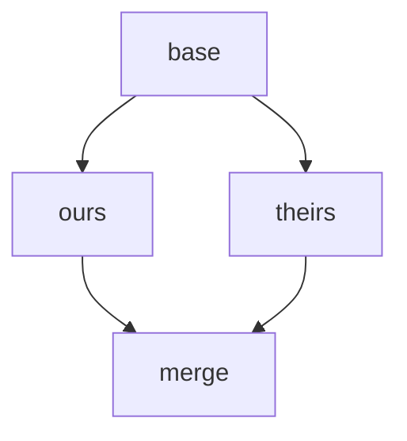
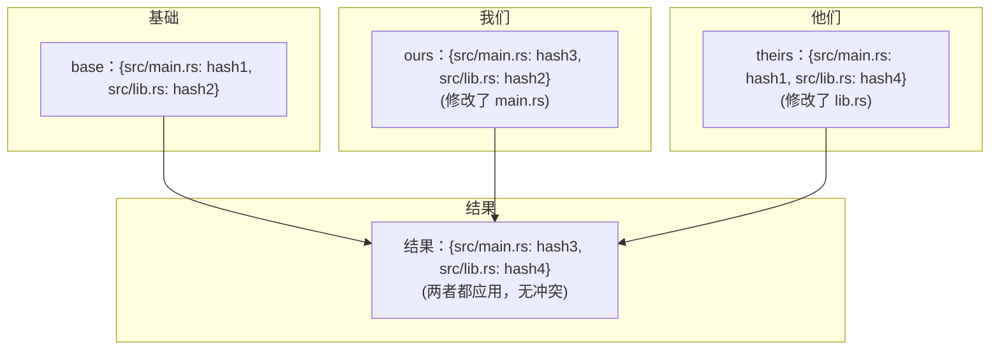
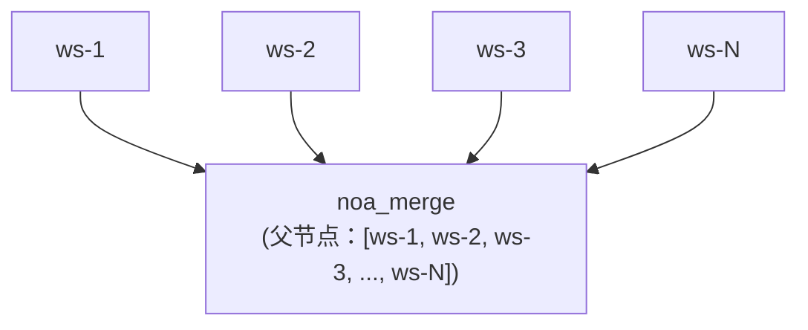
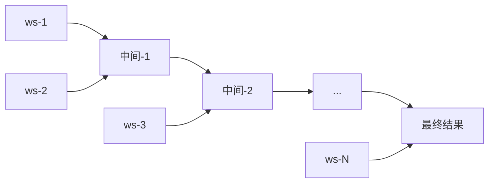

# 合并策略设计

## 概述

noa 使用三路合并算法，具有可配置的冲突解决策略。该设计优先考虑**向前推进**而非人工干预，反映了 AI 代理可以重新生成更改的使用场景。

## 三路合并

### 算法

给定两个快照（ours, theirs）及其共同的祖先（base）：



1. Diff `base` vs `ours` → changes_A
2. Diff `base` vs `theirs` → changes_B
3. 对于每个被触摸的路径：
   - 两方相同更改 → 应用（无冲突）
   - 仅在 A 中更改 → 应用 A
   - 仅在 B 中更改 → 应用 B
   - 对同一路径的不同更改 → **冲突**

### 实现

```rust
pub fn three_way_merge(
    base_tree: &Vec<TreeEntry>,
    ours_tree: &Vec<TreeEntry>,
    theirs_tree: &Vec<TreeEntry>,
) -> (Vec<TreeEntry>, Vec<Conflict>)
```

Tree 条目被规范化为扁平的路径→哈希映射以进行比较：



### 冲突检测

```rust
pub struct Conflict {
    pub path: String,
    pub base_hash: Option<String>,
    pub ours_hash: Option<String>,
    pub theirs_hash: Option<String>,
}
```

冲突类型：
- **Modify/Modify**：两方以不同方式更改同一文件
- **Add/Add**：两方在同一路径添加了内容不同的文件
- **Delete/Modify**：一方删除，另一方修改

## 解决策略

### upstream-wins（默认）

检测到冲突时，采用 theirs 的版本：

```rust
ConflictResolution::UpstreamWins => theirs_hash,
```

理由：在 AI 代理工作流中，"upstream"（main/default 工作区）代表规范状态。代理可以针对更新后的基础重新应用其更改。

### ours-wins

采用我们的版本：

```rust
ConflictResolution::OursWins => ours_hash,
```

### fail（计划中）

中止合并并返回冲突以供手动解决：

```rust
ConflictResolution::Fail => return Err(MergeError::Conflict(conflicts)),
```

## 工作区合并流程

```bash
noa workspace switch default          # 设置 ours = default
noa workspace merge feature-1         # theirs = feature-1
```

内部步骤：
1. 加载 ours 快照（default 的 head）
2. 加载 theirs 快照（feature-1 的 head）
3. 查找合并基础（DAG 中最近的共同祖先）
4. 如果没有共同祖先，使用 `noa_empty` 作为基础
5. 执行三路合并
6. 应用冲突解决策略
7. 创建合并快照，parents = [ours, theirs]
8. 将 default 的 head 更新为合并快照

## 多父级合并

noa 快照支持无限父节点，支持章鱼式合并：



对于 N 路合并，算法执行成对合并：



## 与 Git 合并的对比

| 方面 | noa | Git |
|------|-----|-----|
| 算法 | 三路 | 三路（相同核心算法） |
| 冲突标记 | 无（自动解决） | `<<<<<<<` / `=======` / `>>>>>>>` |
| 默认解决 | upstream-wins | 无（需要人工） |
| 多父级 | 无限制 | 通常 ≤2 |
| Rebase | 不支持 | 支持 |
| Cherry-pick | 不支持 | 支持 |
| Fast-forward | 自动 | 可选（–no-ff） |

## 与 SVN 合并的对比

| 方面 | noa | SVN |
|------|-----|-----|
| 合并跟踪 | 内置（父节点 DAG） | 手动（mergeinfo 属性） |
| 冲突解决 | 自动 | 手动（冲突文件） |
| 分支模型 | 工作区（轻量） | 基于目录（重量级） |
| 合并方向 | 任意 → 任意（DAG） | 通常 branch → trunk |

## 设计理由：为什么自动解决？

传统 VCS 需要人工冲突解决，因为：
1. 人类编写的代码具有只有人能理解的语义含义
2. 冲突可能代表根本性的设计分歧
3. 手动解决确保正确性

AI 代理更改具有不同特征：
1. **可重新生成**：代理可以针对最新状态重新应用更改
2. **高频**：暂停等待人工解决会阻塞所有下游工作
3. **非语义**：文件级更改不需要人工解释

因此，具有明确策略（upstream-wins）的自动解决是 noa 用例的正确权衡。
