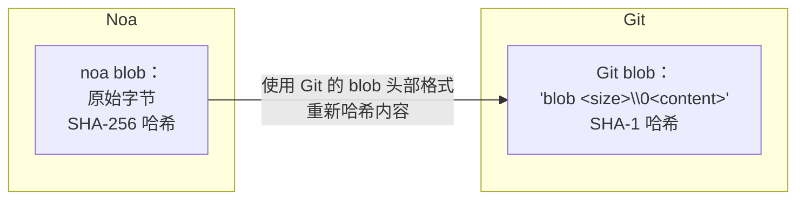
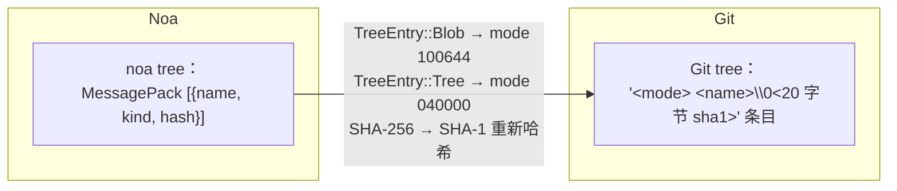
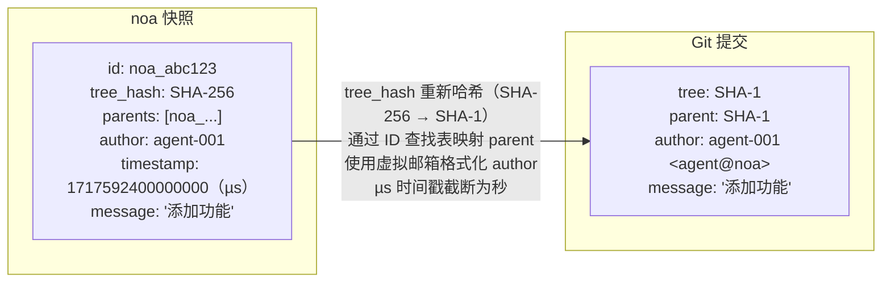
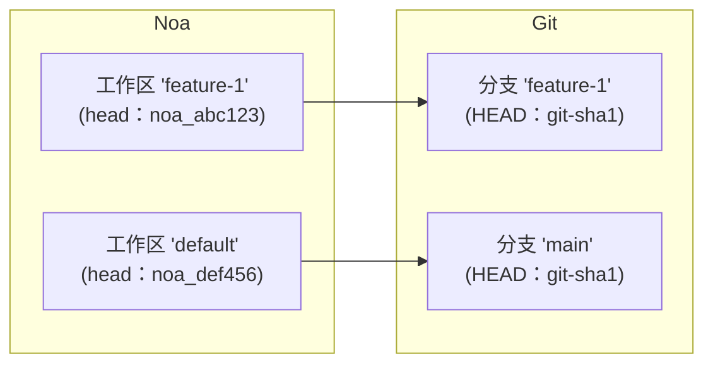
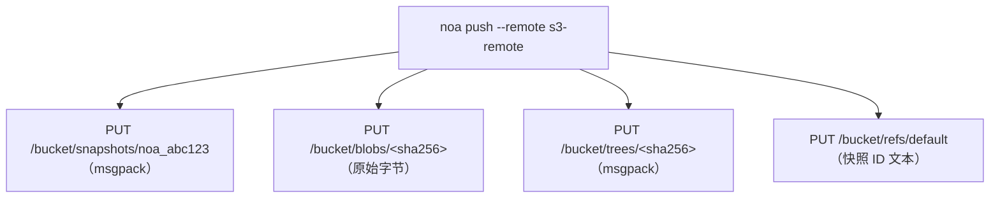

# 远程互操作设计

## 概述

noa 支持多种远程后端，用于跨机器和团队同步快照和对象。主要的互操作目标是 Git，支持与 GitHub、GitLab 和 Bitbucket 现有工作流的无缝集成。

## 远程后端 Trait

```rust
#[async_trait]
pub trait RemoteBackend: Send + Sync {
    async fn push_snapshots(&self, ids: &[SnapshotId]) -> Result<()>;
    async fn fetch_snapshots(&self, ids: &[SnapshotId]) -> Result<Vec<Snapshot>>;
    async fn push_objects(&self, ids: &[String]) -> Result<()>;
    async fn fetch_objects(&self, ids: &[String]) -> Result<()>;
    async fn list_refs(&self) -> Result<HashMap<String, SnapshotId>>;
    async fn update_ref(&self, name: &str, old: Option<&SnapshotId>, new: &SnapshotId) -> Result<()>;
}
```

## Git 转换层

`GitTranslator` 在 noa 的对象模型和 Git 之间转换：

### Blob ↔ Git Blob



### Tree ↔ Git Tree



### Snapshot ↔ Git Commit



### Workspace ↔ Git Branch



## MinIO/S3 后端

对于无需 Git 基础设施的部署：



优势：
- 无需 tree/快照转换（原生 noa 格式）
- 直接 blob 存储（无 Pack 文件开销）
- S3 兼容（适用于 AWS、GCS、MinIO、Cloudflare R2）

## 认证

| 后端 | 方法 |
|------|------|
| Git HTTPS | 从 `~/.git-credentials` 获取凭证或提示输入 |
| Git SSH | SSH agent 或密钥文件 |
| MinIO/S3 | 访问密钥 + 秘密密钥（环境变量或配置） |
