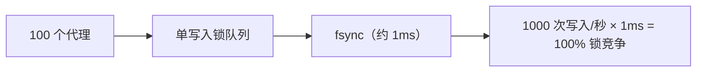
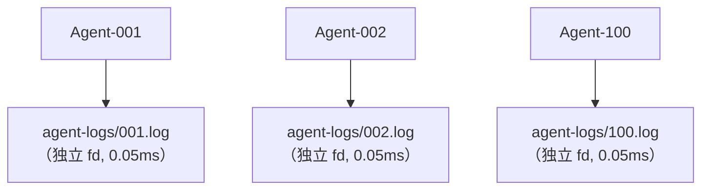

# 代理并发模型

## 设计目标

noa 支持数十到数百个 AI 代理同时写入，**零锁竞争**。

## 问题：单写入者瓶颈

传统嵌入式数据库（包括 redb）使用单写入锁：



## 解决方案：每工作区代理日志

每个工作区拥有独立的 JSONL 文件。写入使用 `O_APPEND`，在 POSIX 系统上是原子操作：



总计：每次写入 0.05ms，零锁竞争。

## AgentLog 格式

```jsonl
{"seq":1,"op":"write","path":"src/main.rs","blob":"abc123...","ts":1717592400000000}
{"seq":2,"op":"delete","path":"src/old.rs","ts":1717592401000000}
{"seq":3,"op":"rename","from":"src/foo.rs","to":"src/bar.rs","ts":1717592402000000}
{"seq":4,"op":"snapshot","snapshot_id":"noa_z7x9","parent":"noa_y6w8","message":"feat","ts":1717592405000000}
```

- `seq`：每个工作区的单调计数器
- `ts`：微秒精度时间戳
- 合并时按 `ts` 全局排序

## 何时使用 redb 与 AgentLog

| 组件 | 存储 | 原因 |
|------|------|------|
| blobs、trees | redb | 内容寻址、不可变、读多写少 |
| snapshots、refs、workspaces | redb | 元数据、写入频率低 |
| 代理增量日志 | 文件 JSONL | 高频并发写入 |

## 合并（Consolidation）

`Consolidator` 读取所有代理日志，按时间戳排序，创建统一的快照链：

```rust
Consolidator::new(&engine)
    .consolidate("default", parent_ids, "agent", "批量更新")
    .await?;
```

## noa-server 多进程并发

对于真正的多进程场景（多个 CLI 进程或分布式代理），使用 noa-server HTTP API：

```bash
noa-server  # 启动于端口 3000

# 代理通过 REST 交互：
POST /api/v1/repo/my-project/blobs
POST /api/v1/repo/my-project/snapshots
POST /api/v1/repo/my-project/agent-log
```

服务器持有单一数据库连接，内部序列化写入，同时通过 MVCC 处理并发读取。
