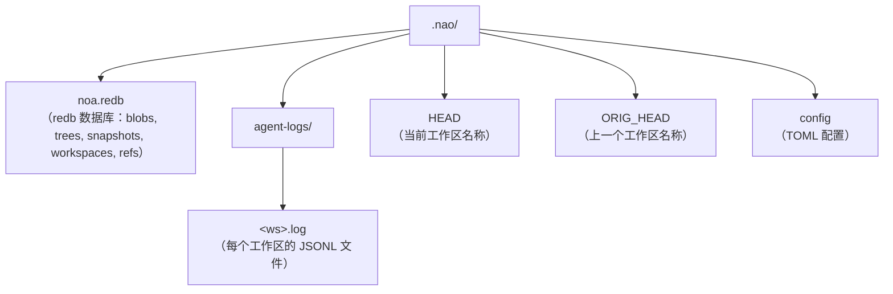
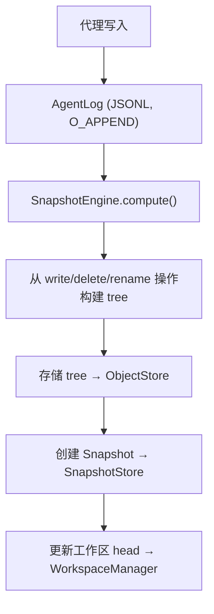

# 架构

完整实现计划见 [PLAN.md](../../PLAN.md)。

## 核心组件

### ObjectStore（对象存储）

基于内容寻址的 blob 和 tree 存储。内容以 SHA-256 哈希为地址。

```
BlobId = SHA256(内容)
TreeId = SHA256(msgpack(Tree条目))
```

实现：
- **RedbObjectStore**：使用 redb 嵌入式 KV 存储的本地存储
- **MinioObjectStore**：使用 S3 兼容 MinIO 的远程存储

### AgentLog（代理日志）

每个工作区一个的只追加日志，支持零锁并发写入。每个工作区在
`.noa/agent-logs/<ws-uuid>.log` 下有独立的 JSONL 文件。

操作：
- **write**：记录文件写入及 blob 引用
- **delete**：记录文件删除
- **rename**：记录文件重命名
- **snapshot**：记录快照创建
- **merge**：记录从其他工作区合并

### Snapshot（快照）

工作区的不可变时间点状态。包含 tree 哈希、父快照、作者和消息。

```
Snapshot = {
    id: "noa_<12字符base62>"
    tree_hash: tree 内容的 SHA256
    parents: [SnapshotId, ...]
    workspace: 工作区名称
    author: 代理标识符
    timestamp: 微秒精度
    message: 人类可读描述
}
```

### Workspace（工作区）

代理的隔离工作上下文。跟踪 head 快照和 base 快照。

### RefStore（引用存储）

指向快照的命名指针，使用比较并交换（CAS）语义确保安全的并发更新。

### Merge Engine（合并引擎）

三路合并，比较 base、ours 和 theirs 的 tree：
- 双方相同更改 → 无冲突
- 仅一方更改 → 应用
- 对同一文件的不同更改 → 冲突（默认策略：upstream-wins）

## 存储布局



## 数据流


