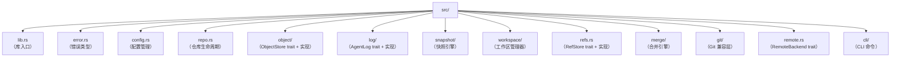

# 构建 noa

## 前置条件

- Rust 1.75+（stable）
- Python 3.8+（构建脚本用）
- `just` 命令运行器

## 安装

```bash
git clone https://github.com/celestia-island/noa.git
cd noa
just init          # 获取 Rust 依赖
just build-dev     # 开发构建
```

## 开发命令

```bash
just fmt            # 格式化代码
just clippy         # 代码检查
just test           # 运行测试
just check          # 类型检查
```

## 项目结构


