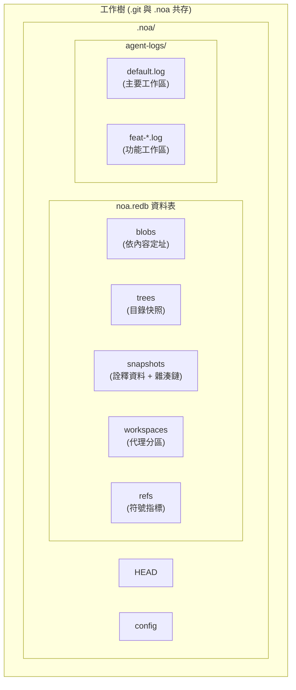
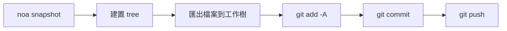
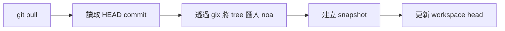
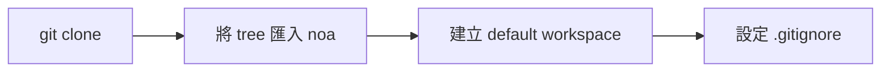

<div align="center"></div>
<h1 align="center">Noa</h1>
<div align="center">
 <strong>AI 原生的分散式版本控制系統</strong>
</div>

<br />

<div align="center">
  <a href="https://github.com/celestia-island/noa/actions">
    
  </a>
  <a href="https://github.com/celestia-island/noa/actions">
    
  </a>
  <a href="https://crates.io/crates/libnoa">
    
  </a>
  <a href="https://docs.rs/libnoa">
    
  </a>
  <a href="../../LICENSE">
    
  </a>
  <a href="https://github.com/celestia-island/noa/releases">
    
  </a>
</div>

<div align="center">

**[English](../en/README.md)** &bull; **[简体中文](../zh-hans/README.md)** &bull;
**[繁體中文]** &bull; **[日本語](../ja/README.md)** &bull;
**[한국어](../ko/README.md)** &bull; **[Français](../fr/README.md)** &bull;
**[Español](../es/README.md)** &bull; **[Русский](../ru/README.md)** &bull;
**[العربية](../ar/README.md)**

</div>

noa 是一個 AI 原生的分散式版本控制系統。它與 `.git` 共存 — git 管理原始碼，noa 管理 AI 代理的迭代資料 — 具備每個代理獨立的零鎖定 JSONL 日誌、基於快照的歷史記錄，以及完整的 git 協定相容性。

## 目錄

- [為什麼選擇 noa](#為什麼選擇-noa)
- [架構](#架構)
- [安裝](#安裝)
- [快速入門](#快速入門)
- [指令](#指令)
- [Git 整合](#git-整合)
- [相容性](#相容性)
- [API (libnoa)](#api-libnoa)
- [從原始碼建置](#從原始碼建置)
- [相關專案](#相關專案)
- [授權條款](#授權條款)

## 為什麼選擇 noa

傳統的 git 將所有貢獻者一視同仁 — 無論是人類還是 AI。但 AI 代理有根本不同的需求：

| 挑戰 | Git 的解決方案 | noa 的解決方案 |
|-----------|-------------|--------------|
| **並行寫入** | 鎖定檔案、合併衝突 | 每個代理獨立的僅附加 JSONL 日誌 |
| **代理識別** | 在每個儲存庫設定 user.name/email | 工作區範圍的 agent_id，具備每個代理的分割區 |
| **部分貢獻** | 一次提交 = 工作樹中的所有變更 | 代理日誌只記錄實際觸及的檔案 |
| **迭代追蹤** | Rebase/squash 會銷毀歷史記錄 | 每個工作區不可變更的快照鏈 |
| **多代理人合併** | 對文字進行三方合併 | 合併快照，偵測檔案層級的衝突 |
| **Git 協定相容性** | 不適用 | 透過系統 git CLI 橋接器進行 clone/push/pull/fetch |

## 架構



**核心概念：**

- **工作區**：一個代理的隔離線性命名空間。每個工作區擁有自己的 JSONL 日誌。
- **快照**：工作區樹在某個時間點的記錄（以 SHA-256 依內容定址的 blobs 與 trees）。
- **代理日誌**：僅附加的 JSONL 檔案，記錄原子檔案操作（`write`、`delete`、`rename`），包含 blob ID 與時間戳記。
- **合併**：將兩個工作區快照針對共同基礎進行三方合併。

## 安裝

### 從 GitHub Releases 安裝

```bash
# 下載適用於您平台的最新版本二進位檔：
#   https://github.com/celestia-island/noa/releases

chmod +x noa
mv noa /usr/local/bin/
```

### 從原始碼建置（需要 Rust 1.85+）

```bash
git clone https://github.com/celestia-island/noa.git
cd noa
cargo build --release
# 二進位檔：target/release/noa、target/release/noa-server
```

### 作為函式庫使用（Cargo）

```toml
[dependencies]
libnoa = { git = "https://github.com/celestia-island/noa" }
```

注意：crates.io 上的套件名稱為 `libnoa`（名稱 `noa` 已被使用）。二進位檔仍命名為 `noa`。

## 快速入門

### 在現有的 git 儲存庫中初始化

```bash
cd my-git-project
noa init                              # 在 .git/ 旁邊建立 .noa/
noa remote add origin "git@github.com:user/repo.git"
noa pull                              # 將目前的 git HEAD 匯入 noa
```

### 建立代理工作區並進行迭代

```bash
# Agent A 處理 auth 功能
noa workspace create feat-auth -a agent-auth
noa workspace switch feat-auth

# Agent 寫入其代理日誌
#（AI 代理直接寫入 JSONL；此處為手動範例）
cat >> .noa/agent-logs/feat-auth.log << EOF
{"seq":1,"op":"write","path":"src/auth.rs","blob_id":"<sha256>","ts":1717000000000000}
EOF

# 儲存工作區狀態
noa snapshot create -m "add auth module" -a agent-auth
```

### 合併功能並與 git 同步

```bash
noa workspace switch default
noa workspace merge feat-auth          # 合併到 default
noa push                               # 匯出為 git commit + git push
```

## 指令

### 工作區管理

```bash
noa workspace create <name> [-a <agent-id>]   # 建立新的工作區
noa workspace switch <name>                    # 切換使用中的工作區
noa workspace list                              # 列出所有工作區
noa workspace delete <name>                     # 刪除工作區
noa workspace merge <from>                      # 將另一個工作區合併到目前的工作區
```

### 快照管理

```bash
noa snapshot create -m <msg> [-a <author>]     # 從代理日誌建立快照
noa snapshot list                               # 列出快照
noa snapshot diff <id-a> <id-b>                # 比對兩個快照（檔案層級）
```

### 遠端操作

```bash
noa remote add <name> <url>                     # 新增遠端儲存庫
noa remote remove <name>                        # 移除遠端儲存庫
noa remote list                                 # 列出遠端儲存庫
noa fetch [-r <remote>]                         # 列出遠端參照
noa pull [-r <remote>]                          # Git pull + 重新匯入 noa
noa push [-r <remote>]                          # 匯出快照 → git commit → git push
```

### 儲存庫操作

```bash
noa init [-p <path>] [--noa-remote <url>]      # 初始化 .noa/ 儲存庫
noa clone <url> [-p <path>]                     # Git clone + 匯入 noa
noa clone --svn <url> [-p <path>]              # SVN 匯出 → git init → 匯入 noa
noa status                                       # 顯示目前工作區狀態
noa log [-w <workspace>] [-n <limit>]          # 顯示快照歷史記錄
```

## Git 整合

noa 使用系統 `git` CLI 進行所有網路操作，確保與任何 git 遠端儲存庫 100% 相容。

### Push 工作流程



### Pull 工作流程



### Clone 工作流程



### 關鍵設計決策

- **匯出為附加模式**：只有 noa 快照中的檔案會被寫入工作樹。不在快照中的現有 git 追蹤檔案則保持不變。
- **匯入使用 gix**：用於本機樹遍歷（無需網路）。網路操作使用系統 `git` CLI。
- **`.noa/` 自動加入 gitignore**：`noa init` 會將 `.noa/` 附加到 `.gitignore`，確保代理資料永遠不會洩漏到 git 歷史記錄中。

## 相容性

### 已測試的平台

| 提供者 | 協定 | Push | Pull | Clone | LFS |
|----------|----------|------|------|-------|-----|
| **GitHub** | HTTPS、SSH | ✓ | ✓ | ✓ | ✓ |
| **Bitbucket** | HTTPS、SSH | ✓ | ✓ | ✓ | ✓ |
| **GitLab** | HTTPS、SSH | ✓ | ✓ | ✓ | ✓ |
| **本機裸儲存庫** | file:// | ✓ | ✓ | ✓ | ✓ |
| **SVN** | svn:// | 僅匯入 | — | `--svn` | — |

### Git LFS

noa 會自動偵測 Git LFS 儲存庫：

- `noa clone`：對 LFS 追蹤的儲存庫執行 `git lfs install` + `git lfs pull`
- `noa push`：在 git push 之後執行 `git lfs push --all`
- `noa pull`：在 git pull 之後執行 `git lfs pull`
- LFS 指標檔案會作為一般 blob 匯入 noa

### SVN

```bash
noa clone --svn file:///path/to/svn/repo -p ./my-project
```

此操作會執行 `svn export trunk → git init → noa import`。這是一次性匯入 — 若要進行增量同步，請排程使用 `svn export` + `noa snapshot create`。

### Bitbucket

SSH（`git@bitbucket.org:ws/repo.git`）和 HTTPS（`https://user@bitbucket.org/ws/repo.git`）兩種 URL 都透過 git 橋接器原生支援。

## API (libnoa)

libnoa 提供 Rust API，可將 noa 功能嵌入到其他工具中：

```rust
use libnoa::repo::Repository;
use libnoa::snapshot::SnapshotEngine;
use libnoa::log::FileAgentLog;

// 開啟儲存庫
let repo = Repository::open(&path)?;

// 建立工作區
let ws_mgr = repo.workspace_manager()?;
ws_mgr.create(&Workspace {
    name: "feat-x".into(),
    head: base_snap_id.clone(),
    base: base_snap_id.clone(),
    agent_id: Some("my-agent".into()),
    created_at: now,
    updated_at: now,
}).await?;

// 從代理日誌建置快照
let engine = SnapshotEngine::new(
    FileAgentLog::new(&path, "my-agent")?,
    repo.snapshot_store()?,
    repo.object_store()?,
)
.with_repo_root(repo.root.clone());
let snapshot = engine.compute("feat-x", vec![], "author", "message").await?;

// 將快照匯出到 git
libnoa::git::export_noa_to_git(&repo.root, repo.db.clone()).await?;
```

更多使用範例請參閱 `tests/smoke.rs` 和 `tests/compat.rs`。

## 從原始碼建置

```bash
# 前置需求：Rust 1.85+、git、pkg-config（LFS/SVN 可選）
git clone https://github.com/celestia-island/noa.git
cd noa

# 建置
cargo build --release
# 輸出：target/release/noa（CLI）、target/release/noa-server（API 伺服器）

# 執行測試
cargo test -- --test-threads=1

# 啟動 noa 伺服器
NOA_PORT=3000 NOA_DB_PATH=/data/noa/server.redb target/release/noa-server
```

## 相關專案

| 專案 | 關聯 |
|---------|-------------|
| [entelecheia](https://github.com/celestia-island/entelecheia) | 多代理人協同運作平台。使用 noa 進行代理工作區版本控制。 |
| [tairitsu](https://github.com/celestia-island/tairitsu) | WASM 元件模型框架。未來：noa 客戶端作為 WASM 元件。 |
| [kirino](https://github.com/celestia-island/kirino) | 零信任驗證/RBAC。由 noa-server 用於身分驗證。 |

## 授權條款

Apache-2.0。詳見 [LICENSE](../../LICENSE)。
