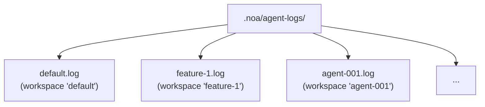
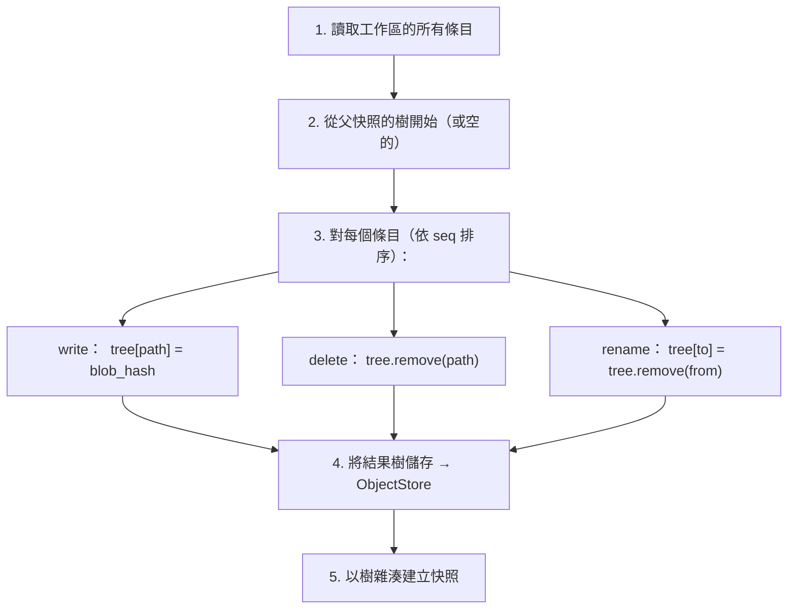
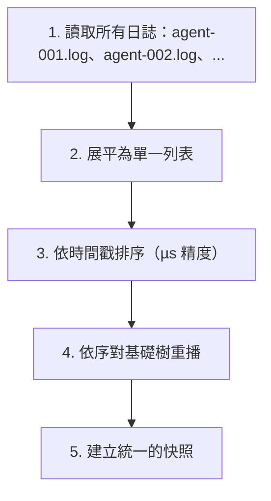

# 代理日誌設計

## 概述

AgentLog 是 noa 的高吞吐量寫入層。它為每個工作區提供僅附加的 JSONL 檔案，可實現多個 AI 代理的零鎖定並行寫入。

## 日誌條目格式

每行是一個 JSON 物件：

```jsonl
{"seq":1,"op":"write","path":"src/main.rs","blob":"a1b2c3...","ts":1717592400000000}
{"seq":2,"op":"delete","path":"src/old.rs","ts":1717592401000000}
{"seq":3,"op":"rename","from":"src/foo.rs","to":"src/bar.rs","ts":1717592402000000}
{"seq":4,"op":"snapshot","snapshot_id":"noa_z7x9","parent":"noa_y6w8","message":"feat","ts":1717592405000000}
{"seq":5,"op":"merge","from_workspace":"feature-1","from_snapshot":"noa_abc","base":"noa_def","ts":1717592408000000}
```

### 欄位

| 欄位 | 型別 | 描述 |
|-------|------|-------------|
| `seq` | u64 | 每個工作區的單調遞增序號 |
| `op` | string | 操作類型：write、delete、rename、snapshot、merge |
| `path` | string | 目標檔案路徑（write、delete） |
| `blob` | string | Blob 雜湊（write） |
| `from` | string | 來源路徑（rename） |
| `to` | string | 目的路徑（rename） |
| `ts` | u64 | 微秒精度的 Unix 時間戳 |

## 檔案結構



每個工作區恰好一個日誌檔案。檔案名稱與工作區名稱相符。

## 寫入路徑

```rust
async fn append(&self, workspace: &str, entry: &LogEntry) -> Result<()> {
    let file = self.get_or_create_file(workspace)?;
    let line = serde_json::to_string(entry)? + "\n";
    file.write_all(line.as_bytes())?;
    file.sync_data()?;  // fdatasync 確保持久性
    Ok(())
}
```

關鍵屬性：
- **O_APPEND**：核心保證原子附加
- **每次寫入 fsync**：確保崩潰後的持久性
- **每個工作區一個 fd**：快取在記憶體中以提升效能

## 讀取路徑

```rust
async fn read_all(&self, workspace: &str) -> Result<Vec<LogEntry>> {
    let path = self.log_dir.join(format!("{}.log", workspace));
    let content = tokio::fs::read_to_string(&path).await?;
    content.lines()
        .filter(|l| !l.is_empty())
        .map(|l| serde_json::from_str(l))
        .collect::<Result<Vec<_>, _>>()
        .map_err(|e| NoaError::Serialization(e.to_string()))
}
```

## 快照計算

`SnapshotEngine` 重播日誌條目以建構樹：



## 整合

當需要合併多個代理日誌時：



## 比較：為什麼不是...

### SQLite 用於代理日誌？

- **寫入放大**：SQLite B-tree 更新用於順序附加
- **鎖定**：SQLite 使用 WAL 鎖定（單一寫入者）
- **fsync 額外負擔**：SQLite 每筆交易發出多次 fsync
- **過度設計**：代理日誌是僅附加的 — 無隨機讀取或更新

### redb 用於代理日誌？

- **單一寫入者**：redb 的 MVCC 需要寫入交易
- **競爭**：多個代理寫入相同的資料庫 → 序列化
- **非針對附加最佳化**：redb 是通用型 KV 儲存

### 記憶體內緩衝區？

- **持久性**：處理程序崩潰會遺失所有緩衝的寫入
- **記憶體壓力**：100 個代理 × 1000 次寫入 = 100K 個條目在記憶體中
- **複雜度**：需要具備崩潰復原的背景清空執行緒

### 使用 O_APPEND 的純 JSONL？

✅ 這就是 noa 使用的方式：
- **最小額外負擔**：每次條目一次寫入 + 一次 fsync
- **核心保證的原子性**：POSIX 上的 O_APPEND
- **崩潰復原**：只有最後一個條目可能不完整（透過尾隨換行符偵測）
- **人類可讀**：JSONL 可用標準工具檢查
- **零鎖定競爭**：每個工作區一個檔案

## 效能

基準測試（ext4、SSD、Linux）：

| 指標 | 數值 |
|--------|-------|
| 單次寫入延遲 | 約 0.05ms（附加 + fdatasync） |
| 吞吐量（1 個工作區） | 約 20,000 次寫入/秒 |
| 吞吐量（100 個工作區） | 約 10,000+ 次寫入/秒 |
| 每 1M 條目的檔案大小 | 約 200MB（平均每條目 200 位元組） |

## 崩潰復原

啟動時，掃描每個日誌檔案：
1. 讀取所有完整行（以 `\n` 結尾）
2. 若最後一行被截斷則捨棄（不完整的寫入）
3. 驗證 `seq` 是單調遞增的
4. 從有效條目重建記憶體內狀態

這確保不會有不完整或損壞的條目被用於快照計算。
