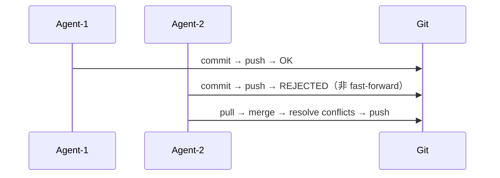
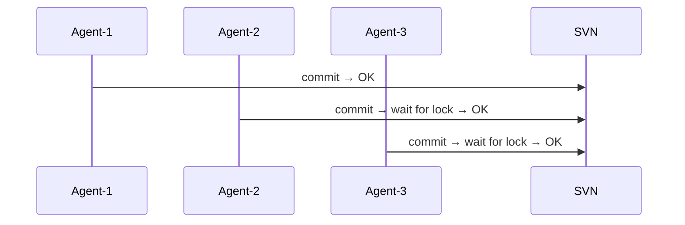
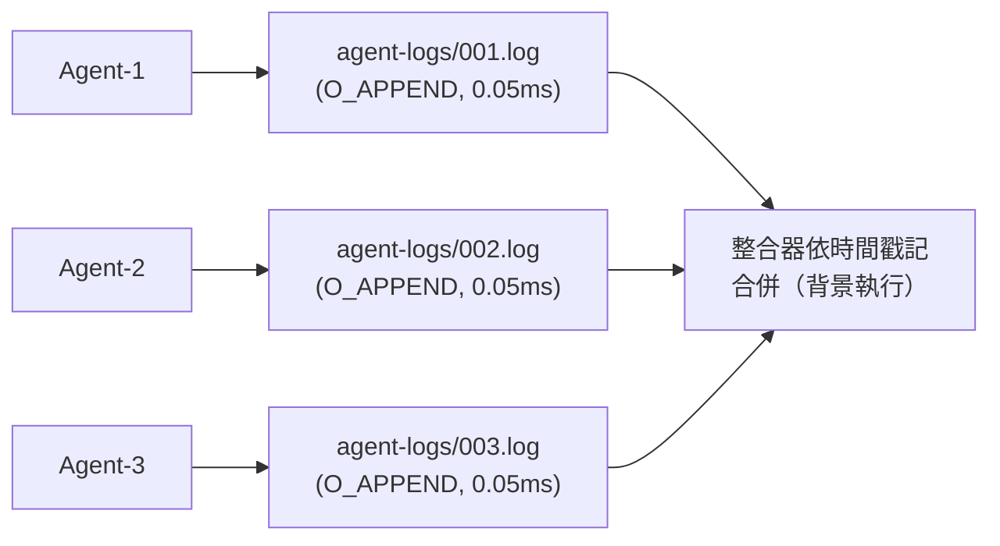
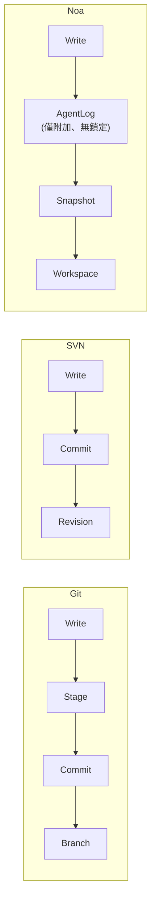
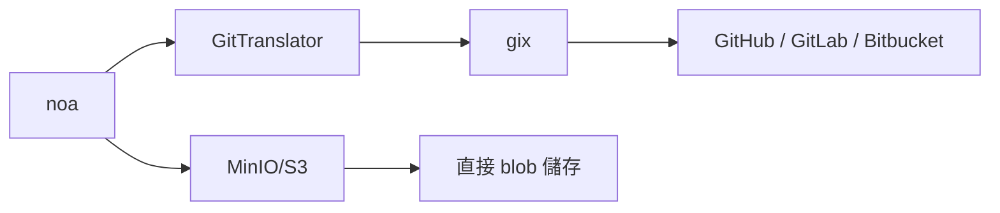

# noa 與 Git 與 SVN 與 Bitbucket：比較分析

## 執行摘要

noa 是一個專為 AI 代理工作流程設計的版本控制系統。與 Git、SVN 和 Bitbucket（其包裝了 Git/SVN）不同，noa 針對**來自非人類行為者的高頻率並行寫入**進行最佳化 — 數十到數百個 AI 代理同時修改檔案而不發生鎖定競爭。

---

## 功能比較矩陣

| 功能 | noa | Git | SVN | Bitbucket |
|---------|-----|-----|-----|-----------|
| **架構** | 嵌入式 KV + 僅附加日誌 | 依內容定址的 DAG | 集中式差異儲存 | Git/SVN 託管 |
| **並行模型** | 每個工作區獨立僅附加日誌（零鎖定） | 分支層級鎖定（合併衝突） | 中央伺服器序列化 | 與 Git/SVN 相同 |
| **合併策略** | 三方、預設 upstream-wins | 三方、手動解決 | 手動合併 | 與 Git/SVN 相同 |
| **快照粒度** | 微秒時間戳、每個代理獨立 | 每次提交（人類節奏） | 每次修訂 | 與 Git/SVN 相同 |
| **代理原生** | 是 — 每個代理一個工作區、代理日誌 | 否 — 為人類工作流程設計 | 否 | 否 |
| **儲存後端** | 可插拔（redb 本機、MinIO/S3 遠端） | Pack 檔案 + 鬆散物件 | Berkeley DB / FSFS | 伺服器端儲存 |
| **分散式** | 是（透過 Git 橋接器進行遠端 push/pull） | 是（原生） | 否（集中式） | 是（託管） |
| **二進位差異** | 依內容定址的 blob（無差異壓縮） | Pack 層級差異壓縮 | 伺服器端差異 | 與 Git/SVN 相同 |
| **鎖定** | 寫入無鎖（僅附加日誌） | 僅建議性鎖定 | `svn:needs-lock` | 與 Git/SVN 相同 |
| **HTTP API** | 內建（noa-server） | git-http-backend | WebDAV | REST API |
| **學習曲線** | 極簡（6 個指令） | 陡峭（約 40 個指令） | 中等 | 中等 |

---

## 詳細比較

### 1. 並行性

**Git**：一個分支 = 同一時間一個寫入者。並行寫入者會產生分歧的歷史記錄，必須透過合併來調和。合併衝突需要人工介入。



**SVN**：中央伺服器序列化所有提交。檔案層級鎖定可用但會產生瓶頸。



**noa**：每個代理寫入自己的僅附加日誌檔案。設計上即無鎖定競爭。整合工作以非同步方式進行。



### 2. 資料模型

**Git**：Blob → Tree → Commit → Branch → Ref。以 SHA-1 依內容定址。不可變物件。分支是可變指標。

**SVN**：檔案/目錄 → 修訂版。線性修訂版號。路徑是一等公民。

**noa**：Blob → Tree → Snapshot → Workspace。以 SHA-256 依內容定址。快照不可變。工作區是可變指標，具備 CAS 更新。

關鍵差異：noa 的 **AgentLog** 層位於代理的寫入和不可變快照層之間，為高頻率操作提供緩衝。



### 3. 合併哲學

**Git**：三方合併，需要人工衝突解決。衝突會阻塞進度直到解決為止。

**SVN**：手動合併追蹤。衝突解決在檔案層級進行。

**noa**：三方合併，具備可設定的自動解決方案（預設：upstream-wins）。專為可重新套用變更而非手動解決衝突的 AI 代理設計。

理念：AI 代理不需要看到衝突標記 — 它們可以針對最新狀態重新生成其變更。upstream-wins 策略確保向前推進。

### 4. 儲存效率

**Git**：Pack 檔案搭配差異壓縮。針對人類規模的提交頻率進行最佳化（約每天 10-100 次提交）。

**SVN**：伺服器端差異儲存。對於大型二進位檔案有效率。

**noa**：依內容定址的 blob，無差異壓縮。快照以 msgpack 編碼。取捨：更簡單的實作、更快的寫入、更大的儲存空間。可接受的原因：
- AI 代理工件經常被重新生成（舊版本是短暫的）
- 儲存空間便宜；代理吞吐量昂貴
- MinIO/S3 後端處理去重

### 5. 遠端互通性

**Git**：原生協定（git://、https://、ssh://）。通用。

**SVN**：svn://、http://。依賴 Apache/Subversion。

**noa**：透過 `gix` (gitoxide) 的 Git 橋接器。可以從任何 Git 遠端 push/pull。也支援原生 MinIO/S3 後端進行直接物件儲存。



### 6. 存取控制

**Git**：檔案系統權限或伺服器端鉤子（pre-receive 等）。

**SVN**：內建於協定中的路徑型 ACL。

**Bitbucket**：分支權限、合併檢查、程式碼審查要求。

**noa**：工作區層級隔離。每個代理只能寫入其被指派的工作區。合併到共享分支需要明確的動作。透過 noa-server 進行伺服器端身分驗證。

---

## 何時使用什麼

| 場景 | 最佳選擇 | 原因 |
|----------|-------------|--------|
| 人類軟體開發 | Git | 成熟的生態系統、通用工具 |
| AI 代理程式碼生成（10+ 個代理） | noa | 零鎖定並行寫入 |
| 企業合規 + 稽核 | SVN | 集中式、路徑型 ACL |
| 團隊協作 + CI/CD | Bitbucket | 內建管線、PR、審查 |
| AI 代理協同運作 + 人類審查 | noa → Git 橋接器 | 代理在 noa 中工作，人類透過 Git 審查 |
| 大型二進位資產 | SVN 或 Git LFS | 二進位檔案的差異壓縮 |
| 嵌入式 / 邊緣裝置 | noa | 單一二進位檔、redb 嵌入式、無守護程序 |

---

## 遷移路徑

### noa ↔ Git

```bash
# 將 noa 快照匯出到 Git
noa remote add origin https://github.com/example/repo.git
noa push --remote origin

# 將 Git 歷史記錄匯入 noa
noa clone https://github.com/example/repo.git
```

`GitTranslator` 在 noa 的 blob/tree 格式和 Git 的物件格式之間進行轉換。快照對應到 Git commit；工作區對應到分支。

### Git → noa

不是替代 — noa 是 Git 的**補充**，用於 AI 代理工作流程。兩者並用：
1. AI 代理在 noa 工作區中工作
2. 已核准的變更透過 push 合併到 Git
3. 人類開發者繼續像以前一樣使用 Git
