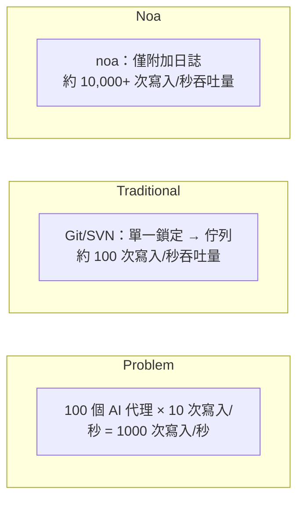
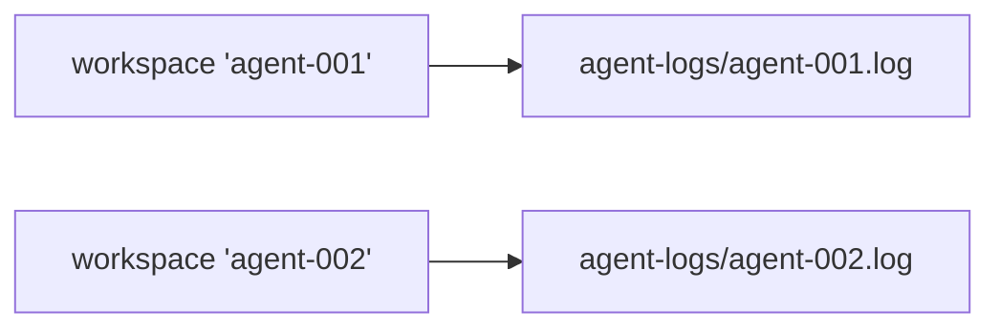
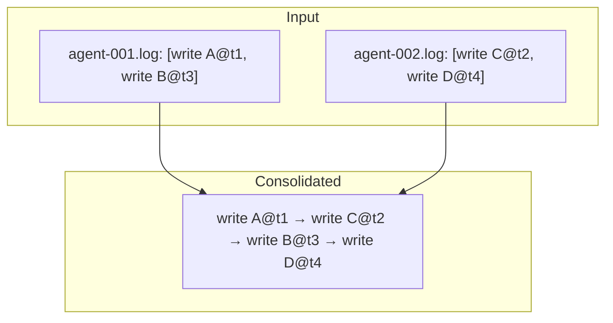
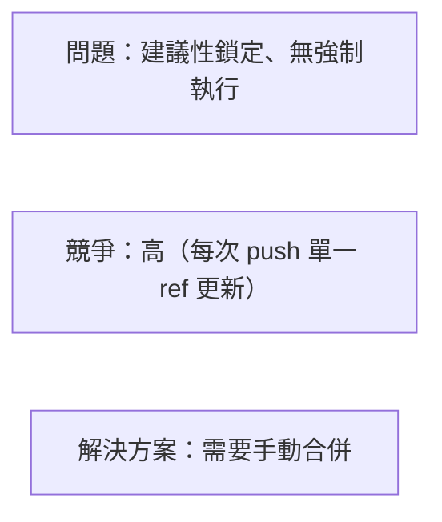
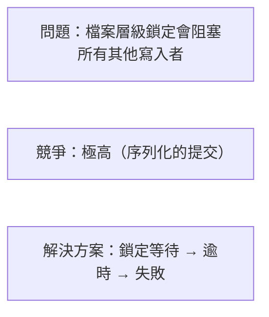
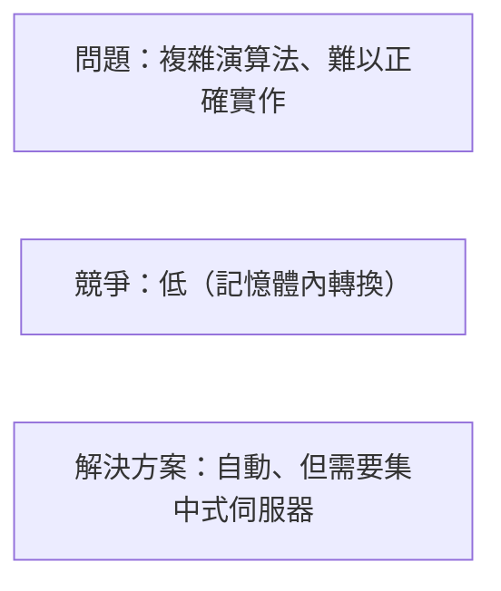
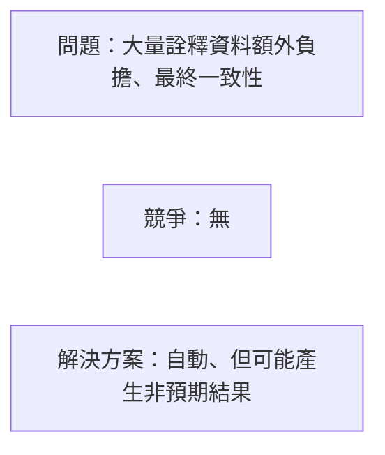
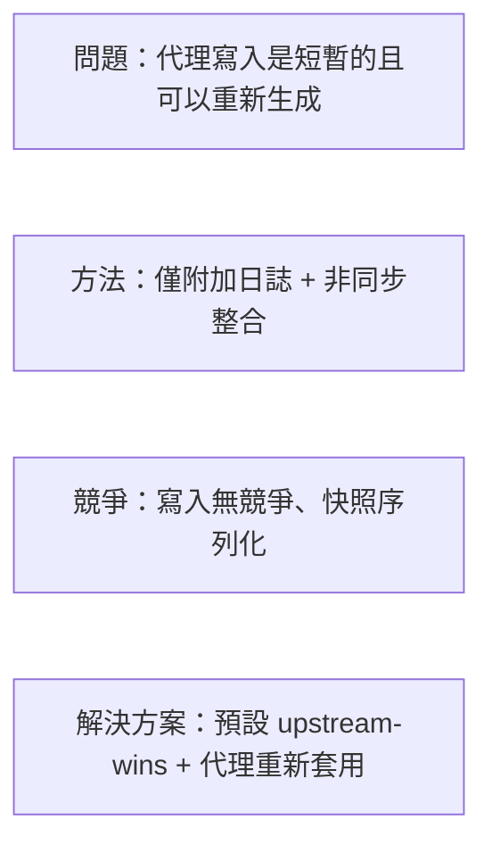

# 並行性設計

## 問題陳述

傳統 VCS 系統透過單一鎖定或合併佇列來序列化寫入。這對人類規模的工作流程（每天 10-100 次提交）可行，但對於每分鐘產生數千次檔案修改的 AI 代理則會崩潰。



## 架構

### 第一層：AgentLog（寫入路徑）

每個工作區在 `.noa/agent-logs/` 下有一個專屬的 JSONL 檔案。



寫入使用 `O_APPEND` 旗標，提供：
- **原子性**：核心保證附加操作的完整寫入原子性
- **排序**：寫入按每個檔案（每個工作區）序列化
- **無鎖定**：不同檔案之間無需 fcntl/flock

```rust
pub trait AgentLog: Send + Sync {
    async fn append(&self, workspace: &str, entry: &LogEntry) -> Result<()>;
    async fn read_all(&self, workspace: &str) -> Result<Vec<LogEntry>>;
}
```

### 第二層：Snapshot Store（讀取路徑）

快照儲存在 redb 中，具備 MVCC（多版本並行控制）：
- 寫入透過 redb 的單一寫入者交易序列化
- 讀取永遠不會阻塞寫入（快照隔離）
- 多個讀取者可以同時存取

### 第三層：整合（合併路徑）

`Consolidator` 讀取所有工作區中的代理日誌，依時間戳記排序，並產生統一的快照鏈：



此過程以非同步方式執行，不會阻塞代理寫入。

## 並行性保證

| 保證 | 機制 |
|-----------|-----------|
| 無資料遺失 | O_APPEND + 每次寫入 fsync |
| 每個工作區的排序 | 每個工作區單一檔案 |
| 跨工作區排序 | 微秒時間戳 |
| 讀取一致性 | redb MVCC 快照隔離 |
| 工作區 head 安全 | CAS（比較並交換）更新 |

## 可擴展性分析

### 單一處理程序（嵌入式）

| 代理數量 | 1-100（相同處理程序） |
| 吞吐量 | 約 10,000 次寫入/秒 |
| 瓶頸 | 磁碟 I/O（每次寫入 fsync） |

### 多處理程序（noa-server）

| 代理數量 | 100-1000（獨立處理程序） |
| 吞吐量 | 約 5,000 次寫入/秒 |
| 瓶頸 | 伺服器端寫入序列化 |

伺服器持有單一資料庫連接並序列化寫入。代理日誌仍為每個檔案獨立以實現平行擷取。

### 分散式（MinIO 後端）

| 代理數量 | 1000+ |
| 吞吐量 | S3 PUT 速率限制（約 3,500/秒 每個前綴） |
| 瓶頸 | 網路 + S3 速率限制 |

## 與替代方案的比較

### Git + 檔案鎖定



### SVN + svn:needs-lock



### 操作轉換（OT）



### CRDT（無衝突複製資料型別）



### noa 的方法



## fsync 策略

每次代理日誌寫入遵循此模式：

```rust
file.write_all(data)?;   // 附加到檔案
file.flush()?;           // 清空使用者空間緩衝區
file.sync_data()?;       // fsync — 確保磁碟持久性
```

在 Linux 上，`sync_data()` 略過詮釋資料同步（fdatasync），與完整的 fsync 相比可減少約 30% 的延遲。

## 未來：寫入前日誌批次處理

目前：每次寫入一次 fsync。
計畫中：將多次寫入批次處理為單一 fsync：

```rust
// 代理在記憶體中緩衝寫入
agent.buffer(write_a);
agent.buffer(write_b);
agent.buffer(write_c);
agent.flush(); // 三者單一 fsync
```

預期的吞吐量改善：對於突發寫入可達 3-5 倍。
