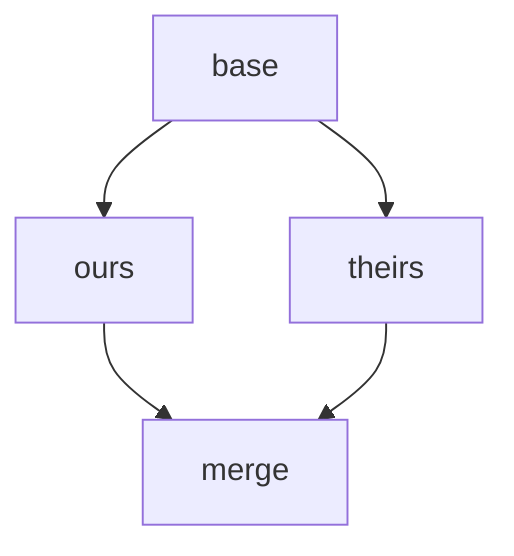
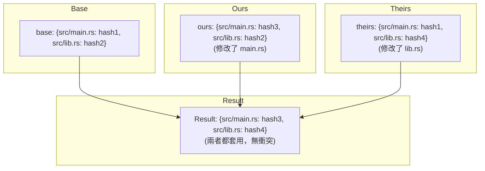
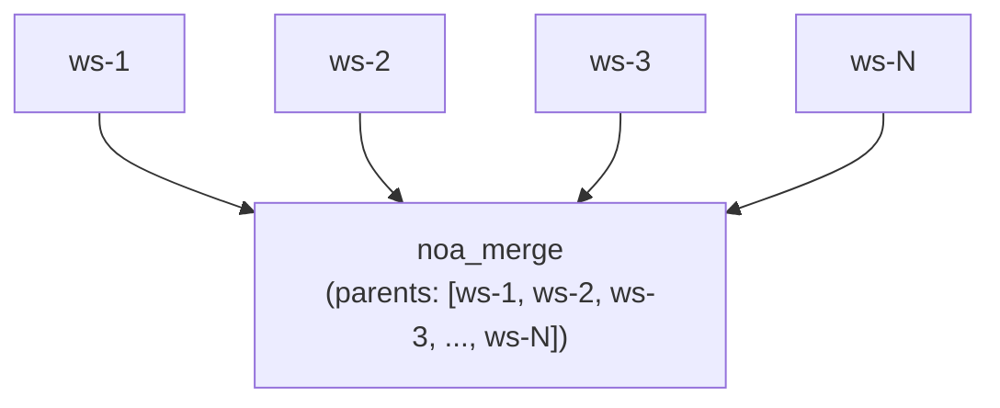
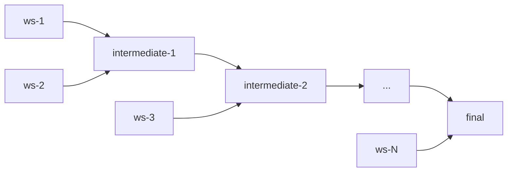

# 合併策略設計

## 概述

noa 使用三方合併演算法，具備可設定的衝突解決方案。此設計優先考慮**向前推進**而非人工介入，反映了 AI 代理使用案例中變更可以被重新生成的特點。

## 三方合併

### 演算法

給定兩個快照（ours、theirs）以及共同祖先（base）：



1. 比對 `base` vs `ours` → changes_A
2. 比對 `base` vs `theirs` → changes_B
3. 對每個被任一方觸及的路徑：
   - 兩邊變更相同 → 套用（無衝突）
   - 僅在 A 方變更 → 套用 A
   - 僅在 B 方變更 → 套用 B
   - 對相同路徑有不同變更 → **衝突**

### 實作

```rust
pub fn three_way_merge(
    base_tree: &Vec<TreeEntry>,
    ours_tree: &Vec<TreeEntry>,
    theirs_tree: &Vec<TreeEntry>,
) -> (Vec<TreeEntry>, Vec<Conflict>)
```

Tree 項目會正規化為扁平的路徑→雜湊對應以進行比較：



## 衝突偵測

```rust
pub struct Conflict {
    pub path: String,
    pub base_hash: Option<String>,
    pub ours_hash: Option<String>,
    pub theirs_hash: Option<String>,
}
```

衝突類型：
- **修改/修改**：兩邊以不同方式修改了相同的檔案
- **新增/新增**：兩邊在相同路徑新增了具有不同內容的檔案
- **刪除/修改**：一方刪除，另一方修改

## 解決策略

### upstream-wins（預設）

當偵測到衝突時，採用 theirs 的版本：

```rust
ConflictResolution::UpstreamWins => theirs_hash,
```

理念：在 AI 代理工作流程中，「上游」（main/default 工作區）代表規範狀態。代理可以針對更新後的 base 重新套用其變更。

### ours-wins

採用我們的版本：

```rust
ConflictResolution::OursWins => ours_hash,
```

### fail（計畫中）

中止合併並回傳衝突以進行手動解決：

```rust
ConflictResolution::Fail => return Err(MergeError::Conflict(conflicts)),
```

## 工作區合併流程

```bash
noa workspace switch default          # 設定 ours = default
noa workspace merge feature-1         # theirs = feature-1
```

內部步驟：
1. 載入 ours 快照（default 的 head）
2. 載入 theirs 快照（feature-1 的 head）
3. 尋找 merge base（DAG 中最近期的共同祖先）
4. 若無共同祖先，使用 `noa_empty` 作為 base
5. 執行三方合併
6. 套用衝突解決策略
7. 建立合併快照，parents = [ours, theirs]
8. 將 default 的 head 更新為合併快照

## 多父節點合併

noa 快照支援無限數量的父節點，可實現章魚式合併：



對於 N 方合併，演算法執行成對合併：



## 與 Git 合併的比較

| 面向 | noa | Git |
|--------|-----|-----|
| 演算法 | 三方 | 三方（相同核心演算法） |
| 衝突標記 | 無（自動解決） | `<<<<<<<` / `=======` / `>>>>>>>` |
| 預設解決方案 | upstream-wins | 無（需要人工介入） |
| 多父節點 | 無限制 | 通常 ≤2 |
| Rebase | 不支援 | 支援 |
| Cherry-pick | 不支援 | 支援 |
| Fast-forward | 自動 | 可選 (–no-ff) |

## 與 SVN 合併的比較

| 面向 | noa | SVN |
|--------|-----|-----|
| 合併追蹤 | 內建（父節點 DAG） | 手動（mergeinfo 屬性） |
| 衝突解決 | 自動 | 手動（衝突檔案） |
| 分支模型 | 工作區（輕量） | 目錄式（重量） |
| 合併方向 | 任意 → 任意（DAG） | 通常是分支 → 主幹 |

## 設計理念：為什麼自動解決？

傳統 VCS 需要人工衝突解決，原因如下：
1. 人類編寫的程式碼具有只有人類才能理解的語意意義
2. 衝突可能代表根本的設計分歧
3. 手動解決確保正確性

AI 代理的變更具有不同的特性：
1. **可重新生成**：代理可以針對最新狀態重新套用變更
2. **高頻率**：為了人工解決而暫停會阻塞所有下游工作
3. **非語意性**：檔案層級的變更不需要人工解釋

因此，在 noa 的使用案例中，採用明確策略（upstream-wins）的自動解決方案是正確的取捨。
