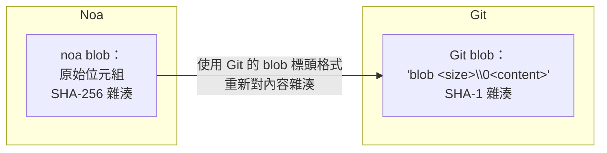
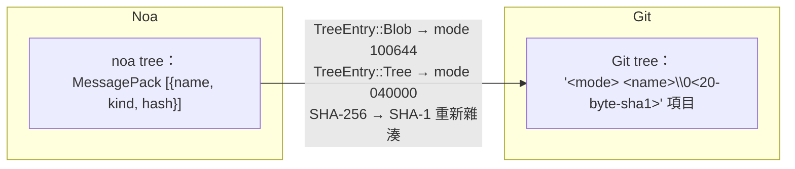
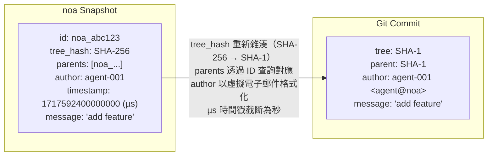
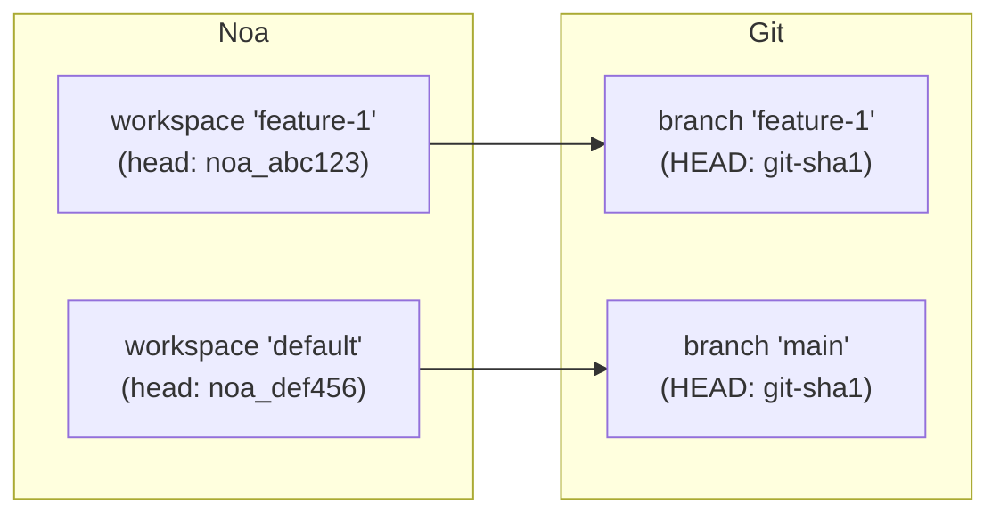
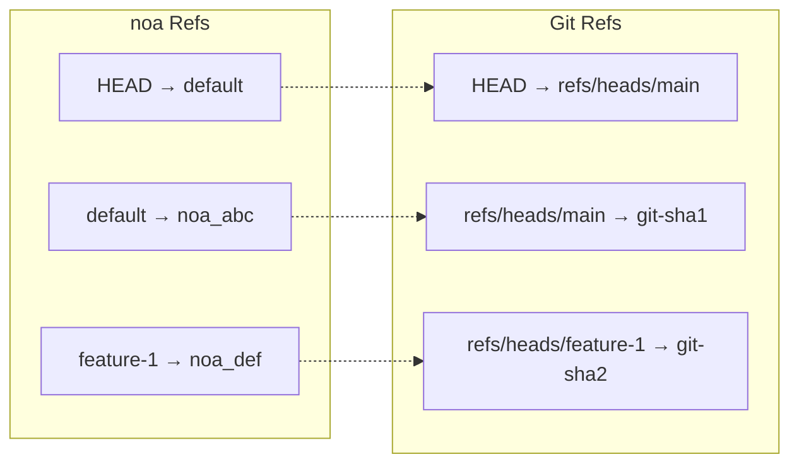
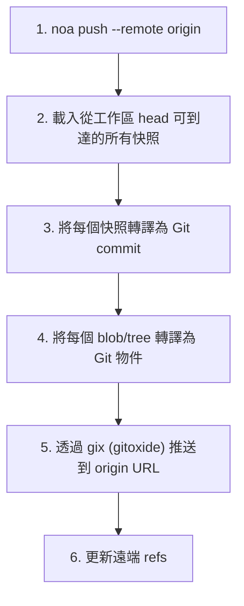
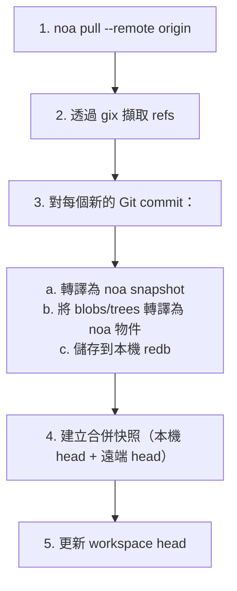
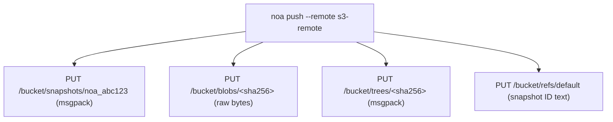

# 遠端互通性設計

## 概述

noa 支援多種遠端後端，用於跨機器和團隊同步快照與物件。主要的互通性目標是 Git，可實現與 GitHub、GitLab 和 Bitbucket 上現有工作流程的無縫整合。

## 遠端後端 Trait

```rust
#[async_trait]
pub trait RemoteBackend: Send + Sync {
    async fn push_snapshots(&self, ids: &[SnapshotId]) -> Result<()>;
    async fn fetch_snapshots(&self, ids: &[SnapshotId]) -> Result<Vec<Snapshot>>;
    async fn push_objects(&self, ids: &[String]) -> Result<()>;
    async fn fetch_objects(&self, ids: &[String]) -> Result<()>;
    async fn list_refs(&self) -> Result<HashMap<String, SnapshotId>>;
    async fn update_ref(&self, name: &str, old: Option<&SnapshotId>, new: &SnapshotId) -> Result<()>;
}
```

## Git 轉譯層

`GitTranslator` 在 noa 的物件模型和 Git 的物件模型之間進行轉換：

### Blob ↔ Git Blob



### Tree ↔ Git Tree



### Snapshot ↔ Git Commit



### Workspace ↔ Git Branch



### Ref 對應



## Push 流程



## Pull 流程



## MinIO/S3 後端

適用於沒有 Git 基礎設施的部署：



相較於 Git 遠端的優勢：
- 無需 tree/Snapshot 轉譯（原生 noa 格式）
- 直接 blob 儲存（無 pack 檔案額外負擔）
- S3 相容（適用於 AWS、GCS、MinIO、Cloudflare R2）

## 遠端設定

儲存在 `.noa/config`（TOML）中：

```toml
[[remotes]]
name = "origin"
url = "https://github.com/example/repo.git"
backend = "git"

[[remotes]]
name = "s3"
url = "s3://my-bucket/noa-repo"
backend = "minio"
endpoint = "https://s3.amazonaws.com"
region = "us-east-1"
```

## 身分驗證

| 後端 | 方法 |
|---------|--------|
| Git HTTPS | 來自 `~/.git-credentials` 的憑證或提示輸入 |
| Git SSH | SSH 代理或金鑰檔案 |
| MinIO/S3 | 存取金鑰 + 秘密金鑰（環境變數或設定檔） |

## 比較：遠端互通方法

| 方法 | 使用方 | 優點 | 缺點 |
|----------|---------|------|------|
| Git 橋接器 (gix) | noa | 通用相容性 | 轉譯額外負擔、SHA-1/SHA-256 不匹配 |
| 原生協定 | Git | 快速、無需轉譯 | 僅適用於 Git |
| WebDAV | SVN | HTTP 標準 | 有限、SVN 專用 |
| REST API | Bitbucket | 現代、靈活 | 需要託管服務 |
| S3 相容儲存 | noa | 可擴展、雲端原生 | 無橋接器則無 Git 互通性 |

noa 同時支援 Git 橋接器（用於相容性）和原生 S3（用於擴展性）。
