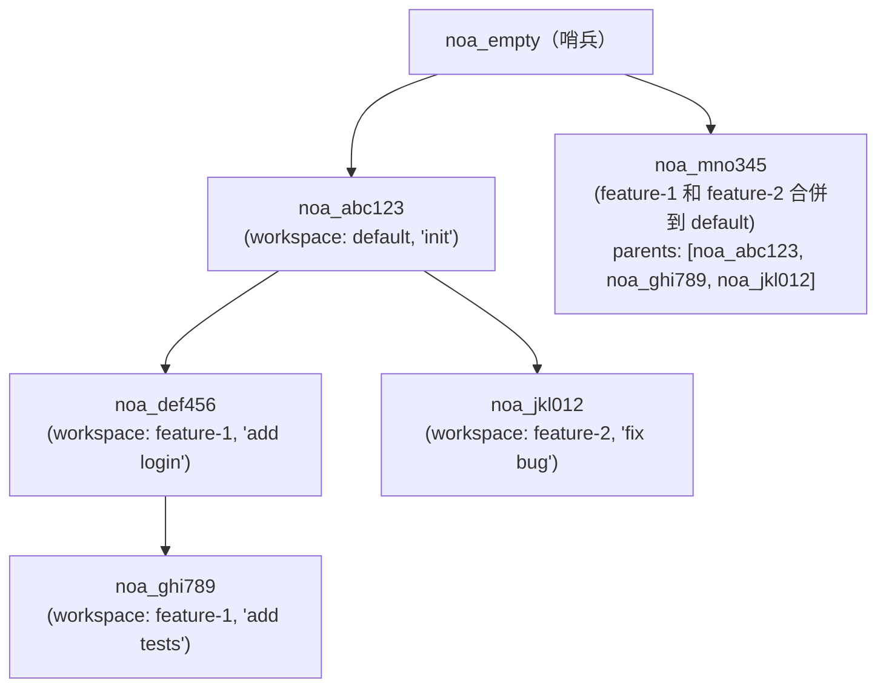
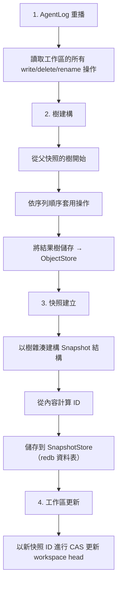

# 快照模型設計

## 概述

快照是工作區在某個時間點完整檔案樹狀態的不可變、依內容定址的記錄。快照透過父節點參照形成一個有向無環圖（DAG）。

## 快照結構

```rust
pub struct SnapshotId(pub String);  // "noa_<12-char-base62>"

pub struct Snapshot {
    pub id: SnapshotId,
    pub tree_hash: String,           // 根樹的 SHA-256 雜湊
    pub parents: Vec<SnapshotId>,    // 0-N 個父快照
    pub workspace: String,           // 來源工作區
    pub author: String,              // 代理或人類識別碼
    pub timestamp: u64,              // 自 Unix Epoch 以來的微秒數
    pub message: String,             // 人類可讀的描述
}
```

## ID 生成

快照 ID 使用以 `noa_` 為前綴的 12 字元 base62 字串：

```
noa_3kF8x2mP9aB1
```

生成方式：`SHA256(tree_hash || parents || workspace || timestamp)[0..9]` 以 base62 編碼。這提供：
- 62^12 ≈ 3.2 × 10^21 個可能的 ID
- 碰撞機率實際上為零
- 確定性：相同輸入 → 相同 ID（可實現去重）

## 快照 DAG



## 快照建立流程



## 快照儲存

快照儲存在 redb 資料表中，以 ID 為鍵：

```
資料表：snapshots
  鍵：   "noa_abc123"（SnapshotId，型別為 &str）
  值：   msgpack(Snapshot)，型別為 &[u8]
```

## 差異演算法

`diff_snapshots(base, other)` 產生檔案層級變更的列表：

```rust
pub struct FileDiff {
    pub path: String,
    pub kind: DiffKind, // Added、Removed、Modified
    pub old_blob: Option<String>,
    pub new_blob: Option<String>,
}
```

演算法：
1. 載入兩個快照的根樹
2. 同時遞迴遍歷兩個樹
3. 在每個路徑比較 blob 雜湊
4. 不同雜湊 → Modified；僅在其中之一 → Added/Removed

時間複雜度：O(n)，其中 n = 兩個樹中的檔案總數。

## 哨兵快照

`noa_empty` 是一個保留的快照 ID，代表空的樹。所有新的儲存庫都以它作為基礎。它永遠不會被明確儲存 — 工作區管理器將其識別為「尚無快照」。

## 與 Git Commit 的比較

| 面向 | noa Snapshot | Git Commit |
|--------|-------------|------------|
| ID 格式 | `noa_<base62>` | SHA-1 十六進位 |
| 父節點限制 | 無限制（合併 DAG） | 通常 1-2 個 |
| 樹格式 | MessagePack | 自訂二進位格式 |
| 時間戳 | 微秒精度 | 秒精度 + 時區 |
| 作者欄位 | 代理 ID 或人類 | 名稱 + 電子郵件 |
| 不可變性 | 由儲存強制執行 | 由雜湊強制執行 |
| GPG 簽署 | 不支援 | 支援 |
