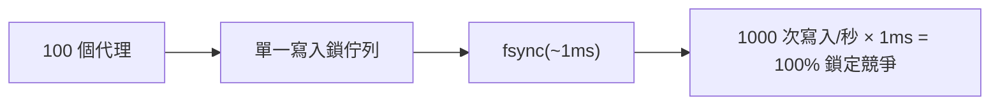
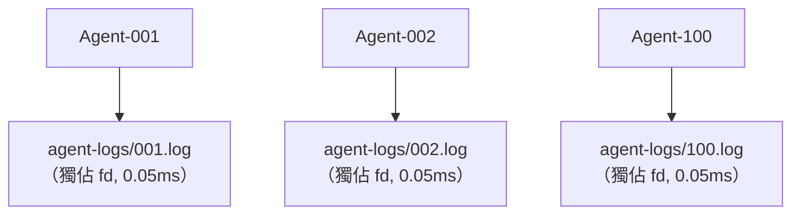

# 代理並行模型

## 設計目標

noa 支援數十到數百個 AI 代理同時寫入，且**零鎖定競爭**。

## 問題：單一寫入者瓶頸

傳統的嵌入式資料庫（包括 redb）使用單一寫入鎖定：



## 解決方案：每個工作區獨立的代理日誌

每個工作區擁有自己的 JSONL 檔案。寫入使用 `O_APPEND`，在 POSIX 系統上為原子操作：



總計：每次寫入 0.05ms，零鎖定競爭。

## AgentLog 格式

```jsonl
{"seq":1,"op":"write","path":"src/main.rs","blob":"abc123...","ts":1717592400000000}
{"seq":2,"op":"delete","path":"src/old.rs","ts":1717592401000000}
{"seq":3,"op":"rename","from":"src/foo.rs","to":"src/bar.rs","ts":1717592402000000}
{"seq":4,"op":"snapshot","snapshot_id":"noa_z7x9","parent":"noa_y6w8","message":"feat","ts":1717592405000000}
```

- `seq`：每個工作區的單調計數器
- `ts`：微秒精度的時間戳
- 整合時根據 `ts` 進行全域排序

## 何時使用 redb vs AgentLog

| 元件 | 儲存方式 | 原因 |
|-----------|---------|--------|
| blobs、trees | redb | 依內容定址、不可變、以讀取為主 |
| snapshots、refs、workspaces | redb | 詮釋資料、低寫入頻率 |
| 代理增量日誌 | 檔案 JSONL | 高頻率並行寫入 |

## 整合

`Consolidator` 讀取所有代理日誌，依時間戳排序，並建立統一的快照鏈：

```rust
Consolidator::new(&engine)
    .consolidate("default", parent_ids, "agent", "batch update")
    .await?;
```

## 用於多處理程序並行的 noa-server

對於真正的多處理程序情境（多個 CLI 處理程序或分散式的代理），請使用 noa-server HTTP API：

```bash
noa-server  # 在埠號 3000 啟動

# 代理透過 REST 互動：
POST /api/v1/repo/my-project/blobs
POST /api/v1/repo/my-project/snapshots
POST /api/v1/repo/my-project/agent-log
```

伺服器持有單一資料庫連接並在內部序列化寫入，同時透過 MVCC 處理並行讀取。
