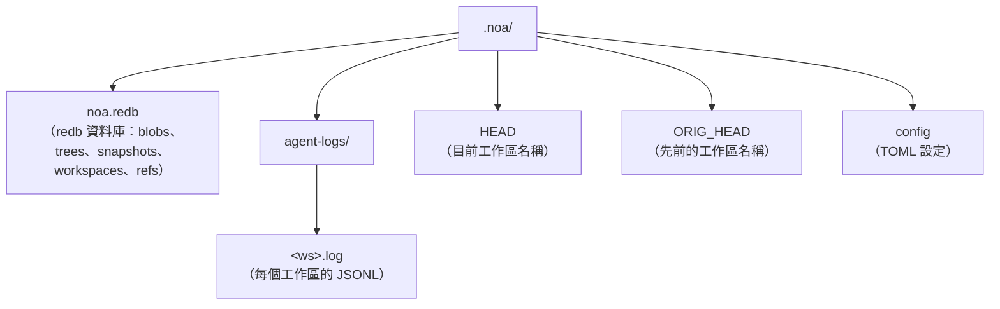
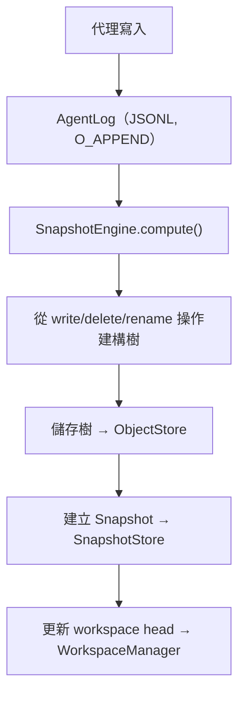

# 架構

## 核心元件

### ObjectStore

用於 blobs 和 trees 的依內容定址儲存。內容以 SHA-256 雜湊定址。

```
BlobId = SHA256(content)
TreeId = SHA256(msgpack(TreeEntries))
```

實作：
- **RedbObjectStore**：使用 redb 嵌入式 KV 儲存的本機儲存
- **MinioObjectStore**：使用 S3 相容 MinIO 的遠端儲存

### AgentLog

每個工作區獨立的僅附加日誌，用於零鎖定的並行寫入。每個工作區在 `.noa/agent-logs/<ws>.log` 下擁有自己的 JSONL 檔案。

操作：
- **write**：記錄帶有 blob 參照的檔案寫入
- **delete**：記錄檔案刪除
- **rename**：記錄檔案重新命名
- **snapshot**：記錄快照建立
- **merge**：記錄來自另一個工作區的合併

### Snapshot

工作區不可變的時間點狀態。包含樹雜湊、父快照、作者和訊息。

```
Snapshot = {
    id: "noa_<12-char-base62>"
    tree_hash: 樹內容的 SHA-256
    parents: [SnapshotId, ...]
    workspace: 工作區名稱
    author: 代理識別碼
    timestamp: 微秒精度
    message: 人類可讀的描述
}
```

### Workspace

代理的隔離工作環境。追蹤 head 快照和 base 快照。

### RefStore

快照的命名指標，具備比較並交換（CAS）語意，用於安全的並行更新。

### 合併引擎

針對 base、ours 和 theirs 樹進行三方合併：
- 兩邊變更相同 → 無衝突
- 僅在一方變更 → 套用
- 對相同檔案有不同的變更 → 衝突（預設：upstream-wins）

## 儲存佈局



## 資料流


