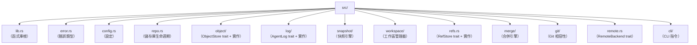

# 建置 noa

## 前置需求

- Rust 1.75+（穩定版）
- Python 3.8+（用於建置腳本）
- `just` 指令執行器

## 設定

```bash
git clone https://github.com/celestia-island/noa.git
cd noa
just init          # 擷取 Rust 相依性
just build-dev     # 開發版建置
```

## 開發

```bash
just fmt            # 格式化程式碼
just clippy         # 程式碼檢查
just test           # 執行測試
just check          # 型別檢查
```

## 專案結構


