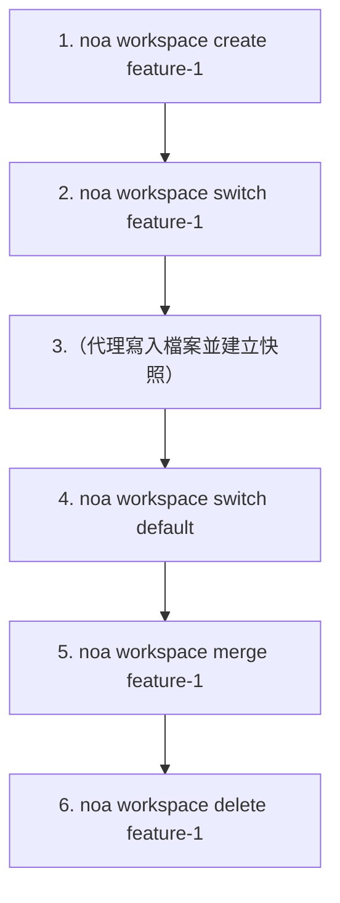
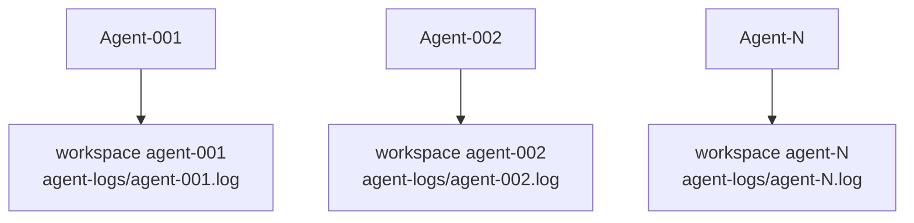

# 工作區指南

工作區是隔離的工作環境，類似於 Git 分支。每個工作區擁有自己的 head 快照和代理日誌。

## 建立工作區

```bash
noa workspace create feature-1
noa workspace create agent-debug --agent bot-42
```

`--agent` 旗標將工作區與特定的代理 ID 關聯。

## 切換工作區

```bash
noa workspace switch feature-1
noa status
# On workspace: feature-1 (head: noa_abc123)
```

## 列出工作區

```bash
noa workspace list
#   default             head: noa_abc123 base: noa_empty
# * feature-1           head: noa_def456 base: noa_abc123
```

`*` 標記顯示使用中的工作區。

## 合併工作區

```bash
noa workspace switch default
noa workspace merge feature-1
# Merged feature-1 into default -> noa_ghi789
```

若偵測到衝突：

```
Conflicts detected:
  CONFLICT: src/main.rs
Merged feature-1 into default -> noa_ghi789
```

預設的解決策略是 upstream-wins（對方優先）。未來版本將支援手動衝突解決。

## 刪除工作區

```bash
noa workspace delete feature-1
# Deleted workspace 'feature-1'
```

您無法刪除使用中的工作區。

## 工作流程模式



## 多代理模式

每個代理擁有自己的工作區：



每個工作區有獨立的代理日誌（`.noa/agent-logs/agent-001.log`），允許零鎖定的並行寫入。整合步驟會依時間戳記合併所有日誌，以建立統一的歷史記錄。

> **注意**：redb 使用獨佔的檔案鎖定，因此多個 CLI 處理程序無法同時開啟相同的資料庫。若要實現真正的多處理程序並行性，請使用 noa-server HTTP API。
